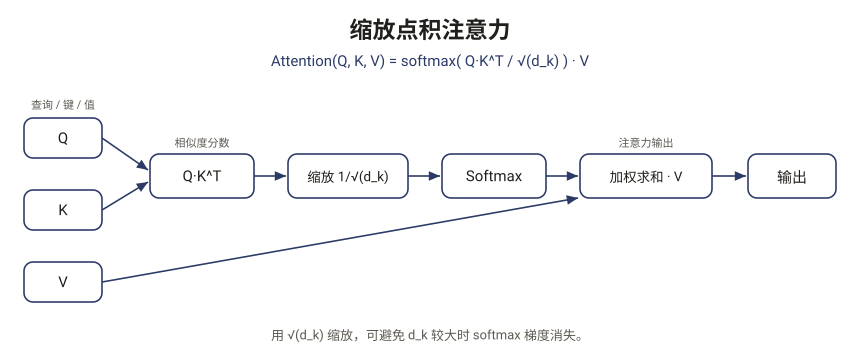

# PaperMind

> **把任意论文，读懂到能复现 —— 关键判断都标原文出处、逐条核验。**
> 粘贴 arXiv 链接 / DOI / 论文标题 / 论文页面 / PDF（也可上传）：结构化分析、带原文依据并核验的问答、整篇方法的框架图、接真实代码仓库的复现指南。

[](https://github.com/Wenhao-Hua/papermind/actions/workflows/ci.yml)
[](https://pypi.org/project/papermind-ai/)
[](https://pypi.org/project/papermind-ai/)
[](LICENSE)

<p align="center">
  
</p>
<p align="center">
  <sub>↑ PaperMind 为论文技术点<b>生成的论文式教学图</b>（管线真实产物）·
  <a href="examples/transformer.md">看完整样例</a> · <a href="examples/README.md">样例画廊 →</a></sub>
</p>

> 在线试用，零安装：**[papermind.try2026.cn](https://papermind.try2026.cn)**

## 凭什么不是「又一个 chat-with-PDF」

- **🔬 自训练检索重排器 —— 相对强稠密基线 Recall@5 +14pt**（QASPER 独立 test）。多数「和论文对话」工具只是套 API；PaperMind 的证据检索是我们自己微调并实测的 cross-encoder（数据见[下方](#实测重排器是自训练实测的不是黑箱)）。
- **🔎 关键判断分层标注、逐条核验。** 回答分 **论文事实 / 推理（带置信度）/ 超纲**，每条引用都对着原文核验——核不到标 ⚠️，绝不默默当真。
- **📐 整篇方法的框架图。** 把端到端方法重建成一张 Figure-1 式架构图（论文只隐含、未画出的步骤标注为*推断*），作为「方法框架」一节直接嵌在分析报告里。
- **🛠️ 复现接论文真实代码仓库。** 用仓库里**真实的依赖文件和 README 运行命令**生成 `setup.sh`，不是模型瞎猜。
- **🆓 全本地、零成本可跑。** `papermind demo` 离线看；`--local` 全程走 Ollama；没 key 自动回退本地。

## 快速开始

```bash
pip install papermind-ai
papermind analyze https://arxiv.org/abs/1706.03762   # 四模块结构化报告
papermind ask <论文> "为什么除以 √d_k？"              # 带原文依据并核验的问答
papermind demo                                        # 离线看效果，无需 key
```

配置任一模型（走 [litellm](https://github.com/BerriAI/litellm)：OpenAI / Anthropic / DeepSeek / Gemini / Qwen / 本地 Ollama），例如：

```bash
papermind config set deepseek-key sk-...
```

图形界面：`pip install "papermind-ai[web]"` 后 `papermind ui`。结果本地缓存，二次运行秒出。

## 能做什么

| 命令 | 作用 |
| --- | --- |
| `analyze` | 四模块报告（含整篇方法的端到端框架图）：核心贡献 · 方法与图示 · 关联工作 · 复现要点 |
| `ask` / `chat` | 带原文依据并核验的问答 |
| `summary` | 一句话 TL;DR + 要点 |
| `compare` | 2–4 篇论文横向对照 |
| `reproduce` | 导出 `setup.sh` / notebook |
| `search` · `batch` · `cite` | 检索 arXiv · 批量 · 生成引用 |

更多：`papermind --help`。

## 实测——重排器是自训练、实测的，不是黑箱

在 **QASPER** 上自训练 cross-encoder 重排器（`bge-reranker-base`），全段落候选下相对强稠密基线：

| | Recall@5 | MRR | nDCG@10 |
| --- | --- | --- | --- |
| Dense (`bge-small-en-v1.5`) | 0.519 | 0.463 | 0.469 |
| **+ 自训练 Reranker** | **0.660** | **0.612** | **0.609** |

dev（888 题）与独立 test（1309 题）一致，无过拟合。复现见 [`docs/RESEARCH_PLAN.md`](docs/RESEARCH_PLAN.md)（`trainer/` 训练 · `evaluation/` 评测）。

## 样例画廊 —— 7 篇论文，跨 5 个领域

管线真实跑出的报告，GitHub 直接打开（论文式示意图、可跳转原文出处、复现表格）：

[Transformer](examples/transformer.md) · [FlashAttention-2](examples/flashattention2.md) · [Llama 2](examples/llama2.md) · [ViT](examples/vit.md) · [Latent Diffusion](examples/latent-diffusion.md) · [PPO](examples/ppo.md) · [LoRA](examples/lora.md) · [完整画廊 →](examples/README.md)

## 自托管

```bash
git clone https://github.com/Wenhao-Hua/papermind && cd papermind
docker build -t papermind . && docker run -p 8080:8080 papermind          # 演示模式（只读缓存，不烧 key）
docker run -p 8080:8080 -e DEEPSEEK_API_KEY=sk-... -e PAPERMIND_TRUST_PROXY=1 papermind \
       papermind serve --host 0.0.0.0 --port 8080 --live                  # 实时分析（你的 key 付费）
```

`--live` 默认带限流（每 IP 8 次/天、全局 300 次/天，可调）；挂在 Cloudflare / 反向代理后要设 `PAPERMIND_TRUST_PROXY=1`，否则 per-IP 限流会失效。

## 贡献 / License

欢迎 PR / issue（[CONTRIBUTING.md](CONTRIBUTING.md)）· [MIT](LICENSE)
