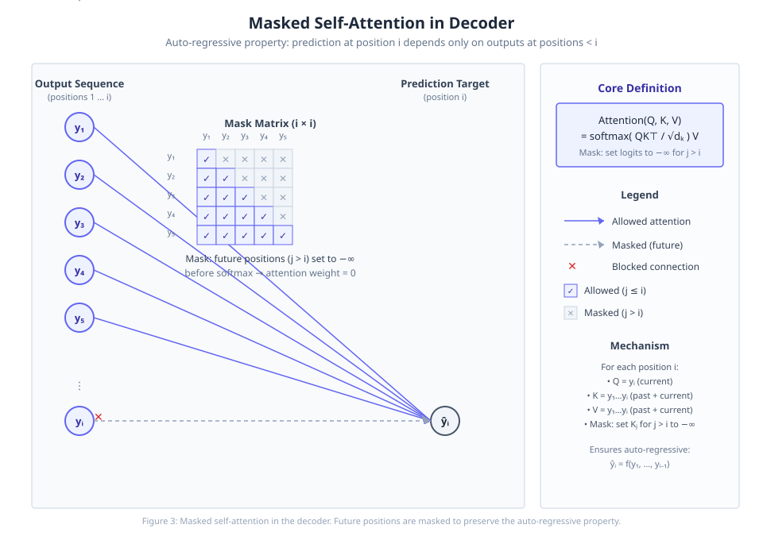

# PaperMind

**English · [简体中文](README.zh-CN.md)**

> **Read any paper — from skim to reproduction — with every key claim traced back to the source.**
> Paste an arXiv link, DOI, paper title, or any paper page / PDF URL (or upload a PDF): structured analysis, grounded & citation‑verified Q&A, a whole‑method framework diagram (downloadable SVG), and a runnable reproduction guide.

[](https://github.com/Wenhao-Hua/papermind/actions/workflows/ci.yml)
[](https://pypi.org/project/paper-mind/)
[](https://pypi.org/project/paper-mind/)
[](LICENSE)

<p align="center">
  
</p>
<p align="center">
  <sub>↑ A <b>paper-style teaching diagram PaperMind generates</b> for a technical point (real output) ·
  <a href="examples/transformer.md"><b>full sample report</b></a> · <a href="examples/README.md">gallery →</a></sub>
</p>

## Why it isn't just another chat‑with‑PDF

- **🔬 We trained our own retrieval reranker — +14pt Recall@5 over a strong dense baseline** (QASPER, held‑out test). Most "chat with a paper" tools wrap an API; PaperMind's evidence retrieval is a cross‑encoder we fine‑tuned and measured (see [Benchmarks](#benchmarks-the-reranker-is-trained-and-measured-not-a-black-box)).
- **🔎 Key claims are labeled and citation‑verified.** Answers are split into **fact / inference (with confidence) / out‑of‑scope**, and each cited quote is checked against the actual paper text — if it can't be found, it's flagged ⚠️ rather than silently trusted.
- **📐 Whole‑method framework diagram.** Beyond per‑point figures, PaperMind reconstructs the paper's end‑to‑end method as a single Figure‑1‑style architecture diagram (steps the paper only implies are marked *inferred*) — view it on the web `/framework` tab and download it as SVG.
- **🛠️ Reproduction grounded in the real code repo.** PaperMind locates the paper's code repository and builds `setup.sh` from the repo's **actual dependency file and README run‑commands** — not a hallucinated guess.
- **🆓 Runs fully local & free.** `papermind demo` works offline; `--local` routes everything through Ollama; with no key it auto‑falls back to local.

| | **PaperMind** | Typical chat‑with‑PDF / SaaS readers |
| --- | :---: | :---: |
| Per‑claim citation **with verification** (flags unverifiable ⚠️) | ✅ | — |
| Reproduction → runnable `setup.sh` from the **real** repo | ✅ | — |
| **Self‑trained** RAG reranker, measured on QASPER | ✅ | — |
| Runs **fully local / offline, zero cost** | ✅ | ✗ |
| **Open‑source & self‑hostable** | ✅ | ✗ |

<sub>“—” = not a documented capability we're aware of; open an issue to correct us. Open‑source/local rows are clear‑cut for closed SaaS tools.</sub>

## Three ways to use it

| | How | Best for |
| --- | --- | --- |
| 🌐 **Online** | open **[papermind.try2026.cn](https://papermind.try2026.cn)** — zero install | trying it instantly |
| 🖥️ **GUI** | `pip install "paper-mind[web]"` → `papermind ui` | full features, in your browser |
| ⌨️ **CLI / API** | `pip install paper-mind` → `papermind analyze https://arxiv.org/abs/2307.08691` | scripting, batch, integration |

> 🆓 No spend: `papermind demo` shows the output offline (no key); add `--local` to any command to run fully on local Ollama at zero cost.

## What you get

```
╭──────────────── Attention Is All You Need · 2017 · arXiv:1706.03762 ───────────────╮
🎯 Contributions   A fully attention-based model (Transformer): no recurrence/convolution…
🔬 Technical       1. Scaled Dot-Product Attention [high]  softmax(QKᵀ/√d_k)·V; scaling avoids
                      saturated gradients   💡 analogy + 📊 paper-style teaching diagram (SVG)
💬 Grounded Q&A    "Why divide by √d_k?" → [FACT] large d_k inflates dot-product variance…
                      📌 source Section 3.2.1 (p.4) ✓ verified
🛠️ Reproduction    code repo (★24k) github.com/… → setup.sh (real deps + README run commands)
```

Full rendered reports (open on GitHub — paper‑style diagrams, jump‑to‑source citations, reproduction tables):
**[Transformer](examples/transformer.md)** · **[ViT](examples/vit.md)** · **[PPO](examples/ppo.md)** · **[the full gallery →](examples/README.md)**

## Gallery — 7 papers across 5 areas

PaperMind isn't NLP‑only. Real reports generated by the pipeline, grouped by area:

| Area | Papers |
| --- | --- |
| **NLP / Attention** | [Transformer](examples/transformer.md) · [FlashAttention‑2](examples/flashattention2.md) · [Llama 2](examples/llama2.md) |
| **Computer Vision** | [ViT](examples/vit.md) |
| **Generative / Diffusion** | [Latent Diffusion (Stable Diffusion)](examples/latent-diffusion.md) |
| **Reinforcement Learning** | [PPO](examples/ppo.md) |
| **Efficient fine‑tuning** | [LoRA](examples/lora.md) |

## Benchmarks — the reranker is trained and measured, not a black box

We fine‑tuned a cross‑encoder reranker (`bge‑reranker‑base`) on **QASPER**. Over all‑paragraph candidates, versus a strong dense baseline:

| | Recall@5 | MRR | nDCG@10 |
| --- | --- | --- | --- |
| Dense (`bge‑small‑en‑v1.5`) | 0.519 | 0.463 | 0.469 |
| **+ our reranker** | **0.660** | **0.612** | **0.609** |

Consistent across dev (888 q) and a held‑out test (1309 q) — no overfitting. Reproduce it: [`docs/RESEARCH_PLAN.md`](docs/RESEARCH_PLAN.md) (`trainer/` to train · `evaluation/` to evaluate).

## Self‑host the online service

One Docker command. Public exposure is safe by default (demo mode is read‑only cache, never spends a key):

```bash
git clone https://github.com/Wenhao-Hua/papermind && cd papermind
docker build -t papermind . && docker run -p 8080:8080 papermind            # demo mode

docker run -p 8080:8080 -e OPENAI_API_KEY=sk-... -e PAPERMIND_TRUST_PROXY=1 papermind \
       papermind serve --host 0.0.0.0 --port 8080 --live                    # live (your key, billed)
```

> **`--live` is rate‑limited by default** (8/IP/day, 300/day global; tune with `--rate-per-ip` / `--rate-global`, `0` = unlimited) so a public deployment can't drain your key. Free ops (search / cached / offline demo) aren't limited.
>
> **Behind Cloudflare/a reverse proxy, set `PAPERMIND_TRUST_PROXY=1`** — otherwise every visitor shares one per‑IP quota (the proxy's IP) and per‑IP limiting silently breaks. Only set it when you're actually behind a trusted proxy that sets `cf-connecting-ip`.
>
> **Faster figures:** diagrams default to the main model (cleanest layout, slower). Point figures at a fast non‑thinking model to speed them up: `papermind config set figure-model deepseek/deepseek-chat`.

## What it can do

`analyze` (4‑module report) · `summary` (TL;DR) · `ask`/`chat` (grounded Q&A) · `tutor`/`debug` (reproduction help) · `compare` (multi‑paper) · `reproduce` (export setup.sh / notebook) · `search`/`batch`/`list` · `cite`.

Models via [litellm](https://github.com/BerriAI/litellm): OpenAI / Anthropic / DeepSeek / Gemini / local Ollama. Results are cached locally — re‑runs are instant. More: `papermind --help`.

## Contributing / License

PRs and issues welcome ([CONTRIBUTING.md](CONTRIBUTING.md)) · [MIT](LICENSE)
