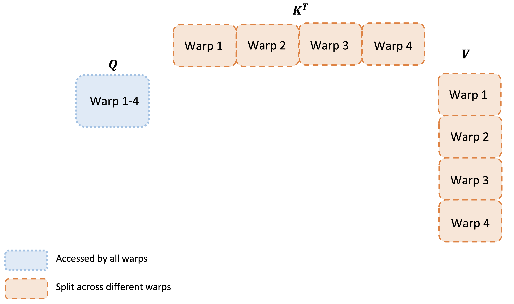
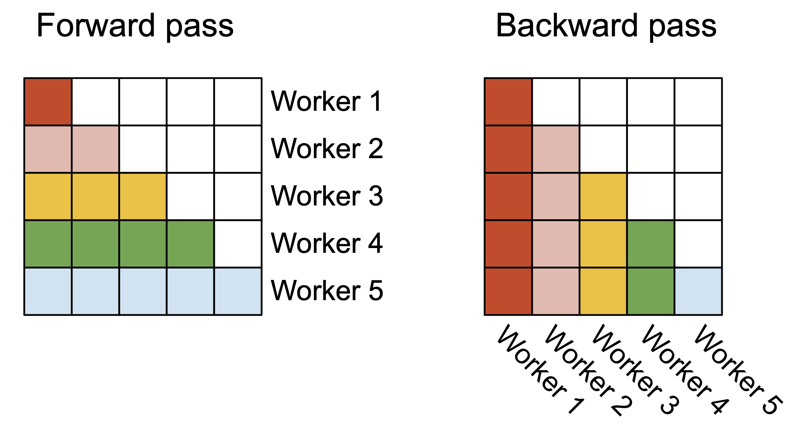
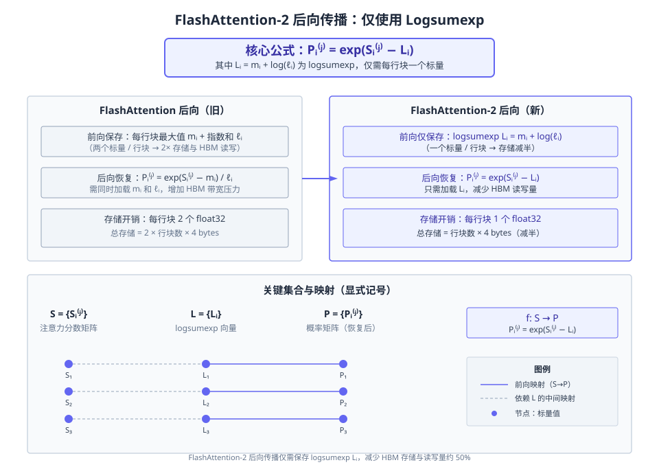
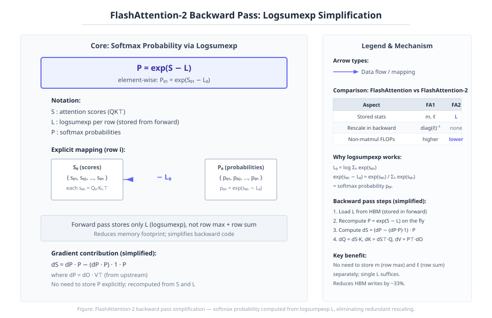
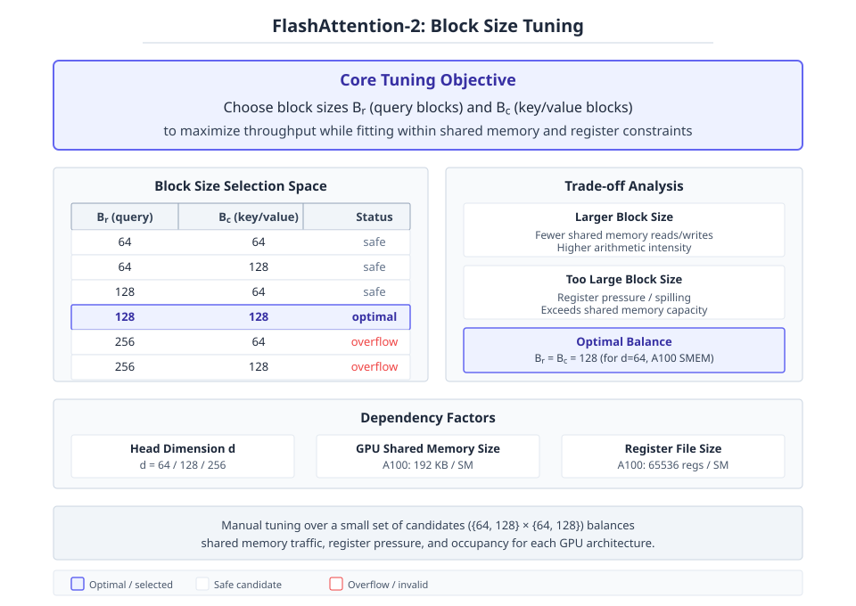

# FlashAttention-2: Faster Attention with Better Parallelism and Work Partitioning

**Authors:** Tri Dao  •  **Year:** 2023  •  **arXiv:** [2307.08691](https://arxiv.org/abs/2307.08691)  •  [PDF](https://arxiv.org/pdf/2307.08691.pdf)

- [🎯 贡献与创新点](#contributions)
- [🔬 技术细节解释](#technical)
- [🔗 知识关联](#connections)
- [🛠️ 复现指南](#reproduction)

<a id="contributions"></a>

## 🎯 贡献与创新点

**核心贡献:** 提出 FlashAttention-2，通过更好的并行化和工作划分（减少非矩阵乘 FLOPs、跨线程块并行化单头注意力、在 warp 间分配工作以减少共享内存通信），实现约 2× 加速，达到理论峰值 FLOPs/s 的 50–73%。

**新颖之处:** 针对 FlashAttention 在工作划分上的不足（低占用或不必要的共享内存读写），重新设计了算法、并行化策略和 warp 间工作划分。

**解决的问题:** 解决了 FlashAttention 效率仍远低于 GEMM 操作（仅 25–40% 理论峰值）的问题，大幅提升 GPU 利用率与速度。

> **原文出处:**
> - [Frontmatter (p.1)](https://arxiv.org/pdf/2307.08691.pdf#page=1): We propose FlashAttention-2, with better work partitioning to address these issues. In particular, we (1) tweak the algorithm to reduce the number of non-matmul FLOPs (2) parallelize the attention computation, even for a single head, across different thread blocks to increase occupancy, and (3) within each thread block, distribute the work between warps to reduce communication through shared memory. These yield around 2× speedup compared to FlashAttention, reaching 50-73% of the theoretical maximum FLOPs/s on A100 and getting close to the efficiency of GEMM operations.
> - [Frontmatter (p.1)](https://arxiv.org/pdf/2307.08691.pdf#page=1): We observe that the inefficiency is due to suboptimal work partitioning between different thread blocks and warps on the GPU, causing either low-occupancy or unnecessary shared memory reads/writes.

<a id="technical"></a>

## 🔬 技术细节解释

### 1. Forward pass warp work partitioning  `🔴 high`

在FlashAttention-2的前向传播中，每个线程块内的warp不再采用FlashAttention的“split-K”方案（即将K和V分给不同warp，导致warp间需要共享内存通信来累加部分输出），而是改为将Q分给各warp，保持K和V对所有warp可见。这样每个warp计算完$QK^\top$的一部分后，直接乘以共享的V得到对应的输出分片，无需warp间通信，从而减少共享内存读写，提升速度。

> 💡 **类比:** 就像在装配流水线上，原来需要每个工人加工一部分零件，最后汇总组装（需要相互等待和传递），现在改为每个工人独立负责完整的装配工作，各自使用相同的零部件，免去了协作开销。

📍 出处: [Section 3.3 (p.9)](https://arxiv.org/pdf/2307.08691.pdf#page=9)


*Figure 3: Work partitioning between different warps in the forward pass (论文原图)*

### 2. Parallelization along sequence length  `🔴 high`

FlashAttention-2在前向传播中将原先的嵌套循环顺序改为外循环遍历行块、内循环遍历列块，并将外循环的每一行块分配给不同的线程块并行执行，不再需要通信。反向传播中，由于计算dQ时需要累加来自各列块的贡献，故按列块分配线程块，并使用原子加来安全地更新dQ。这种在序列长度维度上的额外并行增加了线程块数量，显著提高长序列和小批量情况下的GPU占用率。

> 💡 **类比:** 原先一个工人按顺序处理所有行，现在增加工人，每个工人只负责一行（或一列），同时工作，但反向需要记账时，大家往同一个本子上写东西，要用原子笔防冲突。

📍 出处: [Section 3.2 (p.7)](https://arxiv.org/pdf/2307.08691.pdf#page=7)


*Figure 2: In the forward pass (left), we parallelize the workers (thread blocks) where each worker takes care of a block of rows of the attention matrix. In the backward pass (right), each worker takes care of a block of columns of the attention matrix. (论文原图)*

### 3. Online softmax with reduced non-matmul FLOPs  `🟡 mid`

FlashAttention-2修改了在线softmax的累积方式：维护一个“未缩放”的累积输出$\tilde{O}^{(j)}$，且只使用指数求和$\ell^{(j)}$和最大值$m^{(j)}$更新，仅在循环结束时用$\ell^{(T_c)}$对$\tilde{O}^{(T_c)}$做一次缩放得到最终输出。同时，只保存logsumexp $L = m + \log(\ell)$用于反向传播，代替原来的$m$和$\ell$。这些调整减少了非矩阵乘法的FLOPs（如除法和乘法），将更多计算留给GPU上更快的矩阵乘法单元。

$$
\tilde{O}^{(2)} = \text{diag}(e^{m^{(1)}-m^{(2)}})^{-1}\tilde{O}^{(1)} + e^{S^{(2)}-m^{(2)}}V^{(2)},\quad O^{(2)} = \text{diag}(\ell^{(2)})^{-1}\tilde{O}^{(2)}
$$

> 💡 **类比:** 就像是做一道需要分步计算的菜，原本每次加料时都要调整整锅汤的浓度，现在改为最后一次性调浓度，省去了每次的计算，且只记下关键的浓度日志（log）而不是分别记两本账。

📍 出处: [Section 3.1.1 (p.5)](https://arxiv.org/pdf/2307.08691.pdf#page=5)


*Figure 1: Diagram of how FlashAttention forward pass is performed, when the key K is partitioned into two blocks and the value V is also partitioned into two blocks. By computing attention with respect to each block and rescaling the output, we get the right answer at the end, while avoiding expensive memory reads/writes of the intermediate matrices S and P. We simplify the diagram, omitting the s (论文原图)*

### 4. Optimized causal masking  `🟡 mid`

对于因果注意力，FlashAttention-2利用分块特性，当整个块的所有列索引都大于行索引时（即完全处于因果掩码的遮蔽区域），直接跳过该块的计算，从而节省大约一半的计算量。对于其他块，由于已经天然满足因果条件，无需显式应用掩码，进一步减少开销。整体带来约1.7-1.8倍的加速。

> 💡 **类比:** 就像在填一个下三角矩阵，如果看到某个正方形格子全在对角线上方，直接跳过不填；而恰在对角线下的格子，不需要检查，直接填。

📍 出处: [Section 3.1.1 (Causal masking) (p.6)](https://arxiv.org/pdf/2307.08691.pdf#page=6)


*教学示意图：Optimized causal masking（教学示意图）*

> **读图**：FlashAttention-2通过跳过完全遮蔽的块优化因果掩码。
>
> - Q行K列矩阵，对角线以下有效。
> - 块跳过策略：列索引>行索引时跳过。
> - 跳过块零计算，其余正常计算无需掩码。
> - 相比标准因果注意力加速约1.7-1.8倍。
>
> **关键**：利用分块特性跳过全遮蔽块，减少计算量。

### 5. Backward pass simplification with logsumexp  `🟡 mid`

在FlashAttention-2的反向传播中，不再需要保留softmax的行最大值和行和，而是只使用前向传播计算并存储的logsumexp $L$。通过$L$可以方便地计算softmax概率 $P = \exp(S - L)$（每个元素广播减去行$L$），用于梯度计算。这减少了需要存储的中间量，并简化了代码。

$$
P^{(j)}_i = \exp(S^{(j)}_i - L_i)
$$

> 💡 **类比:** 原来记账需要同时记录每行的最高温度和累计热量，现在只记录一个综合的热力指数（logsumexp），还原时用指数和减法即可，账本变薄了。

📍 出处: [Section 3.1.2 (p.7)](https://arxiv.org/pdf/2307.08691.pdf#page=7)


*教学示意图：Backward pass simplification with logsumexp（教学示意图）*

> **读图**：FlashAttention-2反向传播用logsumexp简化softmax概率计算
>
> - L是前向存储的每行logsumexp
> - P = exp(S - L) 逐元素计算softmax概率
> - 反向传播中P从S和L重算，无需存储
> - 相比FA1，FA2只存L，减少内存和计算
>
> **关键**：核心：用L代替m和ℓ，简化反向传播

### 6. Block size tuning  `🟢 low`

FlashAttention-2通过手动调优选择块大小$B_r$和$B_c$，通常在$\{64, 128\} \times \{64, 128\}$范围内，取决于头维度$d$和GPU共享内存大小。增加块大小可减少共享内存读写的次数，但会增加寄存器压力和共享内存使用量，可能导致寄存器溢出或超出SM容量。手动调优在有限几个选项中平衡这些因素。

> 💡 **类比:** 就像选择搬运箱子的大小：箱子太小搬运次数多，箱子太大的搬不动（寄存器不够）或者卡在门口（共享内存溢出），所以要挑个合适的尺寸。

📍 出处: [Section 3.3 (Tuning block sizes) (p.9)](https://arxiv.org/pdf/2307.08691.pdf#page=9)


*教学示意图：Block size tuning（教学示意图）*

> **读图**：FlashAttention-2块大小调优的权衡与选择空间
>
> - Br和Bc是块大小，在{64,128}×{64,128}中选择
> - 状态：safe/optimal/overflow表示可行性
> - 权衡：大块减少读写但增加寄存器压力
> - 依赖因素：头维度d和GPU共享内存大小
>
> **关键**：在有限候选集中手动调优，平衡吞吐与资源约束

<a id="connections"></a>

## 🔗 知识关联

| 概念 | 相关论文 | 关系 |
| --- | --- | --- |
| Standard Attention | [Vaswani et al. 2017](https://arxiv.org/abs/1706.03762) | 本文指出标准注意力实现因存储S和P矩阵导致O(N^2)显存和运行时瓶颈，FlashAttention-2通过更好的并行和工作划分进一步加速精确注意力计算，与标准实现对比获得3-10×加速。 |
| FlashAttention | [Dao et al. 2022](https://arxiv.org/abs/2205.14135) | 本文直接继承FlashAttention的IO感知分块思想和在线softmax算法，通过调整减少非矩阵乘FLOPs、并行化序列长度维度、优化线程块内warp工作划分，实现约2×提速。 |
| Online Softmax | [Milakov and Gimelshein 2018; Rabe and Staats 2021](https://arxiv.org/abs/1805.02867) | 本文沿用在线softmax作为基本技术实现分块注意力计算，并在前向传播中调整重缩放时机、仅保留log-sum-exp以减少非矩阵乘FLOPs。 |
| Sequence-Length Parallelism and Loop Reordering | [Tillet et al. 2019 (Triton implementation)](https://arxiv.org/abs/1906.02442) | 本文采纳Triton实现中的前向循环交换（按行分块外层循环）和序列长度维度的并行化思想，提升长序列小批量的GPU占用率。 |
| Multi-Query Attention (MQA) | [Shazeer 2019](https://arxiv.org/abs/1911.02150) | FlashAttention-2在算法层面隐式处理MQA的头部索引，避免显式复制键值头，支持多查询注意力变体。 |
| Grouped-Query Attention (GQA) | [Ainslie et al. 2023](https://arxiv.org/abs/2305.13245) | FlashAttention-2同样通过隐式头部索引处理，支持分组查询注意力，并在反向传播中正确累加跨头梯度。 |

<a id="reproduction"></a>

## 🛠️ 复现指南

- **代码仓库（论文原文链接 · ★24026）:** [https://github.com/Dao-AILab/flash-attention](https://github.com/Dao-AILab/flash-attention)
- **安装 / 运行（取自该仓库，非模型生成）:**
  - `pip install -e .`
  - `python setup.py install`
- **环境要求:** CUDA >= 11.6, PyTorch >= 1.12, A100/H100 GPU
- **推荐硬件:** NVIDIA A100 (80GB) or H100
- **关键超参数:** `block_size_Br=64/128`, `block_size_Bc=64/128`, `causal=True/False`, `head_dim=64/128`

### 环境配置步骤

**1. 确认 CUDA 版本**

FlashAttention-2 要求 CUDA 11.6 或更高版本。

```bash
nvcc --version
```

**2. 安装 PyTorch**

推荐 PyTorch 2.0 及以上（CUDA 11.8 版本）。

```bash
pip install torch torchvision torchaudio --index-url https://download.pytorch.org/whl/cu118
```

**3. 克隆仓库**

克隆 FlashAttention 官方仓库。

```bash
git clone https://github.com/Dao-AILab/flash-attention.git && cd flash-attention
```

**4. 安装编译依赖**

安装必要的编译工具和 Python 包。

```bash
pip install ninja packaging wheel
```

**5. 编译并安装 FlashAttention-2**

设置 CUDA 架构（若需编译特定架构）并安装。

```bash
TORCH_CUDA_ARCH_LIST="8.0" python setup.py install
```

### 性能基准

| 设置 | Baseline | 结果 | 加速 | 显存 |
| --- | --- | --- | --- | --- |
| seq_len=2048, causal=True, head_dim=128, forward+backward | 69 TFLOPs/s (FlashAttention) | 155 TFLOPs/s (FlashAttention-2) | 2.25x | O(N) extra memory (same as FlashAttention) |

### 常见报错与解决

- **报错:** `RuntimeError: FlashAttention only supports Ampere GPUs or newer.`
  - 原因: GPU 计算能力低于 8.0（如 V100、T4 等）不支持 FlashAttention-2 所需指令。
  - 修复: `请使用 A100、A6000、A40、H100 等 Ampere 或更新架构的 GPU。`
- **报错:** `nvcc fatal   : Unsupported gpu architecture 'compute_80'`
  - 原因: CUDA 版本太低，无法识别 compute_80。
  - 修复: `升级 CUDA 到 11.6 以上版本，或检查 TORCH_CUDA_ARCH_LIST 设置。`
- **报错:** `ImportError: cannot import name 'flash_attn_func'`
  - 原因: 未正确安装编译好的 flash_attn 模块。
  - 修复: `重新运行 python setup.py install，确保编译成功且没有错误。`
- **报错:** `RuntimeError: CUDA error: no kernel image is available for execution on the device`
  - 原因: 编译时指定的 GPU 架构与当前使用的不匹配。
  - 修复: `重新编译并设置 TORCH_CUDA_ARCH_LIST="8.0;8.6"（根据实际 GPU 调整）。`

### ⚠️ 坑点提示

- 块大小（block size）需要根据头维度和 GPU 共享内存手动调整，否则可能溢出或效率低下。
- 前向传播的并行策略（沿序列长度分块）在长序列、小批量时能显著提高占用率。
- 反向传播会使用原子加法更新 dQ，需确保设备支持原子操作。
- 在 H100 上可以获得更高吞吐（可达 335 TFLOPs/s），但当前实现未使用 TMA 等新特性。


---
*Generated by [PaperMind](https://github.com/Wenhao-Hua/papermind).*