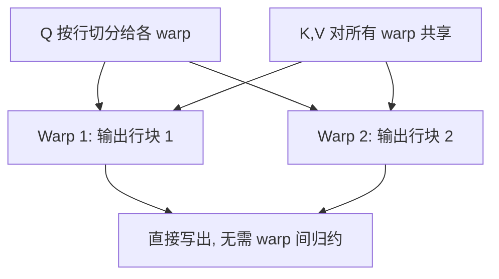

<!-- 这是 PaperMind 的示例输出（illustrative sample），用于展示报告形态。
     运行 `papermind analyze https://arxiv.org/abs/2307.08691 --format md` 可生成你自己的版本。 -->

# FlashAttention-2: Faster Attention with Better Parallelism and Work Partitioning

**Authors:** Tri Dao  •  **Year:** 2023  •  **arXiv:** [2307.08691](https://arxiv.org/abs/2307.08691)  •  [PDF](https://arxiv.org/pdf/2307.08691.pdf)

## 🎯 贡献与创新点

**核心贡献:** 在 FlashAttention 的 IO 感知思想之上，重新设计算法的并行方式与 warp 间的工作划分，使精确（非近似）注意力在 GPU 上的实际吞吐再提升约 2×，达到 A100 理论 FLOPs 利用率的 50–73%。

**新颖之处:** FlashAttention-1 受限于线程块内 warp 之间的同步与共享内存读写；本文 (1) 减少非矩阵乘 (non-matmul) 的 FLOPs，(2) 把注意力计算沿序列长度维并行化（而不仅是 batch×head），(3) 在一个线程块内重新划分 warp 的工作，避免共享内存往返。

**解决的问题:** 之前精确注意力的实现要么显存随序列长度平方增长，要么 GPU 占用率低、无法在长序列下吃满算力；FlashAttention-2 同时保持 O(N) 显存与高占用率。

> **原文出处:**
> - [Abstract (p.1)](https://arxiv.org/pdf/2307.08691.pdf#page=1): "...we propose FlashAttention-2, with better work partitioning... reaching 50-73% of the theoretical maximum FLOPs/s on A100."
> - [Section 3 (p.4)](https://arxiv.org/pdf/2307.08691.pdf#page=4): 描述了三项算法改动。

## 🔬 技术细节解释

### 1. Warp 间工作划分 (Work Partitioning)  `🔴 high`

FlashAttention-1 把 K、V 切给一个线程块内的不同 warp，每个 warp 算出部分结果后还要把中间值写回共享内存、再彼此读取做归约。FlashAttention-2 改为切分 Q：每个 warp 负责输出的不同行，K、V 对所有 warp 共享。这样每个 warp 独立算出自己那部分输出，几乎不需要 warp 间通信与共享内存往返。

> 💡 **类比:** 与其让四个厨师各炒半道菜再拼盘（要反复交接），不如一人负责一整道菜——交接成本几乎消失。

📍 出处: [Section 3.2 (p.6)](https://arxiv.org/pdf/2307.08691.pdf#page=6)


*AI 生成示意图：FlashAttention-2 的 warp 工作划分（切 Q 而非切 KV）*

### 2. 减少 non-matmul FLOPs  `🟡 mid`

GPU 的 Tensor Core 对矩阵乘 (matmul) 极快，但 softmax 里的缩放、指数、归一化等逐元素操作走的是普通 ALU，单位 FLOP 慢一个数量级。FlashAttention-2 把在线 softmax 的重缩放推迟到块循环结束时只做一次，减少了每步都要乘的归一化因子，从而显著降低昂贵的非矩阵乘运算占比。

逐块更新的在线 softmax 统计量（行最大值 $m$、归一化和 $\ell$）：

$$
m_i=\max\!\big(m_{i-1},\,\text{rowmax}(S_i)\big),\quad
\ell_i=e^{\,m_{i-1}-m_i}\,\ell_{i-1}+\text{rowsum}\!\big(e^{\,S_i-m_i}\big)
$$

> 💡 **类比:** 记账时不必每记一笔就换算一次汇率，最后统一换算一次即可，省下大量重复计算。

📍 出处: [Section 3.1 (p.5)](https://arxiv.org/pdf/2307.08691.pdf#page=5)


*AI 生成示意图：延迟归一化以减少 non-matmul 运算*

### 3. 沿序列长度维并行  `🟡 mid`

当 batch×head 数量较少（如长上下文、单条长序列推理）时，仅按 batch×head 并行会让大量 SM 闲置。FlashAttention-2 额外沿序列长度（query 块）维度划分线程块，让长序列也能填满 GPU 的所有流多处理器 (SM)。

> 💡 **类比:** 只有 2 桌客人却开了 100 个灶台，把每桌的菜再拆给多个灶台一起做，灶台就不闲置了。

📍 出处: [Section 3.2 (p.6)](https://arxiv.org/pdf/2307.08691.pdf#page=6)

## 🔗 知识关联

| 概念 | 相关论文 | 关系 |
| --- | --- | --- |
| FlashAttention (IO-aware attention) | [Dao et al. 2022](https://arxiv.org/abs/2205.14135) | 直接前作，本文在其基础上优化并行与工作划分 |
| Self-Attention / Transformer | [Vaswani et al. 2017](https://arxiv.org/abs/1706.03762) | 被加速的原始注意力机制 |
| Online softmax | Milakov & Gimelshein 2018 | tiling 中分块计算 softmax 的数值稳定基础 |
| Multi-Query / Grouped-Query Attention | [Shazeer 2019](https://arxiv.org/abs/1911.02150) | 同样面向注意力的效率优化，可与之叠加 |

## 🛠️ 复现指南

- **官方代码:** [https://github.com/Dao-AILab/flash-attention](https://github.com/Dao-AILab/flash-attention) (`v2.0.0`)
- **环境要求:** CUDA >= 11.6, PyTorch >= 1.12, Linux, Ampere/Ada/Hopper 架构 (sm80+)
- **推荐硬件:** A100 / H100（消费级需 sm80+，如 RTX 3090/4090）
- **关键超参数:** `head_dim<=256`, `causal=True/False`, `dropout_p`, `softmax_scale`

### 环境配置步骤

**1. 确认 CUDA 与 GPU 架构**

确认 GPU 计算能力 >= 8.0 且本机 CUDA 与 PyTorch 的 CUDA 版本一致。

```bash
nvcc --version && python -c "import torch; print(torch.version.cuda, torch.cuda.get_device_capability())"
```

**2. 安装 PyTorch（匹配 CUDA 版本）**

```bash
pip install torch --index-url https://download.pytorch.org/whl/cu118
```

**3. 安装 flash-attn（预编译 wheel 优先）**

源码编译耗时较长，建议先尝试官方预编译 wheel。

```bash
pip install flash-attn --no-build-isolation
```

**4. 验证安装**

```bash
python -c "import flash_attn; from flash_attn import flash_attn_func; print(flash_attn.__version__)"
```

### 性能基准

| 设置 | Baseline | 结果 | 加速 | 显存 |
| --- | --- | --- | --- | --- |
| seq_len=2k, A100, fwd | FlashAttention-1 | — | ~2.0x | O(N)，与 FA1 同 |
| seq_len=8k, A100, fwd+bwd | FlashAttention-1 | — | ~1.7–2.0x | O(N) |
| A100 FLOPs 利用率 | ~25–40% (FA1) | 50–73% | — | — |

### 数据集

- **OpenWebText / The Pile** — GPT 风格语言模型预训练基准 — 见 [The Pile](https://pile.eleuther.ai/)
- **Long-Range Arena** — 长序列能力评测 — [arxiv.org/abs/2011.04006](https://arxiv.org/abs/2011.04006)

### 常见报错与解决

- **报错:** `RuntimeError: FlashAttention only supports fp16 and bf16 data type`
  - 原因: 输入张量是 fp32，FlashAttention 仅支持半精度。
  - 修复: `q, k, v = (t.half() for t in (q, k, v))`
- **报错:** `FlashAttention is only supported on GPUs with compute capability >= 8.0`
  - 原因: 显卡架构低于 Ampere（如 V100/sm70）。
  - 修复: 换用 sm80+ 显卡，或回退到 PyTorch SDPA 的 math/mem-efficient 后端。
- **报错:** 编译卡住或 OOM during build
  - 原因: 源码编译占用大量内存与时间。
  - 修复: `MAX_JOBS=4 pip install flash-attn --no-build-isolation`

### ⚠️ 坑点提示

- 源码编译约需 5–15 分钟甚至更久，期间无输出属正常现象；优先用预编译 wheel。
- `head_dim` 必须 <= 256，否则不支持；MQA/GQA 需用对应的接口。
- 反向传播同样要求 fp16/bf16；混精训练时注意 autocast 的覆盖范围。

---
*Generated by [PaperMind](https://github.com/Wenhao-Hua/papermind).*
