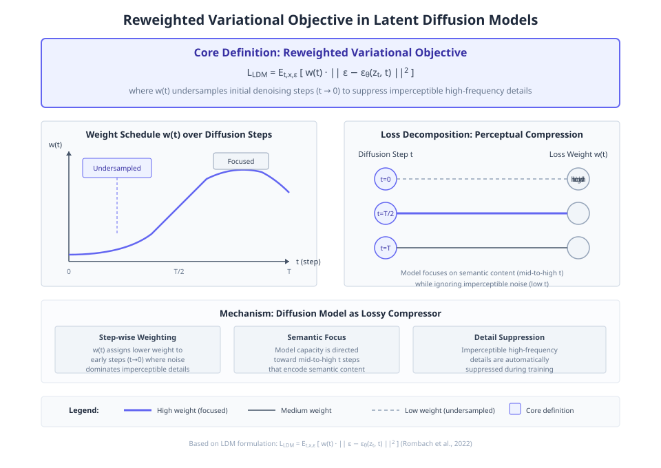
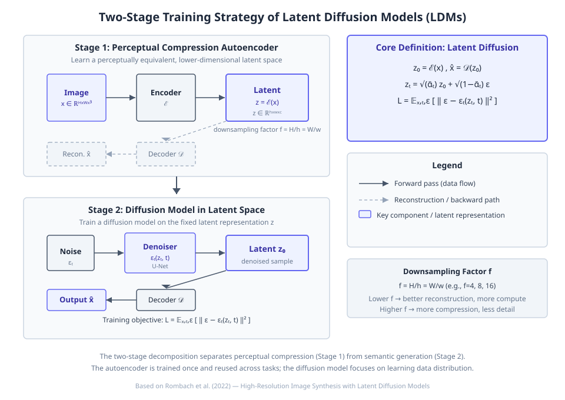
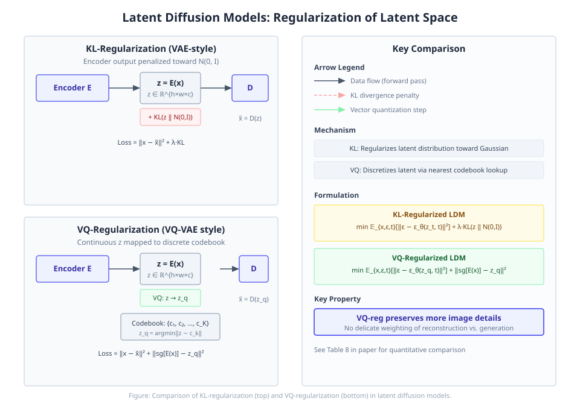

# High-Resolution Image Synthesis with Latent Diffusion Models

**Authors:** Robin Rombach, Andreas Blattmann, Dominik Lorenz, Patrick Esser, Björn Ommer  •  **Year:** 2021  •  **arXiv:** [2112.10752](https://arxiv.org/abs/2112.10752)  •  [PDF](https://arxiv.org/pdf/2112.10752.pdf)

- [🎯 贡献与创新点](#contributions)
- [🔬 技术细节解释](#technical)
- [🔗 知识关联](#connections)
- [🛠️ 复现指南](#reproduction)

<a id="contributions"></a>

## 🎯 贡献与创新点

**核心贡献:** 

**新颖之处:** 

**解决的问题:** 

<a id="technical"></a>

## 🔬 技术细节解释

### 1. Cross-Attention Conditioning Mechanism  `🔴 high`

将不同模态的条件输入 $y$（如文本、边界框）通过领域特定编码器 $\tau_\theta$ 投影为中间表示 $\tau_\theta(y) \in \mathbb{R}^{M \times d_\tau}$，然后通过多个交叉注意力层注入到 UNet 中间特征 $\phi_i(z_t)$ 中。每个交叉注意力层计算 $\text{Attention}(Q,K,V) = \text{softmax}(QK^\top/\sqrt{d})V$，其中 $Q$ 来自 UNet 特征，$K,V$ 来自条件投影。这样模型可以一个框架支持多种条件方式，且无需重训练。

$$
\text{Attention}(Q,K,V)=\text{softmax}(\frac{QK^\top}{\sqrt{d}})V,\ Q=W_Q^{(i)}\cdot\phi_i(z_t),\ K=W_K^{(i)}\cdot\tau_\theta(y),\ V=W_V^{(i)}\cdot\tau_\theta(y)
$$

> 💡 **类比:** 好比在翻译句子时，解码器（UNet）生成图像，而源语言（条件）通过一个翻译器（编码器）转化为“上下文表示”，解码器每步都参考这个表示来生成更符合要求的图像。

📍 出处: [3.3 (p.6)](https://arxiv.org/pdf/2112.10752.pdf#page=6)


*教学示意图：Cross-Attention Conditioning Mechanism（教学示意图）*

> **读图**：交叉注意力机制将多种条件注入潜扩散模型
>
> - 条件编码器将文本/边界框等投影为M×dτ矩阵
> - 交叉注意力层用UNet特征作Q，条件投影作K,V
> - 注意力权重最大映射高亮显示条件与特征的对应
>
> **关键**：一个模型无需重训练即可处理多种条件输入

### 2. Latent Diffusion Model Training Objective  `🔴 high`

在预训练自编码器的潜在空间中训练扩散模型，学习去噪函数 $\epsilon_\theta(z_t, t)$ 以重建被高斯噪声污染的潜在变量 $z_t$。优化目标简化为 $L_{\text{LDM}} = \mathbb{E}_{E(x),\epsilon\sim\mathcal{N}(0,1),t}\big[\|\epsilon - \epsilon_\theta(z_t, t)\|_2^2\big]$，其中 $z_t$ 由正向扩散过程从编码特征 $E(x)$ 生成。这大幅减少了高分辨率图像训练的计算量。

$$
L_{\text{LDM}} := \mathbb{E}_{E(x),\epsilon\sim\mathcal{N}(0,1),t}\big[\|\epsilon - \epsilon_\theta(z_t, t)\|_2^2\big]
$$

> 💡 **类比:** 类似于先让一个画家（自编码器）把复杂的街景画成简笔画（低维潜在），再教另一个画家（扩散模型）在简笔画上练习去噪与创作，最后将简笔画还原成精细油画。

📍 出处: [3.2 (p.4)](https://arxiv.org/pdf/2112.10752.pdf#page=4)


*教学示意图：Latent Diffusion Model Training Objective（教学示意图）*

> **读图**：潜在扩散模型训练目标：学习去噪函数重建潜在变量。
>
> - E(x)编码图像为潜在表示z。
> - 正向扩散从z生成噪声潜在zt。
> - 去噪器εθ从zt预测噪声ε。
> - 损失L_LDM为预测与真实噪声的MSE。
>
> **关键**：在潜在空间训练扩散模型，降低计算成本。

### 3. Downsampling Factor Trade‑off in Perceptual Compression  `🟡 mid`

自编码器将 $H\times W\times 3$ 的输入图像编码为 $h\times w\times c$ 的潜在表示，下采样因子 $f = H/h = W/w$，选取 $f=2^m$。较大的 $f$ 更压缩，训练更快，但细节保留较差；较小的 $f$ 细节好但计算消耗大。研究发现 $f=4$ 或 $f=8$ 在降低计算复杂度和保留视觉保真度之间达到接近最优的平衡。

> 💡 **类比:** 像给一张高清照片制作缩略图：缩略图太小（f 大）虽省内存，但放大后模糊；太大（f 小）接近原图，处理耗时；合适大小才能既快速浏览又看清内容。

📍 出处: [4.1 (p.5)](https://arxiv.org/pdf/2112.10752.pdf#page=5)


*Figure 6. Analyzing the training of class-conditional LDMs with different downsampling factors f over 2M train steps on the Im- ageNet dataset. Pixel-based LDM-1 requires substantially larger train times compared to models with larger downsampling factors (LDM-{4-16}). Too much perceptual compression as in LDM-32 limits the overall sample quality. All models are trained on a sin- gle NVIDIA A100 w (论文原图)*

### 4. Convolutional Sampling for High‑Resolution Synthesis  `🟡 mid`

在密集条件任务（如超分辨率、修复）中，模型可以在潜在空间上以卷积方式滑动应用，每次处理一个局部块，然后拼接生成远大于训练尺寸的图像。由于潜在空间已压缩，这种方式可高效合成 $\sim 1024^2$ 像素的大图，并保持全局一致性。

> 💡 **类比:** 就像用一台只能打印 A4 的打印机输出海报，将图像分割为多个重叠的 A4 块逐块打印，再拼接复原，因为潜在表示的压缩特性，拼接处自然无痕。

📍 出处: [4.3.2 (p.7)](https://arxiv.org/pdf/2112.10752.pdf#page=7)


*Figure 12. Convolutional samples from the semantic landscapes model as in Sec. 4.3.2, finetuned on 5122 images. (论文原图)*

### 5. Generalized Super‑Resolution via Diverse Image Degradation (LDM‑BSR)  `🟢 low`

标准的超分辨模型仅训练于双三次下采样的低清图像，对真实世界复杂退化泛化差。LDM‑BSR 在训练时采用 BSR 退化流水线，随机施加 JPEG 压缩、噪声、模糊、插值等方式，使模型学会处理多种退化形式，从而能对任意输入（如网络图片、合成图像）生成清晰的高分辨率结果。

> 💡 **类比:** 平时只练习从标准低清照片恢复细节的学生，遇到带噪点、压缩痕迹的老照片就手足无措；若训练时故意用各种“损坏”方式模拟真实世界低清图像，学生就能应对各种旧照片修复任务。

📍 出处: [D.6.1 (p.22)](https://arxiv.org/pdf/2112.10752.pdf#page=22)


*Figure 18. LDM-BSR generalizes to arbitrary inputs and can be used as a general-purpose upsampler, upscaling samples from a class- conditional LDM (image cf. Fig. 4) to 10242 resolution. In contrast, using a fixed degradation process (see Sec. 4.4) hinders generalization. (论文原图)*

### 6. KL‑Regularization vs. VQ‑Regularization  `🟢 low`

为防止潜在空间方差过高，论文比较了两种正则化：KL‑reg 在编码输出上施加轻微惩罚使其靠近标准正态分布，类似 VAE；VQ‑reg 则在解码器中引入向量量化层，将连续表示映射到离散码本。实验表明 VQ‑reg 能更好地保留图像细节（如表 8 所示），且无需精细平衡重建与生成能力。

> 💡 **类比:** 好比整理一个杂乱的工具箱：KL‑reg 是规定每个工具放回大致位置，不过度突出；VQ‑reg 是将工具固定到预定槽位中，归还时对齐更精准，用起来更顺手。

📍 出处: [3.1 (p.4)](https://arxiv.org/pdf/2112.10752.pdf#page=4)


*教学示意图：KL‑Regularization vs. VQ‑Regularization（教学示意图）*

> **读图**：比较KL与VQ正则化在潜扩散模型中的机制与效果。
>
> - KL正则化：编码器输出向N(0,I)惩罚，类似VAE。
> - VQ正则化：连续潜变量映射到离散码本。
> - 损失函数：KL含λ·KL项，VQ含量化损失项。
> - 关键性质：VQ保留更多图像细节，无需精细权衡。
>
> **关键**：VQ正则化优于KL，细节保留更好，见表8。

<a id="connections"></a>

## 🔗 知识关联

| 概念 | 相关论文 | 关系 |
| --- | --- | --- |
| 去噪扩散概率模型（Denoising Diffusion Probabilistic Models） | [Ho et al. 2020](https://arxiv.org/abs/2006.11239) | 改进：将扩散模型的训练与推理从像素空间迁移到感知压缩的潜在空间，显著降低计算消耗。 |
| 感知图像压缩自编码器 | [Esser et al. 2020](https://arxiv.org/abs/2012.09841) | 继承：采用基于VQGAN的编码器-解码器结构，并研究KL-reg与VQ-reg两种正则化方式对重建质量的影响。 |
| 交叉注意力机制（Cross-Attention） | [Vaswani et al. 2017](https://arxiv.org/abs/1706.03762) | 应用/改进：将交叉注意力引入扩散模型的UNet骨干网络，实现文本、布局等多模态条件的灵活生成。 |
| 扩散模型在图像生成中的性能基准（ADM） | [Dhariwal & Nichol 2021](https://arxiv.org/abs/2105.05233) | 对比：所提潜在扩散模型在ImageNet类别条件生成等任务上达到更低的FID，同时大幅降低推理成本。 |
| 感知相似度损失（Perceptual Loss） | [Dosovitskiy & Brox 2016](https://arxiv.org/abs/1602.02668) | 继承：在自编码器训练中引入基于深层网络的感知损失，以提升压缩图像的视觉保真度。 |
| Patch-GAN对抗损失 | [Isola et al. 2017](https://arxiv.org/abs/1611.07004) | 继承：采用基于图像块的对抗训练策略，增强自编码器重建的局部真实感。 |

<a id="reproduction"></a>

## 🛠️ 复现指南

- **代码仓库（论文原文链接 · ★14053）:** [https://github.com/CompVis/latent-diffusion](https://github.com/CompVis/latent-diffusion)
- **安装 / 运行（取自该仓库，非模型生成）:**
  - `conda env create -f environment.yaml`
  - `python scripts/knn2img.py  --prompt "a happy bear reading a newspaper, oil on canvas"`
  - `python scripts/train_searcher.py`
  - `python scripts/knn2img.py  --prompt "a happy pineapple" --use_neighbors --knn <number_of_neighbors>`
  - `python scripts/txt2img.py --prompt "a virus monster is playing guitar, oil on canvas" --ddim_eta 0.0 --n_samples 4 --n_iter 4 --scale 5.0  --ddim_steps 50`
  - `python scripts/txt2img.py --prompt "a sunset behind a mountain range, vector image" --ddim_eta 1.0 --n_samples 1 --n_iter 1 --H 384 --W 1024 --scale 5.0`
  - `python scripts/inpaint.py --indir data/inpainting_examples/ --outdir outputs/inpainting_results`
- **环境要求:** Python >= 3.8, PyTorch >= 1.10, CUDA >= 11.3
- **推荐硬件:** NVIDIA A100 (80GB) or V100 (32GB)
- **关键超参数:** `f=4 or 8 (downsampling factor)`, `diffusion_steps=1000`, `noise_schedule=linear`, `learning_rate=1e-4`, `batch_size=64 (varies per task)`, `DDIM_steps=100-250`

### 环境配置步骤

**1. 克隆仓库并创建环境**

克隆官方代码并创建conda环境

```bash
git clone https://github.com/CompVis/latent-diffusion.git && cd latent-diffusion && conda create -n ldm python=3.8 && conda activate ldm
```

**2. 安装PyTorch**

根据CUDA版本安装PyTorch

```bash
pip install torch==1.12.1+cu113 torchvision==0.13.1+cu113 --extra-index-url https://download.pytorch.org/whl/cu113
```

**3. 安装依赖**

安装其余Python依赖

```bash
pip install -r requirements.txt && pip install -e .
```

**4. 下载预训练自动编码器**

下载用于潜在空间压缩的预训练自动编码器权重

```bash
mkdir -p models/autoencoder && wget -O models/autoencoder/autoencoder_kl_64x64x3.ckpt https://ommer-lab.com/files/latent-diffusion/autoencoder_kl_64x64x3.ckpt
```

**5. 准备数据集**

下载并调整数据集目录结构，如ImageNet、CelebA-HQ等（具体参见README）

```bash
# 示例：下载CelebA-HQ并放置于 data/celebahq
```

### 性能基准

| 设置 | Baseline | 结果 | 加速 | 显存 |
| --- | --- | --- | --- | --- |
| Class-conditional ImageNet 256x256 | ADM-G: FID 4.59, 608M params, 250 DDIM steps | LDM-4-G: FID 3.60, 400M params, 250 DDIM steps | ~1.5x fewer params | - |
| ImageNet 256x256 Super-Resolution (×4) | SR3: FID 5.2, PSNR 26.4 | LDM-4: FID 2.8, PSNR 24.4 | - | Significantly faster sampling than pixel-space DM |
| Unconditional CelebA-HQ 256x256 | StyleGAN2: FID 5.0 (approx.) | LDM-4: FID 5.11 (from Tab. 1) | Training on single GPU (A100) | - |

### 数据集

- **[ImageNet ILSVRC 2012](https://image-net.org/challenges/LSVRC/2012/)** — Class-conditional generation, super-resolution
- **[CelebA-HQ](https://github.com/tkarras/progressive_growing_of_gans)** — Unconditional face generation
- **[FFHQ](https://github.com/NVlabs/ffhq-dataset)** — Unconditional face generation
- **[LSUN (churches, bedrooms)](https://www.yf.io/p/lsun)** — Unconditional scene generation
- **[MS-COCO 2017](https://cocodataset.org/)** — Text-to-image, layout-to-image
- **[OpenImages](https://storage.googleapis.com/openimages/web/index.html)** — Layout-to-image
- **[Places365](http://places2.csail.mit.edu/)** — Image inpainting
- **[LAION-400M](https://laion.ai/blog/laion-400-open-dataset/)** — Text-to-image training

### 常见报错与解决

- **报错:** `RuntimeError: CUDA out of memory`
  - 原因: 模型或batch size过大，超出显存
  - 修复: `减小batch size（如设置 `--batch_size 32`）或启用gradient checkpointing（`--use_checkpoint`）`
- **报错:** `ModuleNotFoundError: No module named 'taming'`
  - 原因: 依赖的taming-transformers未安装
  - 修复: `pip install taming-transformers==0.0.1 (或从源码安装: pip install git+https://github.com/CompVis/taming-transformers.git)`
- **报错:** `KeyError: 'ckpt_path' when loading autoencoder`
  - 原因: 配置文件与预训练模型不匹配或路径错误
  - 修复: `检查 configs/autoencoder/ 下的配置是否与下载的.ckpt对应，确保 `ckpt_path` 正确`
- **报错:** `Validation FID not improving / nan values`
  - 原因: 学习率过高或数据预处理问题
  - 修复: `降低学习率（如1e-5），并检查图像是否归一化到[-1,1]且无NaN输入`

### ⚠️ 坑点提示

- 训练前必须先下载对应自动编码器的预训练权重，编码器始终保持冻结状态
- 下采样因子f决定潜在空间大小，例如f=4时256×256图像变为64×64×3，需确保UNet的通道和分辨率匹配
- 扩散模型默认使用1000步线性噪声调度，采样时可以用更少的DDIM步（如100步）大幅加速
- 条件生成任务（文本、布局）需使用交叉注意力机制，对应的τ_θ编码器需要与UNet联合训练或预训练
- 评估FID/IS时需使用与参考方法一致的预处理（如torch-fidelity包），不同实现可能导致数值偏差


---
*Generated by [PaperMind](https://github.com/Wenhao-Hua/papermind).*