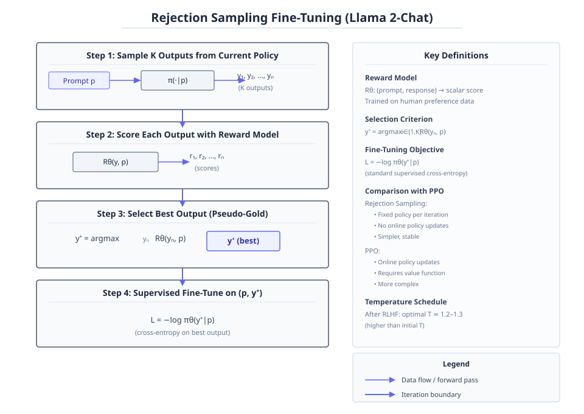

<!-- PaperMind 示例输出（illustrative sample）。运行 `papermind analyze https://arxiv.org/abs/2307.09288` 可生成你自己的版本。-->

# Llama 2: Open Foundation and Fine-Tuned Chat Models

**Authors:** Hugo Touvron, Louis Martin, Kevin Stone, Peter Albert, Amjad Almahairi, Yasmine Babaei et al.  •  **Year:** 2023  •  **arXiv:** [2307.09288](https://arxiv.org/abs/2307.09288)  •  [PDF](https://arxiv.org/pdf/2307.09288.pdf)

- [🎯 贡献与创新点](#contributions)
- [🔬 技术细节解释](#technical)
- [🔗 知识关联](#connections)
- [🛠️ 复现指南](#reproduction)

<a id="contributions"></a>

## 🎯 贡献与创新点

**核心贡献:** Llama 2, including Llama 2-Chat, is released as an open-source set of models that achieve competitive performance with closed-source models through careful pretraining upgrades and iterative fine-tuning with RLHF and safety alignment.

**新颖之处:** Compared to Llama 1, it uses 40% more training data, doubled context length, grouped-query attention, and a novel iterative RLHF process combining rejection sampling and PPO, along with extensive safety fine-tuning and context distillation.

**解决的问题:** It addresses the performance gap between open-source and closed-source chat models, particularly in helpfulness and safety, demonstrating that open models can be a viable substitute for proprietary systems.

> **原文出处:**
> - [Frontmatter (p.1)](https://arxiv.org/pdf/2307.09288.pdf#page=1): In this work, we develop and release Llama 2, a collection of pretrained and fine-tuned large language models (LLMs) ranging in scale from 7 billion to 70 billion parameters. Our fine-tuned LLMs, called Llama 2-Chat, are optimized for dialogue use cases. Our models outperform open-source chat models on most benchmarks we tested, and based on our human evaluations for helpfulness and safety, may be a suitable substitute for closed-source models.
> - [1 Introduction (p.4)](https://arxiv.org/pdf/2307.09288.pdf#page=4): We are releasing the following models to the general public for research and commercial use: 1. Llama 2, an updated version of Llama 1, trained on a new mix of publicly available data. We also increased the size of the pretraining corpus by 40%, doubled the context length of the model, and adopted grouped-query attention ... 2. Llama 2-Chat, a fine-tuned version of Llama 2 that is optimized for dialogue use cases.
> - [1 Introduction (p.4)](https://arxiv.org/pdf/2307.09288.pdf#page=4): Figure 4: Training of Llama 2-Chat: This process begins with the pretraining of Llama 2 using publicly available online sources. Following this, we create an initial version of Llama 2-Chat through the application of supervised fine-tuning. Subsequently, the model is iteratively refined using Reinforcement Learning with Human Feedback (RLHF) methodologies, specifically through rejection sampling and Proximal Policy Optimization (PPO).
> - [Frontmatter (p.1)](https://arxiv.org/pdf/2307.09288.pdf#page=1): We provide a detailed description of our approach to fine-tuning and safety improvements of Llama 2-Chat in order to enable the community to build on our work and contribute to the responsible development of LLMs.

<a id="technical"></a>

## 🔬 技术细节解释

### 1. 分段安全-帮助性奖励合成  `🔴 high`

在RLHF的PPO阶段，奖励函数 $R_c(g|p)$ 根据提示是否被标注为不安全或安全评分低于0.15来动态切换：若是则使用安全奖励模型 $R_s$，否则使用帮助性奖励模型 $R_h$。然后对 $R_c$ 进行白化处理（先取logit再标准化）得到 $\tilde{R}_c$，使奖励分布稳定并与KL惩罚项平衡，最终奖励为 $\tilde{R}_c - \beta D_{KL}$。此设计确保对潜在不安全提示优先施加安全约束，同时避免过度惩罚无害提示。

$$
R_c(g | p) = \begin{cases} R_s(g | p) & \text{if } \text{is\_safety}(p) \text{ or } R_s(g | p) < 0.15 \\ R_h(g | p) & \text{otherwise} \end{cases}, \quad \tilde{R}_c(g | p) = \text{whiten}(\text{logit}(R_c(g | p)))
$$

> 💡 **类比:** 好比一个双评分系统：当检测到危险信号时启动安全考官严厉打分，平时则让帮助性考官打分，最后将所有分数归一化到同一量级，再减去一个“偏离原始路线”的罚分，就像给赛车手安上一个测速仪，一旦超速就切换严苛的裁判。

📍 出处: [Section 3.2.3 (p.14)](https://arxiv.org/pdf/2307.09288.pdf#page=14)


*教学示意图：分段安全-帮助性奖励合成（教学示意图）*

> **读图**：RLHF中根据提示安全性动态组合奖励并白化
>
> - Rc：根据提示安全性选择Rs或Rh的合成奖励
> - Whiten：对Rc取logit后标准化，稳定分布
> - Final reward：白化奖励减去KL散度惩罚项
> - Decision Flow：根据is_safety(p)或Rs<0.15选择RM
>
> **关键**：不安全提示优先用安全RM，否则用帮助性RM

### 2. PPO训练中的KL惩罚项  `🔴 high`

在RLHF的PPO阶段，优化目标为 $\arg\max_\pi \mathbb{E}[R(g|p)]$，其中最终奖励 $R(g|p) = \tilde{R}_c(g|p) - \beta D_{KL}(\pi_\theta(g|p) \parallel \pi_0(g|p))$。KL散度项惩罚当前策略 $\pi_\theta$ 与初始策略 $\pi_0$ 的偏离，系数 $\beta$ 控制惩罚强度。这防止模型为追逐高奖励而产生荒谬回答（奖励黑客），同时保持训练稳定，并通过调整 $\beta$ 适配不同模型尺寸。

$$
R(g | p) = \tilde{R}_c(g | p) - \beta D_{\text{KL}}(\pi_\theta(g | p) \parallel \pi_0(g | p))
$$

> 💡 **类比:** 就像训练一个演讲者：奖励他讲得精彩（高奖励），但若他完全改变个人风格去讨好观众，就扣分（KL惩罚），鼓励他在原有风格基础上改进，防止为了高分而变成另外一个人。

📍 出处: [Section 3.2.3 (p.14)](https://arxiv.org/pdf/2307.09288.pdf#page=14)


*教学示意图：PPO训练中的KL惩罚项（教学示意图）*

> **读图**：PPO训练中KL惩罚项防止奖励黑客并保持策略稳定。
>
> - 最终奖励R(g|p)=̃Rc - β DKL(πθ∥π0)
> - KL散度DKL惩罚πθ偏离初始策略π0
> - β控制惩罚强度，按模型尺寸调整
> - 无KL惩罚时模型可能输出乱码获高奖励
>
> **关键**：KL惩罚项平衡奖励优化与策略稳定性。

### 3. 拒绝采样微调  `🟡 mid`

对于给定提示，从当前模型采样 $K$ 个输出，用奖励模型对每个输出打分，选择得分最高的作为伪标准答案，然后用这个最佳答案对模型进行监督微调（类似SFT）。该方法相当于用奖励模型对生成空间做束搜索并蒸馏回模型，随着迭代，采样的最优温度会变化（如RLHF后最优温度变为1.2-1.3），需要重新调整。与PPO相比，它每次使用固定策略采样，不涉及在线策略更新，但同样能有效提升奖励。

> 💡 **类比:** 就像让学生做一题多解，老师从中选出最优解答当作范本，然后让学生重新学习这份范本；多次考试后，需要调整出题难度（温度），才能找出更好解法。

📍 出处: [Section 3.2.3 (p.13)](https://arxiv.org/pdf/2307.09288.pdf#page=13)


*教学示意图：拒绝采样微调（教学示意图）*

> **读图**：拒绝采样微调流程：采样、评分、选优、监督微调。
>
> - 从当前策略采样K个输出。
> - 用奖励模型对每个输出评分。
> - 选择得分最高的输出作为伪标准答案。
> - 对最佳输出进行监督微调（交叉熵损失）。
>
> **关键**：固定策略采样，选最佳输出微调，类似束搜索蒸馏。

### 4. 分组查询注意力（GQA）  `🟡 mid`

将多头注意力的查询头分成 $G$ 组，每组共享相同的键和值投影（$W^K$ 和 $W^V$），而查询投影 $W^Q$ 仍各自独立。这样在自回归解码时，可以减少键值缓存的内存占用，提升推理速度，尤其对70B等大模型效果显著。GQA在保持性能的同时，改善了微调时多头注意力的扩展性。

$$
\text{Attention}(Q_i, K_g, V_g) = \text{softmax}\left(\frac{Q_i K_g^\top}{\sqrt{d_k}}\right)V_g, \quad i \in \text{group } g
$$

> 💡 **类比:** 就像多个研究员（查询）共用一个资料库（键/值），而不是每人携带全套资料，既节省了存储空间，又能保持各自的研究视角。

📍 出处: [Section 2.2 (p.5)](https://arxiv.org/pdf/2307.09288.pdf#page=5)


*Figure 24 shows how inference speed changed for the 30B GQA and MQA ablation models compared to the MHA baseline, in an experiment using 8 x 80 GiB A100s with tensor parallelism. In these runs we simply duplicated the KV heads for MQA in all GPUs, so the KV cache size for MQA became equal to the GQA and the two variants behaved very similar (with MQA just having a slightly larger FFN dimension). (论文原图)*

### 5. 面向安全的上下文蒸馏  `🟢 low`

先用带有安全引导语（如“你是一个负责任的助手”）的前置提示对对抗性提示生成安全响应，然后去掉引导语，用原始对抗性提示和之前生成的安全响应对模型进行微调。这迫使模型将安全行为内化到无引导语的设定中，从而在无辅助提示时也能主动产生安全输出。该方法作为安全RLHF的初始步骤，可快速提升模型对困难对抗提示的抵抗力。

> 💡 **类比:** 就像教孩子礼貌：先给他看带敬语的对话范例，然后撤去范例，让他自己用平常语气说出同样礼貌的话，通过反复练习使其养成习惯。

📍 出处: [Section 4.2.4 (p.27)](https://arxiv.org/pdf/2307.09288.pdf#page=27)


*Figure 16: Context distillation analysis. Left: Distribution of safety RM scores from the base model, when adding a generic preprompt, and when adding a preprompt based on the risk category with tailored answer template. While a generic preprompt increases safety RM scores, a preprompt with tailored answer template helps even more. Right: Context distillation increases the RM score significantly f (论文原图)*

<a id="connections"></a>

## 🔗 知识关联

| 概念 | 相关论文 | 关系 |
| --- | --- | --- |
| Transformer architecture | [Vaswani et al. 2017](https://arxiv.org/abs/1706.03762) | 继承并改进，在标准Transformer基础上引入RMSNorm、SwiGLU、RoPE和GQA等组件 |
| Root Mean Square Layer Normalization (RMSNorm) | [Zhang and Sennrich 2019](https://arxiv.org/abs/1911.07467) | 继承，采用RMSNorm替代LayerNorm进行预归一化 |
| SwiGLU activation function | [Shazeer 2020](https://arxiv.org/abs/2002.05202) | 继承，使用SwiGLU激活函数替代标准ReLU/GELU |
| Rotary Position Embeddings (RoPE) | [Su et al. 2022](https://arxiv.org/abs/2104.09864) | 继承，采用RoPE作为位置编码方式 |
| Grouped-Query Attention (GQA) | [Ainslie et al. 2023](https://arxiv.org/abs/2305.13245) | 继承，引入GQA以提升大模型推理效率 |
| RLHF with reward modeling and PPO | [Stiennon et al. 2020](https://arxiv.org/abs/2009.01325) | 继承并改进，遵循其RL框架，使用reward模型估计人类偏好，并添加KL惩罚项以稳定训练 |

<a id="reproduction"></a>

## 🛠️ 复现指南

- **官方代码（已核实 · 论文原文链接 ✓官方 · ★59441）:** [https://github.com/facebookresearch/llama](https://github.com/facebookresearch/llama)
- **安装 / 运行（取自仓库）:**
  - `pip install -r requirements.txt`
  - `torchrun --nproc_per_node 1 example_chat_completion.py \`
  - `torchrun --nproc_per_node 1 example_text_completion.py \`
- **推荐硬件:** A100-80GB
- **关键超参数:** `global_batch_size=4M tokens (pretrain)`, `AdamW β1=0.9 β2=0.95 eps=1e-5`, `weight_decay=0.1`, `gradient_clipping=1.0`, `cosine_lr_schedule warmup=2000 decay_to_10% (pretrain)`, `SFT: lr=2e-5 batch_size=64 seq_len=4096 epochs=2`, `PPO: lr=1e-6 batch_size=512 minibatch=64 clip=0.2`, `PPO KL_penalty β=0.01 (7B/13B) / 0.005 (34B/70B)`, `vocab_size=32k`, `context_length=4096`, `grouped-query attention (GQA) for inference`

### 环境配置步骤

**1. 安装 PyTorch**

安装 PyTorch，版本需支持 CUDA，推荐 CUDA 11.8

```bash
pip install torch torchvision --index-url https://download.pytorch.org/whl/cu118
```

**2. 安装依赖库**

安装 transformers、datasets、accelerate、deepspeed、sentencepiece 等常用库

```bash
pip install transformers datasets accelerate deepspeed sentencepiece
```

**3. 准备预训练数据**

论文使用从公开来源混合的 2T token 语料。用户需自行准备或使用类似规模的数据集，如 RedPajama、The Pile 等。

**4. 配置分布式训练**

使用多 GPU 或多节点训练，可通过 accelerate 或 deepspeed 配置文件设置。对于 70B 模型，可能需要 ZeRO-3 优化。

### 数据集

- **MMLU** — 多任务语言理解基准
- **BBH** — BIG-Bench Hard 基准
- **GSM8K** — 数学推理基准
- **HumanEval** — 代码生成基准
- **TruthfulQA** — 真实性评估

### 常见报错与解决

- **报错:** `训练 70B 模型时 OOM`
  - 原因: 模型过大，单个 GPU 显存不足
  - 修复: `启用 gradient checkpointing 并配合 DeepSpeed ZeRO-3 或模型并行`
- **报错:** `RLHF 训练中 reward 不提升甚至下降`
  - 原因: 奖励模型与当前策略分布不匹配
  - 修复: `参照论文 Section 3.2.3，使用新收集的偏好数据迭代更新奖励模型`

### ⚠️ 坑点提示

- 温度参数对拒绝采样的效果影响显著，RLHF 不同阶段可能需要重新调整温度（参见 Figure 8）
- 安全数据比例增加可能导致错误拒绝（false refusal）率上升，需平衡 helpfulness 与 safety
- GAtt（Ghost Attention）能有效提升多轮对话的一致性，建议在微调时应用
- 使用 context distillation 可快速提升安全性，但可能引入模糊回答或错误拒绝（参见 Table 40）


---
*Generated by [PaperMind](https://github.com/Wenhao-Hua/papermind).*