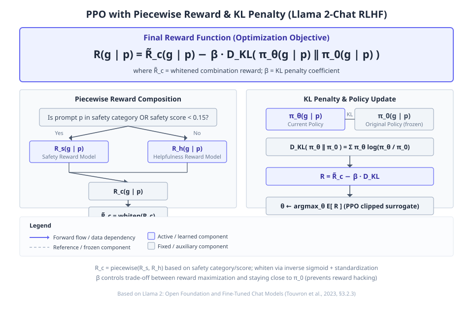
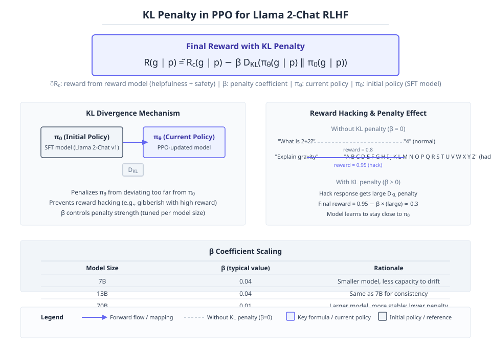

# Llama 2: Open Foundation and Fine-Tuned Chat Models

**Authors:** Hugo Touvron, Louis Martin, Kevin Stone, Peter Albert, Amjad Almahairi, Yasmine Babaei et al.  •  **Year:** 2023  •  **arXiv:** [2307.09288](https://arxiv.org/abs/2307.09288)  •  [PDF](https://arxiv.org/pdf/2307.09288.pdf)

- [🎯 贡献与创新点](#contributions)
- [🔬 技术细节解释](#technical)
- [🔗 知识关联](#connections)
- [🛠️ 复现指南](#reproduction)

<a id="contributions"></a>

## 🎯 贡献与创新点

**核心贡献:** 发布 Llama 2 系列预训练与对话微调模型，并详细公开其微调与安全改进方法，在性能上超越现有开源模型且可与闭源模型媲美。

**新颖之处:** 首次开源达到闭源产品级对话性能与安全水平的模型，并透明地共享了包含 RLHF 和安全微调的完整方法。

**解决的问题:** 先前开源大模型无法替代闭源产品模型，主要因安全微调方法不透明且成本高昂，阻碍了社区对 AI 对齐的研究。

> **原文出处:**
> - [Frontmatter (p.1)](https://arxiv.org/pdf/2307.09288.pdf#page=1): In this work, we develop and release Llama 2, a collection of pretrained and fine-tuned large language models (LLMs) ranging in scale from 7 billion to 70 billion parameters. Our fine-tuned LLMs, called Llama 2-Chat, are optimized for dialogue use cases. Our models outperform open-source chat models on most benchmarks we tested, and based on our human evaluations for helpfulness and safety, may be a suitable substitute for closed-source models. We provide a detailed description of our approach to fine-tuning and safety improvements of Llama 2-Chat in order to enable the community to build on our work and contribute to the responsible development of LLMs.
> - [1 Introduction (p.3)](https://arxiv.org/pdf/2307.09288.pdf#page=3): These closed product LLMs are heavily fine-tuned to align with human preferences, which greatly enhances their usability and safety. This step can require significant costs in compute and human annotation, and is often not transparent or easily reproducible, limiting progress within the community to advance AI alignment research.
> - [1 Introduction (p.3)](https://arxiv.org/pdf/2307.09288.pdf#page=3): We have taken measures to increase the safety of these models, using safety-specific data annotation and tuning, as well as conducting red-teaming and employing iterative evaluations. Additionally, this paper contributes a thorough description of our fine-tuning methodology and approach to improving LLM safety.

<a id="technical"></a>

## 🔬 技术细节解释

### 1. PPO with piecewise reward and KL penalty  `🔴 high`

在RLHF中，PPO阶段优化策略$\pi_\theta$以最大化期望奖励，同时惩罚与原始策略$\pi_0$的KL散度。最终奖励函数为$R(g|p)=\tilde{R}_c(g|p)-\beta D_{KL}(\pi_\theta(g|p)\parallel\pi_0(g|p))$，其中$\tilde{R}_c$是经过白化处理的组合奖励模型。组合奖励$R_c$根据提示是否属于安全类别或安全得分$<0.15$，分别使用安全奖励模型$R_s$或帮助性奖励模型$R_h$。白化奖励使用的 logit 反向 sigmoid 和白化处理是为了增加训练稳定性和与 KL 惩罚项平衡。

$$
R(g | p) = \tilde{R}_c(g | p) - \beta D_{KL}(\pi_\theta(g | p) \parallel \pi_0(g | p))
$$

> 💡 **类比:** 好比训练一只狗表演时，不仅奖励正确的动作（奖励模型打分），还要防止它完全忘记基础服从（原始策略），所以每次给零食要扣除它偏离训练初期表现的“罚款”$\beta$倍KL散度。

📍 出处: [Section 3.2.3 (p.13)](https://arxiv.org/pdf/2307.09288.pdf#page=13)


*教学示意图：PPO with piecewise reward and KL penalty（教学示意图）*

> **读图**：PPO优化策略最大化奖励并惩罚KL散度
>
> - 奖励函数：白化组合奖励减β倍KL散度
> - 分段奖励：安全类别或得分<0.15用R_s，否则R_h
> - 白化处理：logit逆sigmoid后z-score归一化
> - PPO更新：梯度含优势函数A，裁剪比率至[1-ε,1+ε]
>
> **关键**：关注奖励函数分段与白化，平衡KL惩罚

### 2. Iterative Fine-tuning with Rejection Sampling and PPO  `🔴 high`

迭代微调依次训练多个RLHF版本（V1至V5），先用拒绝采样：从最新模型为每个提示采样$K$个回答，用奖励模型选最高分回答作为金标准进行梯度更新；之后叠加PPO进一步优化。拒绝采样仅用于最大的70B模型，小模型蒸馏其拒绝采样数据。早期版本仅从前一次迭代的采样中选择回答，但发现能力退化，后期改为纳入所有先前迭代的最佳样本。温度参数需随模型更新动态调整，RLHF会重新标定温度，对于70B模型采样10-100个输出时最优温度$T\in[1.2,1.3]$。

> 💡 **类比:** 像学生反复修改文章：先对同一题目写多篇草稿（拒绝采样），老师挑最好的一篇来学习（梯度更新）；之后再用强化学习微调表达方式（PPO），而且每次用之前累积的好文章一起参考，避免只学最新风格导致退步。

📍 出处: [Section 3.2.3 (p.13)](https://arxiv.org/pdf/2307.09288.pdf#page=13)


*Figure 4: Training of Llama 2-Chat: This process begins with the pretraining of Llama 2 using publicly available online sources. Following this, we create an initial version of Llama 2-Chat through the application of supervised fine-tuning. Subsequently, the model is iteratively refined using Reinforcement Learning with Human Feedback (RLHF) methodologies, specifically through rejection sampling a (论文原图)*

### 3. Ghost Attention (GAtt) for multi-turn consistency  `🟡 mid`

在多轮对话中，初始指令（如“简洁回答”）容易被模型遗忘。GAtt方法通过修改微调数据：将本该贯穿全对话的指令拼接到每一条用户消息前面，但在训练时对指令部分的token损失设为零掩盖，使得模型学会在每一轮都遵从指令。推理时只需在第一轮提供指令，后续轮次模型能够保持约束。该方法受上下文蒸馏启发。

> 💡 **类比:** 像在智能助手对话首轮设置了一个全局“咒语”，之后助手每轮回答前都会自动在脑海里重复该咒语，从而持续遵守指令，但训练时这个咒语并不作为预测目标，只是暗示上下文。

📍 出处: [Section 3.3 (p.16)](https://arxiv.org/pdf/2307.09288.pdf#page=16)


*Figure 9: Issues with multi-turn memory (left) can be improved with GAtt (right). (论文原图)*

### 4. Safety RLHF with reward model mixture and false refusal analysis  `🟡 mid`

安全RLHF先收集对抗性提示的人类偏好数据训练安全奖励模型，然后与帮助性奖励模型组合成$R_c$：若提示为安全类别或安全奖励$R_s<0.15$，使用$R_s$，否则使用帮助性$R_h$。阈值0.15在Meta安全测试集上对应精确率0.89、召回率0.55。通过调节安全数据比例进行实验，发现安全性能提升的同时帮助性得分几乎不变，但定性观察到更保守的回答，故训练拒绝分类器量化误拒率，发现在帮助性测试集上误拒率很低（约0.05%），但在故意包含敏感词的边界测试集上较高。

$$
R_c(g | p) = \begin{cases} R_s(g | p) & \text{if } \text{is\_safety}(p) \text{ or } R_s(g | p) < 0.15 \\ R_h(g | p) & \text{otherwise} \end{cases}
$$

> 💡 **类比:** 好比给一个助手同时配备两位导师：一位关注任务完成质量（帮助性），一位监督合规性（安全）。当任务有风险或安全导师打出低分时，采纳安全导师的意见；调整安全导师的参与度可看到助手越安全但可能越谨慎，通过测试误拒率来平衡。

📍 出处: [Section 4.2.3 (p.24)](https://arxiv.org/pdf/2307.09288.pdf#page=24)


*教学示意图：Safety RLHF with reward model mixture and false refusal analysis（教学示意图）*

> **读图**：安全RLHF通过混合奖励模型和误拒分析提升安全性。
>
> - Rc：组合奖励函数，根据安全类别或阈值选择Rs或Rh。
> - 阈值0.15：在Meta安全测试集上精确率0.89、召回率0.55。
> - 误拒分析：训练拒绝分类器量化误拒率。
> - 安全数据比例实验：安全得分提升，帮助性得分不变。
>
> **关键**：安全数据比例增加使回答更保守，但帮助性几乎不变。

### 5. Safety context distillation with preprompts and answer templates  `🟡 mid`

通过给对抗性提示加上安全预提示（如“你是一个安全负责的助手”）生成更安全的回答，然后去除预提示，用原始对抗性提示和该安全回答微调模型，使模型学会直接对风险提示输出安全回复。预提示由模板自动生成，使用“responsible”“respectful”等形容词。还可以结合风险类别标注，使用专用回答模板进行定向蒸馏。该方法能快速提升模型对困难对抗性提示的安全行为，后续可进一步用RLHF增强。

> 💡 **类比:** 像教师先给出一道难题并附上安全作答的要点（预提示），学生参考后写出安全答案；之后教师只给原题，让学生模仿之前写出的答案。这样就教会学生一看到难题就自动产生安全思维。

📍 出处: [Section 4.2.4 (p.27)](https://arxiv.org/pdf/2307.09288.pdf#page=27)


*Figure 16: Context distillation analysis. Left: Distribution of safety RM scores from the base model, when adding a generic preprompt, and when adding a preprompt based on the risk category with tailored answer template. While a generic preprompt increases safety RM scores, a preprompt with tailored answer template helps even more. Right: Context distillation increases the RM score significantly f (论文原图)*

### 6. Grouped-Query Attention (GQA) for KV cache reduction  `🟢 low`

在自回归解码中，缓存所有注意力头的键值对占大量内存。GQA将多个查询头分成组，每组共享一套键值投影，从而减少KV缓存大小。与MHA相比，GQA增加FFN维度补偿参数，性能可比肩MHA，且优于仅有一组KV投影的MQA。对于部署在单节点8 GPU的张量并行，MQA无法跨头分片，而GQA仍可正常工作，避免复制KV或跨批分片的复杂性。

> 💡 **类比:** 图书馆原先为每位读者单独复印书本（每头独立KV），成本高；现在让几位读者共用一本共享书（每组的头共享KV），只额外多安排几位管理员分发副本（FFN维度补偿），总成本下降，阅读效率几乎不变。

📍 出处: [Section A.2.1 (p.47)](https://arxiv.org/pdf/2307.09288.pdf#page=47)


*Figure 24 shows how inference speed changed for the 30B GQA and MQA ablation models compared to the MHA baseline, in an experiment using 8 x 80 GiB A100s with tensor parallelism. In these runs we simply duplicated the KV heads for MQA in all GPUs, so the KV cache size for MQA became equal to the GQA and the two variants behaved very similar (with MQA just having a slightly larger FFN dimension). (论文原图)*

<a id="connections"></a>

## 🔗 知识关联

| 概念 | 相关论文 | 关系 |
| --- | --- | --- |
| Proximal Policy Optimization (PPO) | [Schulman et al. 2017](https://arxiv.org/abs/1707.06347) | 继承，作为 RLHF 微调阶段的标准算法 |
| Rejection Sampling fine-tuning | [Bai et al. 2022b](https://arxiv.org/abs/2204.05862) | 继承其基于奖励选择最佳样本的思想，并改进为使用所选输出进行梯度更新 |
| Ghost Attention (GAtt) | [Askell et al. 2021a; Bai et al. 2022b](https://arxiv.org/abs/2112.00861) | 灵感来源于 Context Distillation，用于增强多轮对话一致性 |
| RLHF with reward model and KL penalty | [Stiennon et al. 2020](https://arxiv.org/abs/2009.01325) | 遵循其 RL 方案，使用奖励模型作为偏好估计并添加 KL 散度惩罚 |
| Grouped-Query Attention (GQA) | [Ainslie et al. 2023](https://arxiv.org/abs/2305.13245) | 采用 GQA 变体，并与 MHA 和 MQA 进行性能比较 |
| Context Distillation for safety | [Askell et al. 2021a](https://arxiv.org/abs/2112.00861) | 继承其上下文蒸馏方法，通过安全前置提示生成更安全的响应并微调 |

<a id="reproduction"></a>

## 🛠️ 复现指南

- **代码仓库（论文原文链接 · ★59444）:** [https://github.com/facebookresearch/llama](https://github.com/facebookresearch/llama)
- **安装 / 运行（取自该仓库，非模型生成）:**
  - `pip install -r requirements.txt`
  - `torchrun --nproc_per_node 1 example_chat_completion.py \`
  - `torchrun --nproc_per_node 1 example_text_completion.py \`
- **推荐硬件:** 8x NVIDIA A100 (80GB) or higher (as used in the paper for the 70B model)
- **关键超参数:** `learning_rate=1e-6 (constant, used in PPO)`, `batch_size=512 (PPO)`, `ppo_clip_threshold=0.2`, `mini_batch_size=64 (PPO, one gradient step per mini-batch)`, `weight_decay=0.1`, `gradient_clipping=1.0`, `optimizer=AdamW (β1=0.9, β2=0.95, eps=1e-5)`, `kl_penalty_beta=0.01 (7B/13B), 0.005 (34B/70B)`, `safety_threshold=0.15 (for filtering unsafe responses in the composite reward)`, `temperature_sampling=1.2-1.3 (for RLHF rejection sampling with 10-100 outputs)`, `context_length=4096`, `gqa_groups=8 (grouped-query attention variant used in largest models)`, `pretraining_tokens=150B (ablation experiments; full model details not disclosed)`, `sft_epochs=2 (for safety data scaling ablation)`

### 环境配置步骤

**1. Clone the official repository**

Clone the Llama 2 codebase from Meta's GitHub.

```bash
git clone https://github.com/facebookresearch/llama && cd llama
```

**2. Install PyTorch with CUDA**

Install PyTorch compatible with your CUDA version. Adjust the CUDA version as needed (e.g., cu118).

```bash
pip install torch torchvision torchaudio --index-url https://download.pytorch.org/whl/cu118
```

**3. Install remaining dependencies**

Install packages listed in the repository's requirements file (if present) or common dependencies for large model training.

```bash
pip install -r requirements.txt || pip install transformers datasets accelerate sentencepiece
```

**4. Request model weights access**

Follow Meta's instructions to request access to the pretrained model weights. The weights are not included in the public GitHub repository.

### 数据集

- **[NaturalQuestions](https://huggingface.co/datasets/natural_questions)** — Evaluation of closed-book QA (Exact Match)
- **[TriviaQA](https://huggingface.co/datasets/trivia_qa)** — Evaluation of knowledge-intensive QA (Exact Match)
- **[SQuAD](https://huggingface.co/datasets/squad)** — Reading comprehension evaluation (Exact Match)
- **[GSM8k](https://huggingface.co/datasets/gsm8k)** — Mathematical reasoning evaluation (maj1@1)
- **[MATH](https://huggingface.co/datasets/hendrycks/competition_math)** — Mathematical reasoning evaluation (maj1@1)
- **[HumanEval](https://huggingface.co/datasets/openai_humaneval)** — Code generation evaluation (pass@k)
- **[MBPP](https://huggingface.co/datasets/mbpp)** — Code generation evaluation (pass@k)

### 常见报错与解决

- **报错:** `Generation is extremely slow (20× slower) when using FSDP during PPO training`
  - 原因: FSDP overhead during text generation, even with large batch size and KV cache.
  - 修复: `Consolidate model weights to each node before generation, then free memory after generation. Implementation: modify the training loop to call `model.consolidate_state_dict()` once per node before sampling.`
- **报错:** `Reward hacking: the model starts generating nonsensical text that receives high reward but is not helpful`
  - 原因: The policy overfits to the reward model; this can occur if the KL penalty is too small or the reward model is not well calibrated.
  - 修复: `Increase the KL penalty coefficient (β) or adjust the whitening of reward scores. Monitor KL divergence and use early stopping on held-out prompts (Section 3.2.3).`
- **报错:** `False refusal increases significantly after adding safety RLHF data`
  - 原因: The model becomes overly conservative, refusing benign prompts that contain sensitive keywords (e.g., 'bomb', 'crack').
  - 修复: `Re‑balance safety and helpfulness data; use a borderline test set to measure false refusal rate. Consider using context distillation with appropriate templates to avoid over‑triggering refusals (Section 4.2.4).`

### ⚠️ 坑点提示

- The optimal sampling temperature changes after each RLHF iteration; it should be re‑tuned dynamically. For the RLHF‑tuned model, the best temperature for rejection sampling (10–100 outputs) is around 1.2–1.3.
- Using only rejection sampling from the most recent iteration can cause capability regression; include top samples from all prior iterations to stabilize training.
- Context distillation for safety can make responses vague or introduce false refusals (e.g., model refuses to talk about pizza due to strong opinions). Applying dedicated answer templates per risk category helps.
- Sharding for multi‑query attention (MQA) cannot be done across heads when the number of heads is lower than the number of GPUs; GQA with 8 KV projections offers a better trade‑off for inference speed and memory.


---
*Generated by [PaperMind](https://github.com/Wenhao-Hua/papermind).*