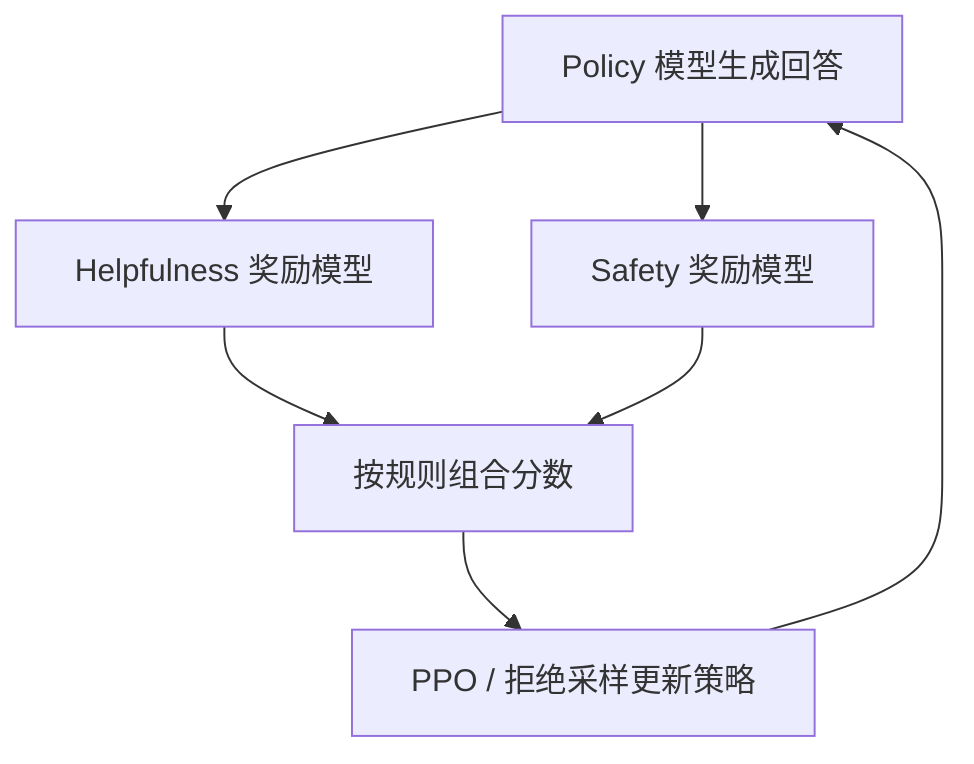

<!-- 这是 PaperMind 的示例输出（illustrative sample），用于展示报告形态。
     运行 `papermind analyze https://arxiv.org/abs/2307.09288 --format md` 可生成你自己的版本。 -->

# Llama 2: Open Foundation and Fine-Tuned Chat Models

**Authors:** Hugo Touvron, Louis Martin, Kevin Stone, Peter Albert, Amjad Almahairi et al.  •  **Year:** 2023  •  **arXiv:** [2307.09288](https://arxiv.org/abs/2307.09288)  •  [PDF](https://arxiv.org/pdf/2307.09288.pdf)

## 🎯 贡献与创新点

**核心贡献:** 发布 7B–70B 的开放权重大语言模型 Llama 2，以及对话微调版本 Llama 2-Chat，并系统性地公开了从预训练、监督微调 (SFT) 到基于人类反馈的强化学习 (RLHF) 的完整训练与对齐方法。

**新颖之处:** 相比同期闭源模型，本文公开了对齐配方的工程细节——尤其是用**两个独立奖励模型**分别优化「有用性 (helpfulness)」与「安全性 (safety)」，并提出 **Ghost Attention (GAtt)** 来在多轮对话中保持系统指令不被遗忘。

**解决的问题:** 此前高质量对话模型多为闭源、配方不透明，社区难以复现 RLHF 对齐；Llama 2 在开放许可下提供了接近闭源水平的模型与可复现的对齐流程。

> **原文出处:**
> - [Abstract (p.1)](https://arxiv.org/pdf/2307.09288.pdf#page=1): "...ranging in scale from 7 billion to 70 billion parameters... fine-tuned LLMs, called Llama 2-Chat, are optimized for dialogue use cases."
> - [Section 3 (p.8)](https://arxiv.org/pdf/2307.09288.pdf#page=8): Fine-tuning（SFT + RLHF）方法。

## 🔬 技术细节解释

### 1. 双奖励模型的 RLHF (Helpfulness + Safety)  `🔴 high`

标准 RLHF 用一个奖励模型为回答打分。Llama 2 发现「有用」和「安全」常常彼此牵制（更安全可能更啰嗦无用），于是训练**两个独立的奖励模型**：一个评有用性、一个评安全性，再在 PPO 优化时按规则组合两者的分数，从而在不牺牲有用性的前提下提升安全性。

> 💡 **类比:** 像考核员工时分设「业绩」与「合规」两位评委，而不是让一个评委同时打一个混合分——避免一项压倒另一项。

📍 出处: [Section 3.2.2 (p.11)](https://arxiv.org/pdf/2307.09288.pdf#page=11)


*AI 生成示意图：Llama 2 的双奖励模型 RLHF 回路*

### 2. Ghost Attention (GAtt)  `🟡 mid`

多轮对话中，模型常在几轮后「忘记」最初的系统指令（如"始终用海盗口吻回答"）。GAtt 在训练数据构造时，把该指令人为拼接到每一轮用户消息上参与注意力，训练后再撤掉，使模型学会在整段对话中持续遵循该指令。

> 💡 **类比:** 排练话剧时先把"你的人设"贴在每页台词旁，演员记熟后撕掉便签也能全程入戏。

📍 出处: [Section 3.3 (p.16)](https://arxiv.org/pdf/2307.09288.pdf#page=16)

### 3. 分组查询注意力 (Grouped-Query Attention, GQA)  `🟡 mid`

34B/70B 模型采用 GQA：多个 query 头共享同一组 key/value 头，介于多头 (MHA) 与多查询 (MQA) 之间。这样推理时的 KV cache 显存与带宽大幅下降，长上下文与大 batch 推理更省资源，同时质量损失很小。

> 💡 **类比:** 多个收银员（query）共用同一份价目表（KV），而不是人手一份，省空间也省更新成本。

📍 出处: [Section 2.1 (p.5)](https://arxiv.org/pdf/2307.09288.pdf#page=5)

## 🔗 知识关联

| 概念 | 相关论文 | 关系 |
| --- | --- | --- |
| LLaMA (第一代) | [Touvron et al. 2023](https://arxiv.org/abs/2302.13971) | 直接前作，本文扩展数据、上下文长度并加入对话对齐 |
| RLHF / InstructGPT | [Ouyang et al. 2022](https://arxiv.org/abs/2203.02155) | 对齐方法的基础，本文用双奖励模型改进 |
| Grouped-Query Attention | [Ainslie et al. 2023](https://arxiv.org/abs/2305.13245) | 采用其 GQA 以降低推理显存 |
| RMSNorm / SwiGLU / RoPE | [Zhang & Sennrich 2019](https://arxiv.org/abs/1910.07467) 等 | 沿用的架构组件 |

## 🛠️ 复现指南

- **官方代码:** [https://github.com/meta-llama/llama](https://github.com/meta-llama/llama)（推理）与 [llama-recipes](https://github.com/meta-llama/llama-recipes)（微调）
- **环境要求:** PyTorch >= 2.0, CUDA >= 11.7, transformers >= 4.31（HF 权重）
- **推荐硬件:** 7B 推理单张 A10/3090 可跑；70B 推理需多卡 A100 80G；全量微调需多机多卡
- **关键超参数:** `context_len=4096`, `GQA(70B/34B)`, `lr` SFT≈2e-5, RLHF 用 PPO + 拒绝采样

### 环境配置步骤

**1. 申请并获取权重访问**

在 Meta / HuggingFace 接受许可后获得访问权限。

```bash
huggingface-cli login
```

**2. 安装依赖**

```bash
pip install "transformers>=4.31" accelerate sentencepiece torch
```

**3. 加载模型推理**

```bash
python -c "from transformers import AutoModelForCausalLM, AutoTokenizer; \
m='meta-llama/Llama-2-7b-chat-hf'; AutoTokenizer.from_pretrained(m); \
AutoModelForCausalLM.from_pretrained(m, device_map='auto', load_in_4bit=True)"
```

**4. （可选）用 llama-recipes 做 LoRA 微调**

```bash
pip install llama-recipes && python -m llama_recipes.finetuning --use_peft --peft_method lora
```

### 性能基准

| 设置 | Baseline | 结果 | 加速 | 显存 |
| --- | --- | --- | --- | --- |
| Llama 2-70B, MMLU | Llama 1-65B (63.4) | 68.9 | — | — |
| 70B 推理 (GQA) | MHA 等价 | — | KV cache 更小 | 显著降低 |
| 7B-chat 单卡推理 | — | 可 4-bit 量化 | — | ~6 GB (4-bit) |

### 数据集

- **公开预训练语料 (2T tokens)** — 预训练（论文未完全公开具体配比） — 见论文 Section 2
- **Meta 收集的人类偏好数据** — 训练奖励模型与 RLHF（未开源）
- **复现可用替代:** [Anthropic HH-RLHF](https://huggingface.co/datasets/Anthropic/hh-rlhf) — 偏好对齐
- **评测:** [MMLU](https://huggingface.co/datasets/cais/mmlu) — 通用知识基准

### 常见报错与解决

- **报错:** `OSError: You are trying to access a gated repo`
  - 原因: 未接受 Llama 2 许可或未登录 HF。
  - 修复: `huggingface-cli login` 并在模型页面接受许可。
- **报错:** `CUDA out of memory`（加载 70B）
  - 原因: 单卡显存不足。
  - 修复: `load_in_4bit=True` + `device_map="auto"`，或使用多卡 / 张量并行。
- **报错:** chat 模板不对、回答异常
  - 原因: 未按 `[INST] ... [/INST]` 与 `<<SYS>>` 系统提示格式拼接。
  - 修复: 使用 `tokenizer.apply_chat_template(messages, tokenize=False)`。

### ⚠️ 坑点提示

- 预训练数据未开源，论文复现指的是「方法复现」而非「逐字节复现」。
- chat 模型对 prompt 模板敏感，务必使用官方对话模板。
- 70B 全量微调成本极高，社区多用 QLoRA/LoRA 在单/多卡上做参数高效微调。

---
*Generated by [PaperMind](https://github.com/Wenhao-Hua/papermind).*
