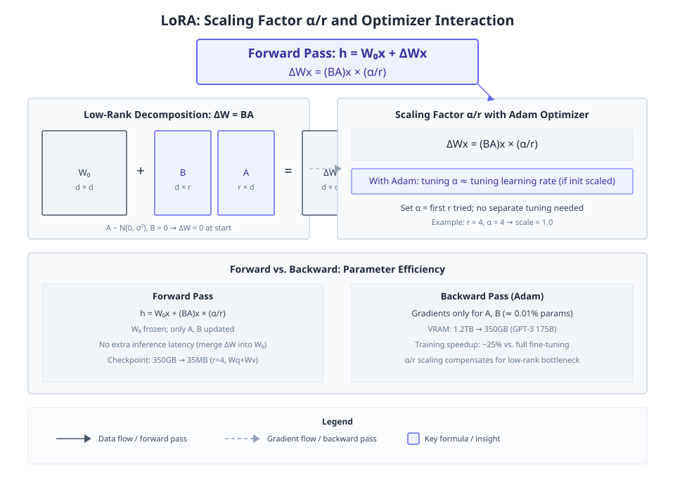
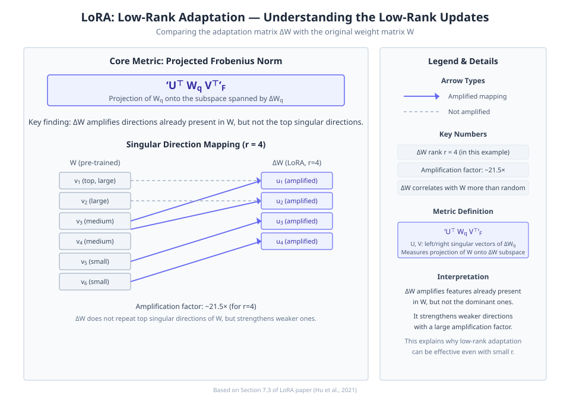
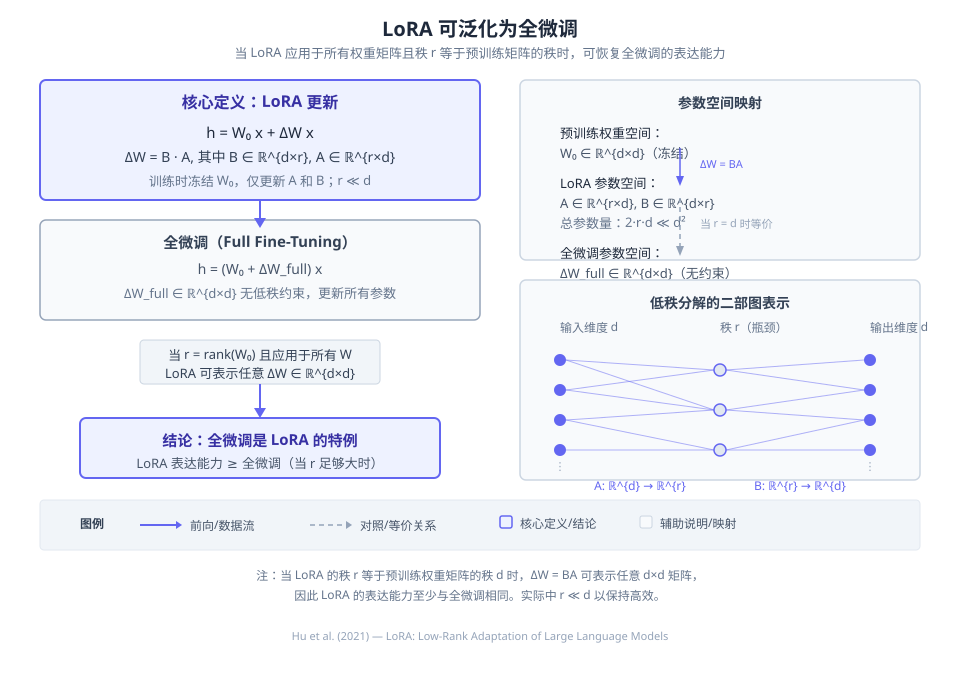
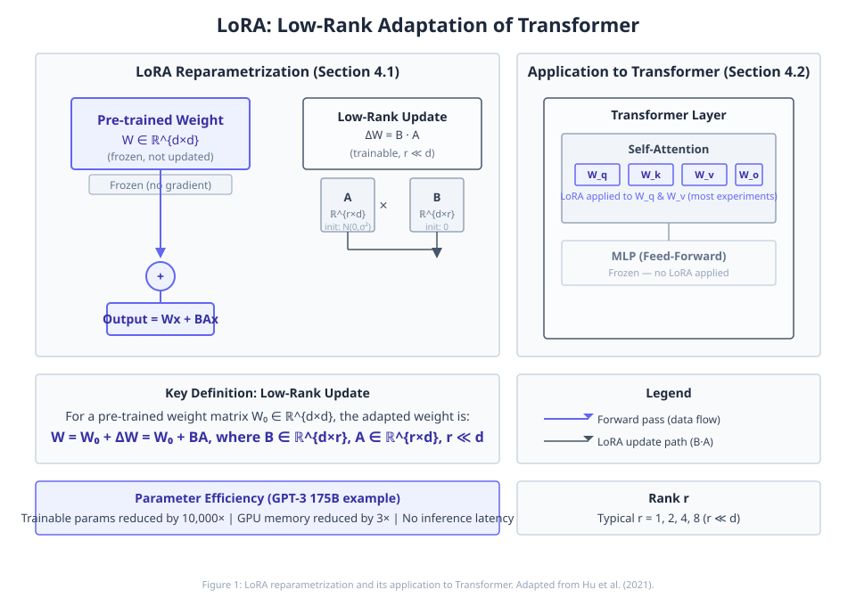
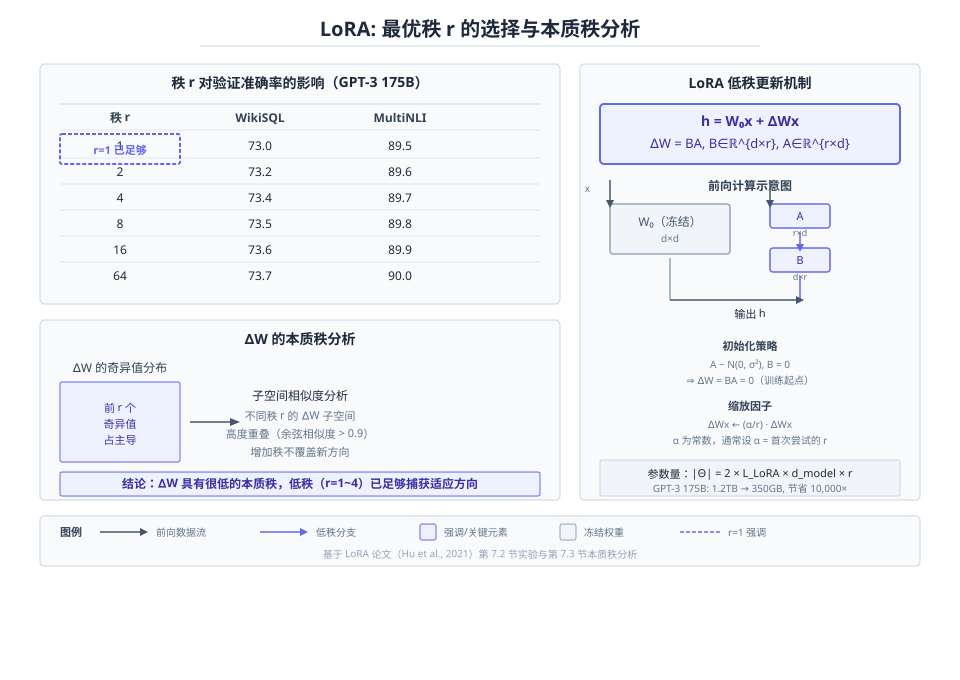
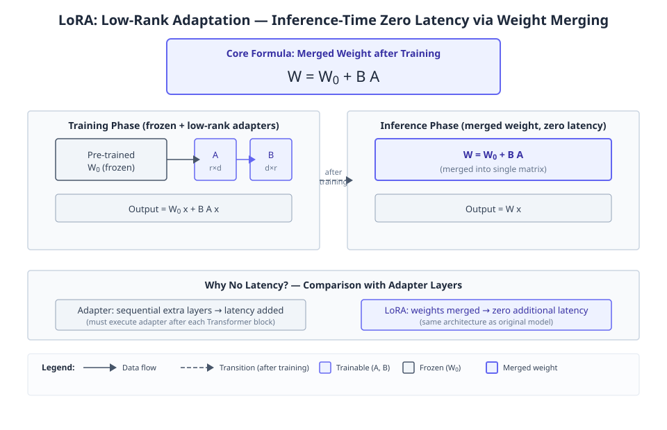

# LoRA: Low-Rank Adaptation of Large Language Models

**Authors:** Edward J. Hu, Yelong Shen, Phillip Wallis, Zeyuan Allen-Zhu, Yuanzhi Li, Shean Wang et al.  •  **Year:** 2021  •  **arXiv:** [2106.09685](https://arxiv.org/abs/2106.09685)  •  [PDF](https://arxiv.org/pdf/2106.09685.pdf)

- [🎯 贡献与创新点](#contributions)
- [🔬 技术细节解释](#technical)
- [🔗 知识关联](#connections)
- [🛠️ 复现指南](#reproduction)

<a id="contributions"></a>

## 🎯 贡献与创新点

**核心贡献:** 提出LoRA（低秩适应），冻结预训练权重并注入可训练的低秩分解矩阵，极大减少下游任务可训练参数数量，同时保持或提升模型质量，且不引入推理延迟。

**新颖之处:** LoRA将权重更新参数化为低秩分解，以并行的方式添加，与顺序插入的适配器不同，实现了零额外推理延迟。

**解决的问题:** 全量微调大语言模型（如GPT-3 175B）导致的高昂部署成本和内存需求，以及适配器引入的推理延迟问题。

> **原文出处:**
> - [Frontmatter (p.1)](https://arxiv.org/pdf/2106.09685.pdf#page=1): We propose Low-Rank Adaptation, or LoRA, which freezes the pre-trained model weights and injects trainable rank decomposition matrices into each layer of the Transformer architecture, greatly reducing the number of trainable parameters for downstream tasks. Compared to GPT-3 175B fine-tuned with Adam, LoRA can reduce the number of trainable parameters by 10,000 times and the GPU memory requirement by 3 times. LoRA performs on-par or better than fine-tuning in model quality on RoBERTa, DeBERTa, GPT-2, and GPT-3, despite having fewer trainable parameters, a higher training throughput, and, unlike adapters, no additional inference latency.

<a id="technical"></a>

## 🔬 技术细节解释

### 1. 缩放因子 α/r 与优化器交互  `🔴 high`

在计算 $\Delta W x$ 后乘以 $\alpha/r$，其中 $\alpha$ 是与 $r$ 无关的常数。使用 Adam 优化器时，若适当缩放初始化，调整 $\alpha$ 与调整学习率效果大致相同。因此作者将 $\alpha$ 固定为第一个尝试的 $r$ 对应的值，不再单独调节。

$$
\Delta W x \cdot \frac{\alpha}{r}
$$

> 💡 **类比:** 就像调节水龙头流量，改变 $\alpha$ 和调节学习率的效果类似，所以只需固定一个合适的 $\alpha$，通过调节学习率来优化，省去了额外的超参数搜索。

📍 出处: [Section 4.1 (p.4)](https://arxiv.org/pdf/2106.09685.pdf#page=4)


*教学示意图：缩放因子 α/r 与优化器交互（教学示意图）*

> **读图**：LoRA通过低秩分解和缩放因子实现高效微调。
>
> - W0冻结，ΔW=BA可训练，秩r远小于d。
> - 缩放因子α/r，α固定，调整学习率等效。
> - 前向传播h=W0x+ΔWx·(α/r)。
> - A初始化高斯，B初始化为0。
>
> **关键**：α/r缩放使超参数调节简化，性能媲美全微调。

### 2. 适应矩阵 ΔW 与原始权重 W 的比较  `🔴 high`

通过计算 $\Delta W_q$ 或 $W_q$ 在对方子空间上的弗罗贝尼乌斯范数，发现 $\Delta W$ 与 $W$ 的相关性强于随机矩阵，表明 $\Delta W$ 放大了一些已存在于 $W$ 中的特征。但它不重复 $W$ 的主要奇异方向，而是强化那些 $W$ 中未强调的方向，放大因子很大（如秩 $4$ 时约 $21.5$）。

$$
\|U^\top W_q V^\top\|_F
$$

> 💡 **类比:** 就像老师给学生补习，不重复课堂上的重点，而是针对学生薄弱但确实有用的知识点进行强化，且强度很大。

📍 出处: [Section 7.3 (p.11)](https://arxiv.org/pdf/2106.09685.pdf#page=11)


*教学示意图：适应矩阵 ΔW 与原始权重 W 的比较（教学示意图）*

> **读图**：ΔW放大W中已有但非主导的方向，因子约21.5倍
>
> - U⊤WqV⊤F：ΔW子空间上Wq的投影范数
> - W的奇异方向v1-v6与ΔW的u1-u4映射
> - 箭头表示ΔW是否放大对应方向
> - ΔW与W的相关性强于随机矩阵
>
> **关键**：ΔW强化W的弱方向，解释低秩适应有效性

### 3. 低秩参数化更新矩阵  `🟡 mid`

冻结预训练权重 $W_0 \in \mathbb{R}^{d \times k}$，引入可训练的低秩矩阵 $B \in \mathbb{R}^{d \times r}$ 和 $A \in \mathbb{R}^{r \times k}$，$r \ll \min(d,k)$，前向传播变为 $h = W_0 x + BA x$。$A$ 用高斯随机初始化，$B$ 用零初始化，训练开始时 $\Delta W = BA = 0$。这极大减少了可训练参数量，且推理时可合并 $W_0$ 与 $BA$ 而不增加延迟。

$$
h = W_0 x + BA x
$$

> 💡 **类比:** 就像在原有的大楼框架上安装可拆卸的装饰板，而不是拆掉重建，既省材料又能在展示效果后轻松复原。

📍 出处: [Section 4.1 (p.4)](https://arxiv.org/pdf/2106.09685.pdf#page=4)


*教学示意图：低秩参数化更新矩阵（教学示意图）*

> **读图**：LoRA通过低秩分解更新矩阵，高效微调大模型。
>
> - 冻结预训练权重W₀，引入低秩矩阵B和A。
> - 前向传播h=W₀x+BAx，仅B和A可训练。
> - A高斯初始化，B零初始化，初始ΔW=0。
> - 推理时合并W₀+BA，不增加延迟。
>
> **关键**：LoRA大幅减少参数量（如GPT-3从175B到17M）。

### 4. 应用于 Transformer 的权重矩阵选择  `🟡 mid`

LoRA 仅应用于注意力模块的查询 ($W_q$) 和值 ($W_v$) 投影矩阵，冻结其余参数（包括键 $W_k$、输出 $W_o$ 和整个 MLP）。实验表明同时适应 $W_q$ 和 $W_v$ 在相同参数量下效果最好，适应单一类型或所有类型反而可能降低性能。可训练参数量由 $|\Theta| = 2 \times \hat{L}_{LoRA} \times d_{model} \times r$ 决定。

$$
|\Theta| = 2 \times \hat{L}_{LoRA} \times d_{model} \times r
$$

> 💡 **类比:** 就像修车时只更换最影响性能的火花塞和燃油喷嘴，而不是整个发动机，达到省时省力且效果好的目的。

📍 出处: [Section 4.2, Section 7.1 (p.5)](https://arxiv.org/pdf/2106.09685.pdf#page=5)


*教学示意图：应用于 Transformer 的权重矩阵选择（教学示意图）*

> **读图**：LoRA仅应用于注意力模块的Wq和Wv矩阵，冻结其余参数。
>
> - LoRA应用于Wq和Wv，冻结Wk、Wo和MLP。
> - 可训练参数量公式：|Θ|=2×L̂LoRA×dmodel×r。
> - 实验表明同时适应Wq和Wv效果最好。
> - LoRA机制：h=W0x+BAx，B∈R^(d×r)，A∈R^(r×d)。
>
> **关键**：LoRA通过低秩分解大幅减少参数量，性能与全微调相当。

### 5. 最优秩 r 的选择  `🟡 mid`

实验发现，同时适应 $W_q$ 和 $W_v$ 时，秩可以非常小——低至 $1$ 就能获得不错的效果，而仅适应 $W_q$ 时需要较大的 $r$。这验证了 $\Delta W$ 具有很低的本质秩。进一步通过奇异向量子空间相似度分析表明，增加秩并不能覆盖更有意义的子空间，低秩已足够。

> 💡 **类比:** 就像给衣服缝补丁，有时候只需要很小的一块布（秩 1）就能补好，因为破损处本身就很集中，用更大块的布并不会带来额外好处。

📍 出处: [Section 7.2 (p.10)](https://arxiv.org/pdf/2106.09685.pdf#page=10)


*教学示意图：最优秩 r 的选择（教学示意图）*

> **读图**：LoRA最优秩选择：极低秩即可有效适应。
>
> - LoRA公式：h=W₀x+BAx，B∈ℝ^{d×r}, A∈ℝ^{r×d}。
> - 同时适应W_q和W_v时，r=1即强性能。
> - 仅适应W_q需较大r（如r=8）。
> - 奇异向量子空间相似度分析显示r=1与r=8高度相似。
>
> **关键**：ΔW本质秩很低，低秩已捕获关键适应方向。

### 6. 推理时零延迟的权重合并  `🟢 low`

训练后，低秩矩阵 $BA$ 可以直接加到原权重 $W_0$ 上：$W = W_0 + BA$。推理时只需使用合并后的权重，与原始模型结构完全一致，因此不引入任何额外延迟，不像适配器层那样需要顺序执行额外模块。

$$
W = W_0 + BA
$$

> 💡 **类比:** 就像把可拆卸的装饰板在展出前固定到墙上，展出时完全看不到额外结构，不会阻碍观众视线。

📍 出处: [Section 4.2 (p.5)](https://arxiv.org/pdf/2106.09685.pdf#page=5)


*教学示意图：推理时零延迟的权重合并（教学示意图）*

> **读图**：LoRA通过权重合并实现推理零延迟。
>
> - 训练时冻结W0，低秩矩阵A、B可训练。
> - 训练后将BA合并到W0得到新权重W。
> - 推理时使用合并权重，无额外层延迟。
> - 对比适配器需顺序执行，LoRA无延迟。
>
> **关键**：LoRA推理时权重已合并，与原始模型结构相同。

<a id="connections"></a>

## 🔗 知识关联

| 概念 | 相关论文 | 关系 |
| --- | --- | --- |
| Transformer | [Vaswani et al. 2017](https://arxiv.org/abs/1706.03762) | LoRA 基于 Transformer 架构，将低秩矩阵注入其注意力权重中 |
| Full fine-tuning (全微调) | [Brown et al. 2020 (GPT-3)](https://arxiv.org/abs/2005.14165) | 对比：在 GPT-3 175B 上，LoRA 可比全微调减少 10000 倍可训练参数与 3 倍 GPU 内存，且模型质量相当或更优 |
| Adapter | [Houlsby et al. 2019](https://arxiv.org/abs/1902.00751) | 对比：LoRA 是并行添加的外部模块，没有 Adapter 的额外推理延迟 |
| Prefix-tuning | [Li & Liang 2021](https://arxiv.org/abs/2101.00190) | 对比：在 GPT-2 和 GPT-3 上直接比较，LoRA 表现更优或持平 |
| GPT-3 | [Brown et al. 2020](https://arxiv.org/abs/2005.14165) | 以 GPT-3 175B 为核心实验平台，验证 LoRA 的大规模高效适应能力 |

<a id="reproduction"></a>

## 🛠️ 复现指南

- **代码仓库（论文原文链接 · ★13576）:** [https://github.com/microsoft/LoRA](https://github.com/microsoft/LoRA)
- **安装 / 运行（取自该仓库，非模型生成）:**
  - `pip install -e .`
- **环境要求:** PyTorch (版本未指定), CUDA, transformers, datasets (推测)
- **推荐硬件:** Multiple A100 80GB GPUs for GPT-3 175B; single GPU for smaller models (RTX 8000 used in latency test)
- **关键超参数:** `r=4 for GPT-3 175B (other ranks tested: 1, 2, 8, 64)`, `Apply LoRA to Wq and Wv (also tested Wk, Wo, all attention weights)`, `A initialized with random Gaussian, B initialized to zero`, `Scale update by α/r, α set to first r tried (value not reported)`, `Freeze original weights and MLP modules`, `Optimizer: Adam`, `Number of trainable parameters: |Θ| = 2 × ˆL_LoRA × d_model × r`

### 环境配置步骤

**1. 克隆官方仓库**

获取 LoRA 代码

```bash
git clone https://github.com/microsoft/LoRA && cd LoRA
```

**2. 安装依赖**

安装必要的 Python 包（若仓库含 requirements.txt 则直接安装，否则需手工安装 PyTorch、transformers、datasets 等）

```bash
pip install -r requirements.txt
```

**3. 下载预训练模型**

根据任务下载对应的预训练 Transformer 权重（如 GPT-2, RoBERTa, DeBERTa），可通过 HuggingFace Hub 或手动放置

```bash
# 示例：下载 GPT-2 模型
python -c "from transformers import GPT2Model; GPT2Model.from_pretrained('gpt2')"
```

**4. 准备数据集**

下载论文中使用的数据集（GLUE, E2E, WikiSQL, SAMSum），并按照仓库说明放置于 data/ 目录

**5. 运行训练示例**

使用仓库提供的脚本进行微调，例如在 GPT-2 上应用 LoRA

```bash
python run_lora.py --model_type gpt2 --task e2e --rank 4 --apply_to qv
```

### 性能基准

| 设置 | Baseline | 结果 | 加速 | 显存 |
| --- | --- | --- | --- | --- |
| GPT-3 175B training (full fine-tuning vs LoRA r=4 on Wq and Wv) | VRAM: 1.2 TB; checkpoint: 350 GB; training time: baseline | VRAM: 350 GB; checkpoint: 35 MB; training throughput: 25% speedup | 1.25x | VRAM reduction ~3.4x; checkpoint reduction ~10,000x |

### 数据集

- **GLUE benchmark** — 自然语言理解（用于 RoBERTa, DeBERTa 评估）
- **E2E NLG Challenge** — 端到端自然语言生成（用于 GPT-2 评估）
- **WikiSQL** — Text-to-SQL（用于 GPT-3 评估）
- **MultiNLI (matched)** — 自然语言推断（用于 GPT-3 验证）
- **SAMSum** — 对话摘要（用于 GPT-3 评估）

### 常见报错与解决

- **报错:** `CUDA out of memory during training on GPT-3 175B`
  - 原因: 即使使用 LoRA，基础模型仍需加载在 GPU 上，内存不足
  - 修复: `减小 batch size；启用梯度累积；降低秩 r；使用更少 GPU 并行`
- **报错:** `Trainable parameters count not reduced significantly`
  - 原因: 未正确冻结 MLP 模块或对过多权重矩阵应用 LoRA
  - 修复: `检查代码确保仅对 Wq、Wv 注入 LoRA，且冻结其余参数（model.requires_grad_(False) 后单独开启 LoRA 参数）`
- **报错:** `Inference results worse than expected after merging LoRA weights`
  - 原因: 合并时未正确应用缩放因子 α/r，或使用了错误的秩
  - 修复: `按照仓库 merge.py 示例，确保`merged_weight = original_weight + (lora_A @ lora_B) * (alpha / r)``

### ⚠️ 坑点提示

- LoRA 并行注入，推理时无额外延迟，但调整缩放因子 α 和学习率需要类似的超参搜索
- 仅在注意力权重上应用 LoRA（Wq, Wv）已足够，扩展到更多矩阵可能边际收益小
- 秩 r 极小（甚至为 1）即可产生有效适应，但不同任务最优 r 可能不同
- 保存和加载任务专属 checkpoint 时，只需保存 LoRA 参数（通常 < 50 MB），便于快速切换
- 冻结 MLP 模块是人为选择，论文未探索 MLP 上的 LoRA 效果


---
*Generated by [PaperMind](https://github.com/Wenhao-Hua/papermind).*