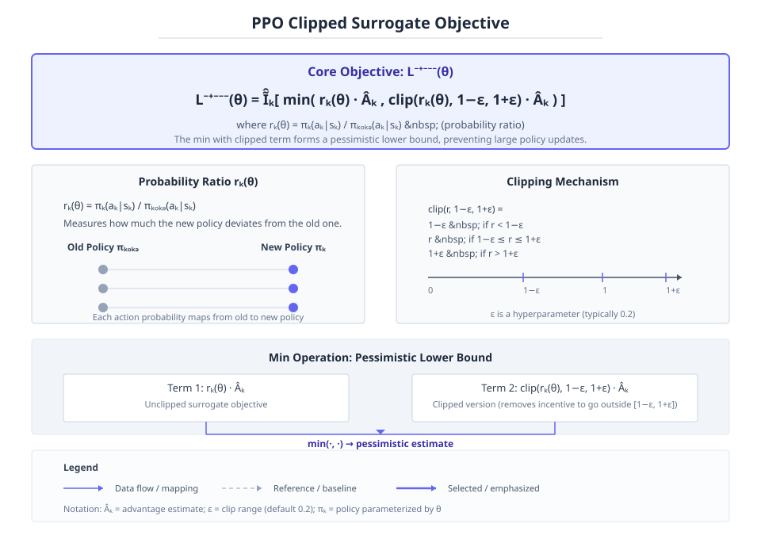
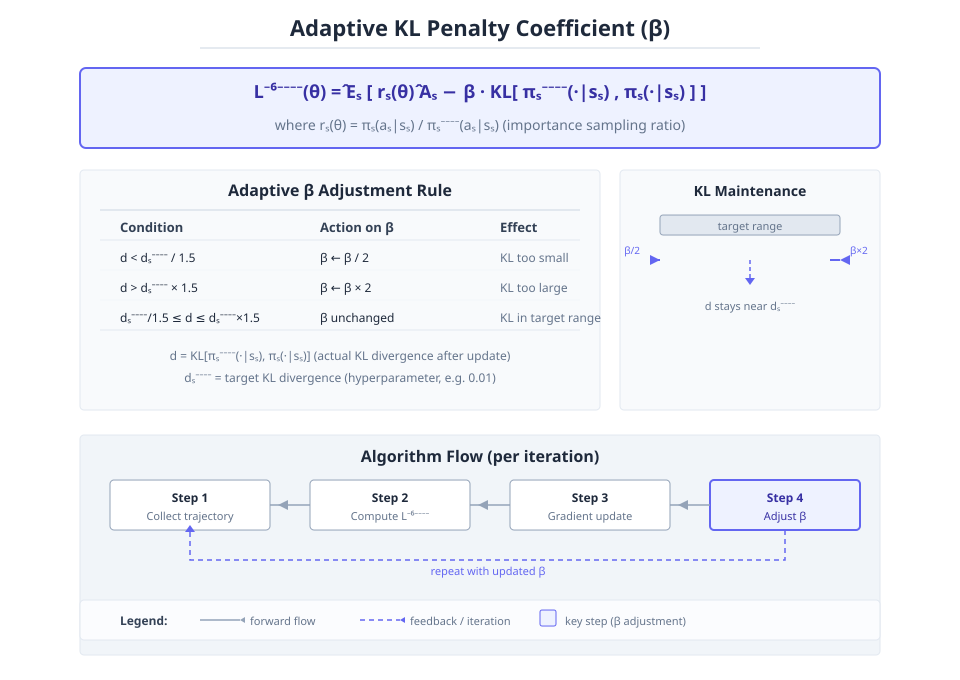
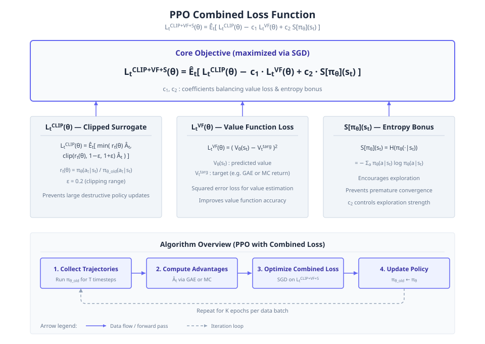
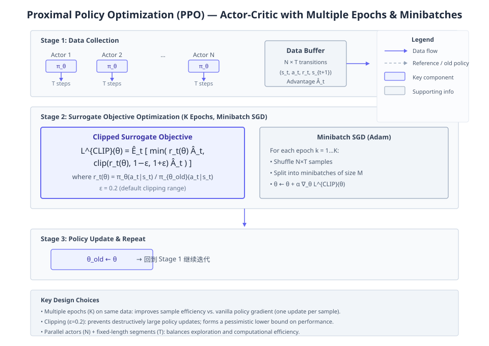
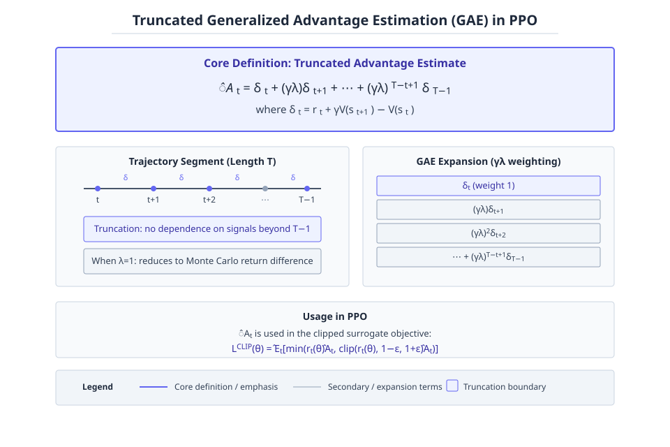

# Proximal Policy Optimization Algorithms

**Authors:** John Schulman, Filip Wolski, Prafulla Dhariwal, Alec Radford, Oleg Klimov  •  **Year:** 2017  •  **arXiv:** [1707.06347](https://arxiv.org/abs/1707.06347)  •  [PDF](https://arxiv.org/pdf/1707.06347.pdf)

- [🎯 贡献与创新点](#contributions)
- [🔬 技术细节解释](#technical)
- [🔗 知识关联](#connections)
- [🛠️ 复现指南](#reproduction)

<a id="contributions"></a>

## 🎯 贡献与创新点

**核心贡献:** 提出近端策略优化（PPO）算法，通过交替采样和优化带剪裁概率比的替代目标，仅用一阶优化实现多次 mini-batch epoch 更新，在简单性、通用性和样本效率上均优于 TRPO 和普通策略梯度方法。

**新颖之处:** 与 TRPO 的二阶约束不同，PPO 使用基于概率比剪裁的悲观替代目标进行一阶优化；同时通过该目标允许在单个轨迹数据上进行多轮更新而不导致破坏性大更新，从而克服了标准策略梯度方法无法多次利用数据的问题。

**解决的问题:** 解决了标准策略梯度方法数据效率低、多次更新导致策略退化的问题，以及 TRPO 实现复杂、与 dropout 或参数共享架构不兼容的问题，同时保持了可靠性和样本效率。

> **原文出处:**
> - [Abstract (p.1)](https://arxiv.org/pdf/1707.06347.pdf#page=1): ⚠️ 未核实 · We propose a new family of policy gradient methods for reinforcement learning, which alternate between sampling data through interaction with the environment, and optimizing a “surrogate” objective function using stochastic gradient ascent. ... The new methods, which we call proximal policy optimization (PPO), have some of the benefits of trust region policy optimization (TRPO), but they are much simpler to implement, more general, and have better sample complexity (empirically).
> - [Abstract (p.1)](https://arxiv.org/pdf/1707.06347.pdf#page=1): We propose a novel objective with clipped probability ratios, which forms a pessimistic estimate (i.e., lower bound) of the performance of the policy. To optimize policies, we alternate between sampling data from the policy and performing several epochs of optimization on the sampled data.
> - [3 Clipped Surrogate Objective (p.3)](https://arxiv.org/pdf/1707.06347.pdf#page=3): The main objective we propose is the following: LCLIP(θ) = Êt [min(rt(θ)Ât, clip(rt(θ), 1 − ϵ, 1 + ϵ)Ât)]

<a id="technical"></a>

## 🔬 技术细节解释

### 1. Clipped Surrogate Objective  `🔴 high`

PPO 的核心是修改的策略梯度目标函数 $L^{CLIP}(\theta)=\hat{\mathbb{E}}_t[\min(r_t(\theta)\hat{A}_t,\operatorname{clip}(r_t(\theta),1-\epsilon,1+\epsilon)\hat{A}_t)]$，其中 $r_t(\theta)=\pi_\theta(a_t|s_t)/\pi_{\theta_{\text{old}}}(a_t|s_t)$ 是新旧策略的概率比值。该目标通过截断概率比来移除让 $r_t$ 超出 $[1-\epsilon,1+\epsilon]$ 的激励，并对截断与未截断项取最小值，形成对未截断目标的下界（悲观估计），从而防止策略更新过大，同时只在目标变差时考虑比率变化，变好时忽略。

$$
L^{CLIP}(\theta)=\hat{\mathbb{E}}_t\big[\min(r_t(\theta)\hat{A}_t,\ \operatorname{clip}(r_t(\theta),1-\epsilon,1+\epsilon)\hat{A}_t)\big]
$$

> 💡 **类比:** 像给策略更新装了一个安全阀门：一旦新旧策略差异超过阈值，就截断优势信号，阻止进一步放大改动，从而避免一步跨得太远而崩溃。

📍 出处: [Section 3 (p.3)](https://arxiv.org/pdf/1707.06347.pdf#page=3)


*教学示意图：Clipped Surrogate Objective（教学示意图）*

> **读图**：PPO的截断替代目标函数，通过截断概率比防止策略更新过大。
>
> - L^CLIP(θ) = E[min(r_t(θ)Â_t, clip(r_t,1-ε,1+ε)Â_t)]
> - r_t(θ) = π_θ(a_t|s_t)/π_θ_old(a_t|s_t) 概率比
> - clip(r,1-ε,1+ε) 将r限制在[1-ε,1+ε]内
> - min操作形成悲观下界，只考虑目标变差的情况
>
> **关键**：截断与min结合，确保策略更新保守且稳定。

### 2. Adaptive KL Penalty Coefficient  `🟡 mid`

另一种约束策略更新的方式是在目标中加入 KL 散度惩罚项 $L^{KLPEN}(\theta)=\hat{\mathbb{E}}_t[\frac{\pi_\theta}{\pi_{\theta_{\text{old}}}}\hat{A}_t -\beta\,\operatorname{KL}[\pi_{\theta_{\text{old}}},\pi_\theta]]$，并自适应调节系数 $\beta$。每次更新后计算实际 KL 散度 $d$，若 $d$ 低于目标值 $d_{\text{targ}}/1.5$ 则 $\beta\leftarrow\beta/2$，若高于 $d_{\text{targ}}\times 1.5$ 则 $\beta\leftarrow\beta\times 2$，使得 KL 散度大致围绕目标值波动。

$$
L^{KLPEN}(\theta)=\hat{\mathbb{E}}_t\!\left[\frac{\pi_\theta(a_t|s_t)}{\pi_{\theta_{\text{old}}}(a_t|s_t)}\hat{A}_t-\beta\,\operatorname{KL}[\pi_{\theta_{\text{old}}}(\cdot|s_t),\pi_\theta(\cdot|s_t)]\right]
$$

> 💡 **类比:** 就像自动调温器，如果室温（实际 KL）偏离设定温度（目标 KL）太多，就调节加热（惩罚系数）的强度，让温度回到舒适区。

📍 出处: [Section 4 (p.4)](https://arxiv.org/pdf/1707.06347.pdf#page=4)


*教学示意图：Adaptive KL Penalty Coefficient（教学示意图）*

> **读图**：自适应KL惩罚系数的PPO目标函数与调整规则
>
> - L^KLPEN(θ) = E_t[ r_t(θ) A_t - β·KL ]
> - r_t(θ) = π_θ(a_t|s_t) / π_θ_old(a_t|s_t)
> - β根据实际KL散度d与目标d_targ自适应调整
>
> **关键**：β调整使KL散度围绕目标值波动，平衡更新幅度

### 3. Overall Combined Loss Function  `🟡 mid`

PPO 实际优化的目标除了策略替代损失外，还加入价值函数误差项（平方损失 $L^{VF}_t=(V_\theta(s_t)-V^{\text{targ}}_t)^2$）和熵奖励 $S$，形成 $L^{CLIP+VF+S}_t(\theta)=\hat{\mathbb{E}}_t[L^{CLIP}_t(\theta)-c_1 L^{VF}_t(\theta)+c_2 S[\pi_\theta](s_t)]$，其中 $c_1,c_2$ 为系数。这让单次优化同时改进策略、价值估计并保持探索，尤其当策略与价值网络共享参数时。

$$
L^{CLIP+VF+S}_t(\theta)=\hat{\mathbb{E}}_t\!\left[L^{CLIP}_t(\theta)-c_1 L^{VF}_t(\theta)+c_2 S[\pi_\theta](s_t)\right]
$$

> 💡 **类比:** 类似于多任务学习：同一模型同时做三道题——提高动作决策、校准状态估值、维持好奇心，联合优化让学习更稳定。

📍 出处: [Section 5 (p.5)](https://arxiv.org/pdf/1707.06347.pdf#page=5)


*教学示意图：Overall Combined Loss Function（教学示意图）*

> **读图**：PPO组合损失函数，包含CLIP、VF和熵项。
>
> - Lt: 时间步t的组合损失函数。
> - CLIP项: 裁剪替代损失，防止策略更新过大。
> - VF项: 价值函数平方误差损失，改进价值估计。
> - S项: 策略熵奖励，鼓励探索。
>
> **关键**：最大化Lt以同时优化策略、价值估计和探索。

### 4. Proximal Policy Optimization Algorithm with Multiple Epochs and Minibatches  `🟡 mid`

PPO 的 Actor-Critic 实现采用固定长度的轨迹片段：每个迭代让 $N$ 个并行的 actor 各收集 $T$ 步数据，然后用这些 $NT$ 个时间步的数据构建替代损失，使用小批量 SGD（如 Adam）进行 $K$ 个 epoch 的优化，从而多次利用同一批数据更新策略，提高样本效率，同时通过截断或 KL 惩罚限制每次更新幅度。

> 💡 **类比:** 类似读书时把段落反复咀嚼多遍（K 个 epoch），而不是只读一遍就扔掉，从而充分消化信息，但每次咀嚼都小心不改变对书本的理解太剧烈。

📍 出处: [Section 5 (p.4)](https://arxiv.org/pdf/1707.06347.pdf#page=4)


*教学示意图：Proximal Policy Optimization Algorithm with Multiple Epochs and Minibatches（教学示意图）*

> **读图**：PPO算法通过多epoch小批量SGD优化截断替代目标。
>
> - N个并行actor各收集T步数据存入缓冲。
> - 替代目标含截断项，限制策略更新幅度。
> - K个epoch内用小批量SGD多次更新策略。
> - 更新后旧策略参数替换，重复数据收集。
>
> **关键**：多epoch利用同批数据，截断防止策略更新过大。

### 5. Truncated Generalized Advantage Estimation  `🟡 mid`

在有限长度片段上计算优势估计时，PPO 使用截断的广义优势估计 $\hat{A}_t = \delta_t + (\gamma\lambda)\delta_{t+1} + \dots + (\gamma\lambda)^{T-t+1}\delta_{T-1}$，其中 $\delta_t = r_t + \gamma V(s_{t+1}) - V(s_t)$。该估计不依赖未来超出片段的信号，当 $\lambda=1$ 时退化为简单的蒙特卡洛返回差。

$$
\hat{A}_t=\delta_t+(\gamma\lambda)\delta_{t+1}+\cdots+(\gamma\lambda)^{T-t+1}\delta_{T-1}
$$

> 💡 **类比:** 好比只根据眼下能看到的几步棋来估算当前局面的好坏，而不是等到终局，这样在长游戏中也能及时更新判断。

📍 出处: [Section 5 (p.5)](https://arxiv.org/pdf/1707.06347.pdf#page=5)


*教学示意图：Truncated Generalized Advantage Estimation（教学示意图）*

> **读图**：截断GAE：在有限片段内加权求和TD残差估计优势。
>
> - δt = rt + γV(st+1) - V(st)：TD残差定义。
> - Ât = Σk=0^{T-t-1} (γλ)^k δt+k：截断窗口内加权求和。
> - λ=1时退化为蒙特卡洛返回差，不依赖未来信号。
> - γ折扣因子，λ平滑参数，T片段长度。
>
> **关键**：仅用片段内TD残差加权求和，避免未来信号依赖。

<a id="connections"></a>

## 🔗 知识关联

| 概念 | 相关论文 | 关系 |
| --- | --- | --- |
| Trust Region Policy Optimization (TRPO) | [Schulman et al. 2015](https://arxiv.org/abs/1502.05477) | PPO aims to achieve the data efficiency and reliable performance of TRPO while using only first-order optimization, making it simpler to implement and more general. The clipped surrogate objective and adaptive KL penalty are motivated by TRPO's monotonic improvement theory. |
| Conservative Policy Iteration (CPI) | Kakade & Langford 2002 | PPO inherits the CPI surrogate objective $L^{CPI}(\theta) = \hat{\mathbb{E}}_t [r_t(\theta) \hat{A}_t]$ and modifies it by clipping the probability ratio to penalize large policy changes, forming a pessimistic bound. |
| Advantage Actor Critic (A2C) | [Mnih et al. 2016](https://arxiv.org/abs/1602.01783) | In experiments on continuous control and Atari, PPO is compared against A2C and shows better sample complexity and overall performance; PPO builds upon the actor-critic style but uses multiple epochs of minibatch updates instead of a single gradient step. |
| Sample Efficient Actor-Critic with Experience Replay (ACER) | [Wang et al. 2016](https://arxiv.org/abs/1611.01224) | On Atari, PPO performs similarly to ACER in terms of sample complexity but is much simpler to implement. |
| KL Penalized Objective with Adaptive Coefficient | [Schulman et al. 2015 (TRPO theory)](https://arxiv.org/abs/1502.05477) | PPO explores an alternative approach that uses a penalty on KL divergence with an adaptive coefficient, inspired by the TRPO theory that suggests a penalty instead of a constraint; however, the clipped surrogate objective is found to perform better. |
| Generalized Advantage Estimation (GAE) | [Schulman et al. 2015](https://arxiv.org/abs/1506.02438) | PPO utilizes truncated GAE for advantage estimation in its actor-critic algorithm, as described in the paper. |

<a id="reproduction"></a>

## 🛠️ 复现指南

- **代码仓库（论文原文链接 · ★1654）:** [https://github.com/berkeleydeeprlcourse/homework](https://github.com/berkeleydeeprlcourse/homework)
- **环境要求:** Python >= 3.6, MuJoCo >= 1.50, OpenAI Gym, PyTorch or TensorFlow (implementation dependent); see repository's requirements.txt.
- **推荐硬件:** For MuJoCo 1M timestep benchmark: CPU sufficient but GPU recommended. For Atari 40M frames: GPU (e.g., GTX 1080 or higher) recommended.
- **关键超参数:** `Horizon T=2048 (MuJoCo)`, `Adam step size=3e-4`, `Number of epochs=10`, `Minibatch size=64`, `Discount γ=0.99`, `GAE λ=0.95`, `Clipping ε=0.2`

### 环境配置步骤

**1. 克隆代码仓库**

获取包含PPO实现的代码仓库（本指南基于berkeleydeeprlcourse/homework中的hw4）

```bash
git clone https://github.com/berkeleydeeprlcourse/homework
```

**2. 安装 MuJoCo 物理引擎**

PPO 的连续控制实验需要 MuJoCo。请从官网下载并安装，然后设置环境变量。还需要安装 Python 绑定。

```bash
# 安装 mujoco-py
pip install mujoco-py
# 设置 LD_LIBRARY_PATH（示例）
export LD_LIBRARY_PATH=$LD_LIBRARY_PATH:/path/to/mujoco/bin
```

**3. 安装依赖包**

安装 OpenAI Gym 及其他 Python 依赖。如果仓库中有 requirements.txt 则直接使用。

```bash
cd homework/hw4
pip install -r requirements.txt  # 如果存在
# 否则手动安装
pip install gym numpy tensorflow torch
```

**4. 运行 MuJoCo 实验**

运行 PPO 在 MuJoCo 环境上的训练脚本。通常命令类似 python main.py --env-name HalfCheetah-v1 --alg ppo

```bash
python main.py --env-name HalfCheetah-v1 --alg ppo
```

### 常见报错与解决

- **报错:** `ERROR: GLEW initalization error: Missing GL version`
  - 原因: MuJoCo 需要 OpenGL 渲染，但 headless 服务器缺少图形库。
  - 修复: `# 可尝试在 headless 模式下运行，或安装 libgl1-mesa-glx
sudo apt-get install libgl1-mesa-glx libgl1-mesa-dri
# 或在脚本中设置环境变量
export MUJOCO_GL='egl'`
- **报错:** `ImportError: No module named 'mujoco_py'`
  - 原因: 未安装 MuJoCo Python 绑定。
  - 修复: `pip install mujoco-py`

### ⚠️ 坑点提示

- 需要有效的 MuJoCo 许可证文件 mjkey.txt，放置在 ~/.mujoco/ 目录下。
- 某些环境（如 Humanoid）训练时间较长，建议先在小环境（如 InvertedPendulum）上测试超参数。
- 在 Atari 实验中，超参数 ε 和 learning rate 会随训练步数线性衰减，请参考论文表5实现。


---
*Generated by [PaperMind](https://github.com/Wenhao-Hua/papermind).*