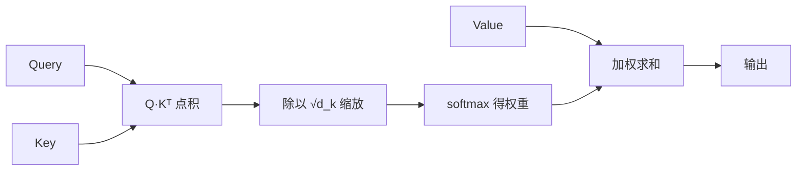
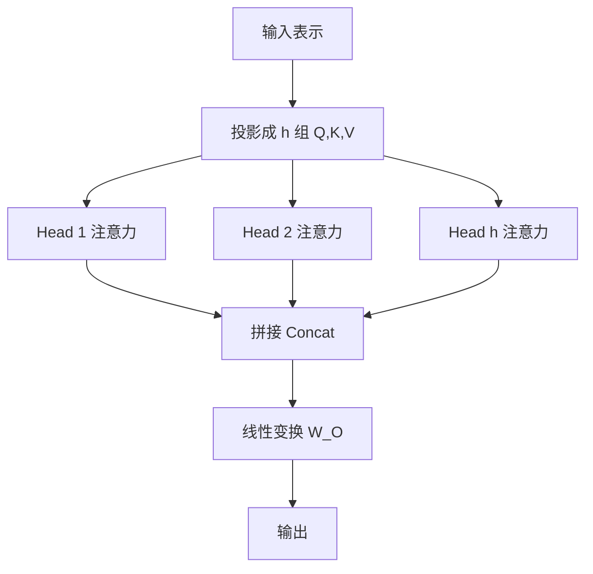

<!-- 这是 PaperMind 的示例输出（illustrative sample），用于展示报告形态。
     运行 `papermind analyze https://arxiv.org/abs/1706.03762 --format md` 可生成你自己的版本。 -->

# Attention Is All You Need

**Authors:** Ashish Vaswani, Noam Shazeer, Niki Parmar, Jakob Uszkoreit, Llion Jones, Aidan N. Gomez et al.  •  **Year:** 2017  •  **arXiv:** [1706.03762](https://arxiv.org/abs/1706.03762)  •  [PDF](https://arxiv.org/pdf/1706.03762.pdf)

## 🎯 贡献与创新点

**核心贡献:** 提出完全基于注意力机制的序列转换架构 **Transformer**，彻底去掉循环 (RNN) 与卷积 (CNN)，在机器翻译上以更高质量、更强并行性和更短训练时间刷新当时 SOTA。

**新颖之处:** 用**自注意力 (self-attention)** 直接建模序列中任意两个位置的依赖，路径长度恒为 O(1)；引入**多头注意力**让模型在不同子空间并行关注不同关系；用**位置编码**在无循环结构下注入顺序信息。

**解决的问题:** RNN 必须按时间步串行计算，难以并行且长程依赖会随距离衰减；Transformer 把依赖建模变成可并行的矩阵运算，既快又能直接捕捉长程关系。

> **原文出处:**
> - [Abstract (p.1)](https://arxiv.org/pdf/1706.03762.pdf#page=1): "We propose a new simple network architecture, the Transformer, based solely on attention mechanisms, dispensing with recurrence and convolutions entirely."
> - [Section 3 (p.2)](https://arxiv.org/pdf/1706.03762.pdf#page=2): 模型整体结构。

## 🔬 技术细节解释

### 1. 缩放点积注意力 (Scaled Dot-Product Attention)  `🔴 high`

注意力把每个查询 (Query) 与所有键 (Key) 做点积得到相关性分数，softmax 归一化后对值 (Value) 加权求和。关键的"缩放"是除以 $\sqrt{d_k}$：当维度大时点积数值会很大，导致 softmax 进入梯度极小的饱和区，除以 $\sqrt{d_k}$ 把方差拉回稳定范围。

$$
\text{Attention}(Q,K,V)=\text{softmax}\!\left(\frac{QK^\top}{\sqrt{d_k}}\right)V
$$

> 💡 **类比:** 像搜索引擎：查询词 (Q) 与每篇文档的关键词 (K) 算匹配度，再按匹配度加权汇总文档内容 (V)；除以 √d_k 相当于先把分数标准化，避免某些项过分压倒其他。

📍 出处: [Section 3.2.1 (p.4)](https://arxiv.org/pdf/1706.03762.pdf#page=4)


*AI 生成示意图：缩放点积注意力的计算流程*

### 2. 多头注意力 (Multi-Head Attention)  `🟡 mid`

把 Q/K/V 线性投影到 $h$ 个较低维子空间，各自独立做注意力，再拼接并线性变换。不同的"头"可以学习关注不同类型的关系（如句法依赖、共指、局部 vs 长程），表达力强于单个全维注意力。

$$
\text{MultiHead}(Q,K,V)=\text{Concat}(\text{head}_1,\dots,\text{head}_h)\,W^O,\quad
\text{head}_i=\text{Attention}(QW_i^Q,KW_i^K,VW_i^V)
$$

> 💡 **类比:** 一个委员会从多个专业角度（语法、语义、指代…）同时审阅同一句话，再汇总意见，比一个人通览更全面。

📍 出处: [Section 3.2.2 (p.4)](https://arxiv.org/pdf/1706.03762.pdf#page=4)


*AI 生成示意图：多头注意力的并行子空间结构*

### 3. 位置编码 (Positional Encoding)  `🟡 mid`

自注意力本身对顺序不敏感（打乱输入顺序结果不变），因此用不同频率的正弦/余弦函数为每个位置生成一个向量并加到词嵌入上，让模型据此感知相对与绝对位置。正弦形式还能外推到训练时未见过的更长序列。

$$
PE_{(pos,2i)}=\sin\!\left(\frac{pos}{10000^{2i/d_{\text{model}}}}\right),\quad
PE_{(pos,2i+1)}=\cos\!\left(\frac{pos}{10000^{2i/d_{\text{model}}}}\right)
$$

> 💡 **类比:** 给每个座位贴上不同频率交织的"条形码"，模型即使不靠顺序排列也能读出谁坐在前、谁坐在后。

📍 出处: [Section 3.5 (p.6)](https://arxiv.org/pdf/1706.03762.pdf#page=6)

## 🔗 知识关联

| 概念 | 相关论文 | 关系 |
| --- | --- | --- |
| Seq2Seq + Attention | [Bahdanau et al. 2014](https://arxiv.org/abs/1409.0473) | 注意力机制的来源，本文将其推广为唯一的建模手段 |
| RNN/LSTM 编解码器 | Sutskever et al. 2014 | 被替代的循环式序列模型 |
| 卷积序列模型 (ConvS2S) | [Gehring et al. 2017](https://arxiv.org/abs/1705.03122) | 同为并行化方案的对比对象 |
| Layer Normalization | [Ba et al. 2016](https://arxiv.org/abs/1607.06450) | 残差连接后的归一化组件 |

## 🛠️ 复现指南

- **官方代码:** [tensorflow/tensor2tensor](https://github.com/tensorflow/tensor2tensor)；现代实现可参考 [The Annotated Transformer](https://nlp.seas.harvard.edu/annotated-transformer/) 与 HuggingFace transformers
- **环境要求:** 原版基于 TF1 + tensor2tensor；推荐用 PyTorch >= 2.0 复现
- **推荐硬件:** base 模型 1×GPU 可训；论文 base 用 8×P100 约 12 小时，big 约 3.5 天
- **关键超参数:** `d_model=512`, `h=8`, `d_ff=2048`, `N=6` 层, `P_drop=0.1`, `warmup_steps=4000`, Adam(β1=0.9, β2=0.98)

### 环境配置步骤

**1. 创建环境并安装 PyTorch**

```bash
pip install torch torchtext sacrebleu
```

**2. 按 Annotated Transformer 搭建最小可跑实现**

按教程实现 EncoderDecoder、MultiHeadedAttention、PositionwiseFeedForward 等模块。

```bash
git clone https://github.com/harvardnlp/annotated-transformer && cd annotated-transformer
```

**3. 使用 Noam 学习率调度**

warmup 后按 step^-0.5 衰减，这是稳定训练的关键。

```python
lr = d_model**-0.5 * min(step**-0.5, step * warmup_steps**-1.5)
```

**4. 训练并用 BLEU 评测**

```bash
sacrebleu ref.txt -i hyp.txt -m bleu
```

### 性能基准

| 设置 | Baseline | 结果 | 加速 | 显存 |
| --- | --- | --- | --- | --- |
| EN-DE (newstest2014), BLEU | ConvS2S 25.2 | Transformer-big 28.4 | — | — |
| EN-FR (newstest2014), BLEU | 之前 SOTA | 41.8 | — | — |
| 训练成本 | RNN/Conv 模型 | 显著更低 (8×P100) | 高并行 | — |

### 数据集

- **WMT 2014 English-German** — 机器翻译基准 (~4.5M 句对) — [statmt.org/wmt14](https://www.statmt.org/wmt14/translation-task.html)
- **WMT 2014 English-French** — 机器翻译基准 (~36M 句对) — [statmt.org/wmt14](https://www.statmt.org/wmt14/translation-task.html)

### 常见报错与解决

- **报错:** 训练 loss 不下降 / 发散
  - 原因: 未使用 warmup 学习率调度，或忘记对注意力分数做 √d_k 缩放。
  - 修复: 实现 Noam 调度（warmup_steps=4000），确认 `scores = QK^T / sqrt(d_k)`。
- **报错:** 解码时信息泄漏（看到未来 token）
  - 原因: decoder 自注意力缺少因果掩码。
  - 修复: `scores.masked_fill_(subsequent_mask == 0, float('-inf'))`
- **报错:** 显存随序列长度平方增长 OOM
  - 原因: 注意力矩阵为 O(N²)。
  - 修复: 减小 batch/序列长度，或改用 FlashAttention 等 IO 感知实现。

### ⚠️ 坑点提示

- 学习率 warmup 与 √d_k 缩放是稳定训练的两个最常被忽略的关键点。
- 注意区分 encoder 自注意力（无掩码）、decoder 自注意力（因果掩码）与 cross-attention。
- 论文的 base/big 是两套超参；复现报数前先对齐配置。

---
*Generated by [PaperMind](https://github.com/Wenhao-Hua/papermind).*
