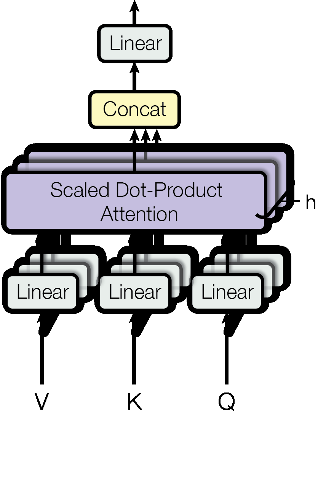
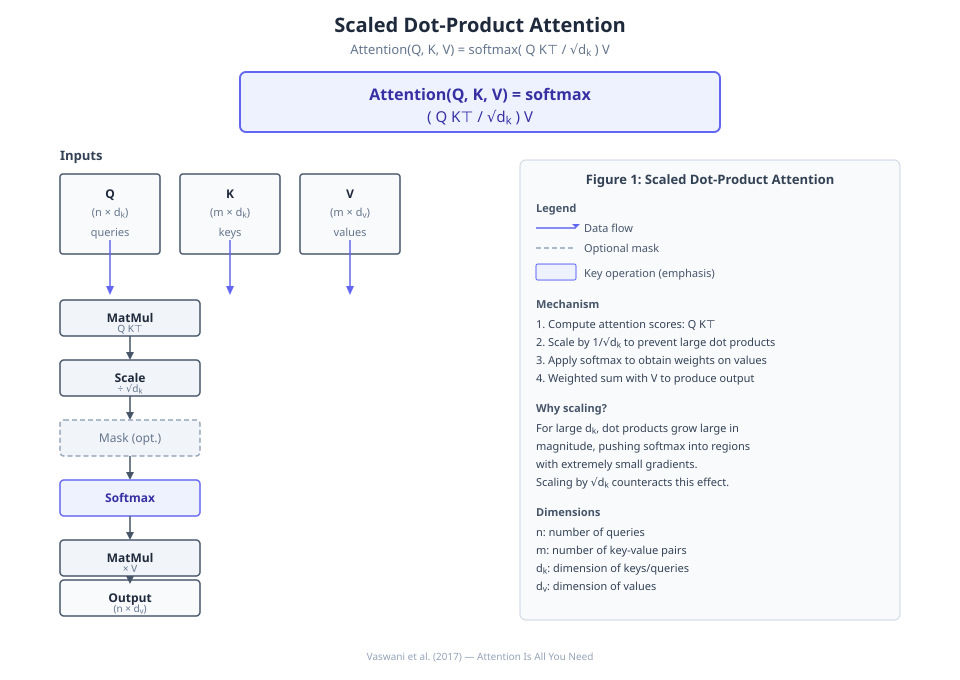
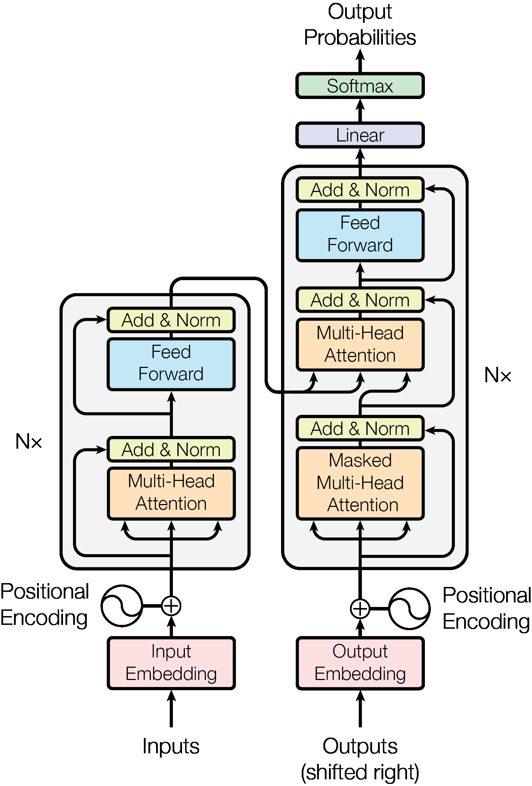
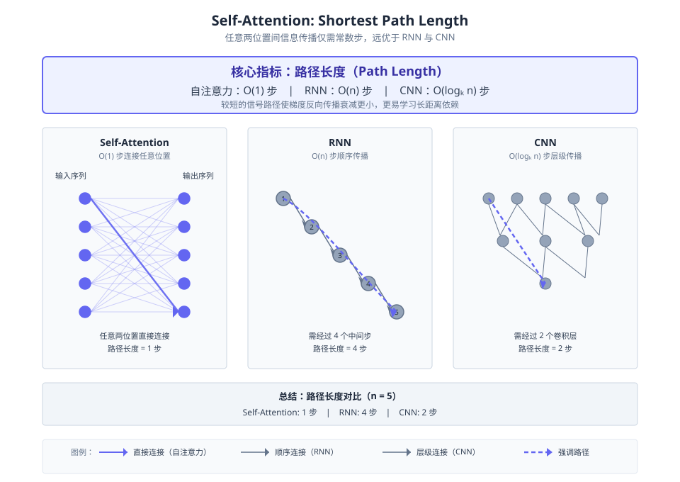
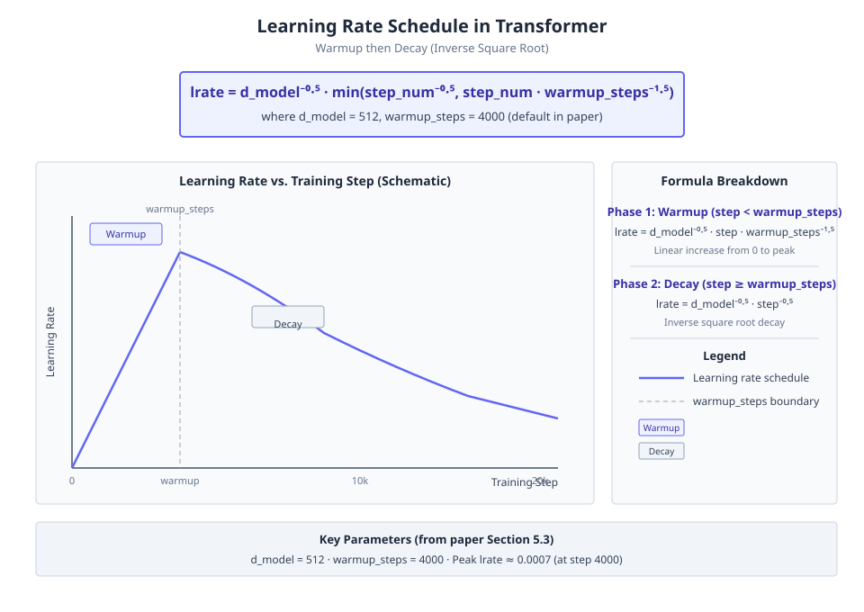
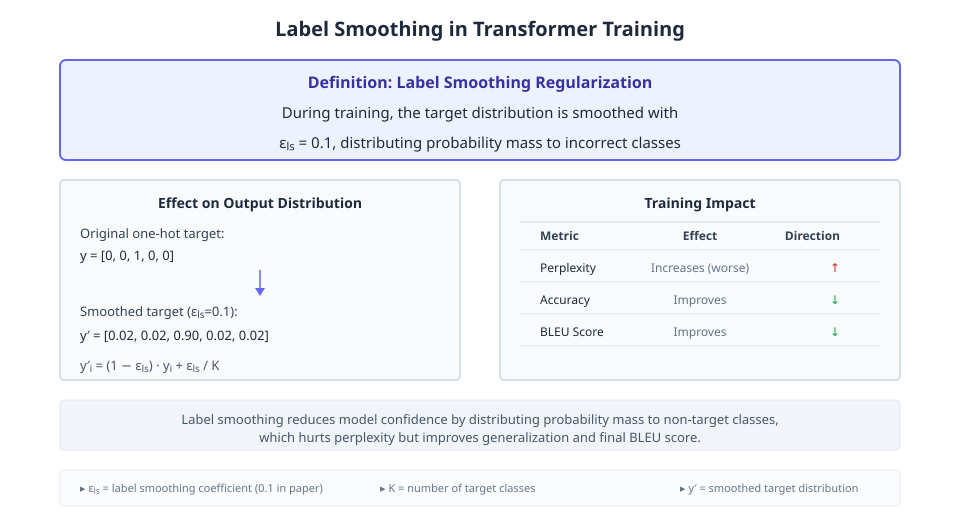

# Attention Is All You Need

**Authors:** Ashish Vaswani, Noam Shazeer, Niki Parmar, Jakob Uszkoreit, Llion Jones, Aidan N. Gomez et al.  •  **Year:** 2017  •  **arXiv:** [1706.03762](https://arxiv.org/abs/1706.03762)  •  [PDF](https://arxiv.org/pdf/1706.03762.pdf)

- [🎯 贡献与创新点](#contributions)
- [🔬 技术细节解释](#technical)
- [🔗 知识关联](#connections)
- [🛠️ 复现指南](#reproduction)

<a id="contributions"></a>

## 🎯 贡献与创新点

**核心贡献:** 提出了完全基于注意力机制的Transformer架构，摒弃了循环和卷积。

**新颖之处:** 第一个完全依赖自注意力计算输入输出表示、不采用序列对齐RNN或卷积的转导模型。

**解决的问题:** 克服了循环神经网络顺序计算导致的训练并行化限制和长距离依赖学习困难。

> **原文出处:**
> - [Frontmatter (p.1)](https://arxiv.org/pdf/1706.03762.pdf#page=1): We propose a new simple network architecture, the Transformer, based solely on attention mechanisms, dispensing with recurrence and convolutions entirely.
> - [2 Background (p.2)](https://arxiv.org/pdf/1706.03762.pdf#page=2): the Transformer is the first transduction model relying entirely on self-attention to compute representations of its input and output without using sequence-aligned RNNs or convolution.
> - [1 Introduction (p.2)](https://arxiv.org/pdf/1706.03762.pdf#page=2): Recurrent models typically factor computation along the symbol positions of the input and output sequences. Aligning the positions to steps in computation time, they generate a sequence of hidden states ht, as a function of the previous hidden state ht−1 and the input for position t. This inherently sequential nature precludes parallelization within training examples.
> - [4 Why Self-Attention (p.6)](https://arxiv.org/pdf/1706.03762.pdf#page=6): As noted in Table 1, a self-attention layer connects all positions with a constant number of sequentially executed operations, whereas a recurrent layer requires O(n) sequential operations.

<a id="technical"></a>

## 🔬 技术细节解释

### 1. Multi-Head Attention  `🔴 high`

Instead of performing a single attention function, the model linearly projects queries, keys and values $h$ times with different learned projections to dimensions $d_k$, $d_k$ and $d_v$. Attention is computed in parallel on each projected version, and the outputs are concatenated and projected again. This allows the model to jointly attend to information from different representation subspaces at different positions, avoiding the averaging effect of a single head.

$$
MultiHead(Q,K,V) = Concat(head_1,\dots,head_h)W^O \\ \text{where } head_i = Attention(QW_i^Q, KW_i^K, VW_i^V)
$$

> 💡 **类比:** Like having multiple detectives examining different aspects of a case simultaneously, then combining their insights to form a complete picture.

📍 出处: [Section 3.2.2 (p.4)](https://arxiv.org/pdf/1706.03762.pdf#page=4)


*Figure 2: (left) Scaled Dot-Product Attention. (right) Multi-Head Attention consists of several attention layers running in parallel. (论文原图)*

### 2. Scaled Dot-Product Attention  `🟡 mid`

The core attention mechanism computes the dot products of queries with all keys, divides by $\sqrt{d_k}$ to scale, then applies softmax to obtain weights. The output is a weighted sum of the values. Scaling prevents the dot products from growing too large in magnitude, which would push the softmax into regions with very small gradients for large $d_k$.

$$
Attention(Q,K,V) = softmax(\frac{QK^\top}{\sqrt{d_k}})V
$$

> 💡 **类比:** Like computing similarity scores between a query and a set of keys, then focusing on the values proportionally, but dampening large scores to prevent extreme focusing.

📍 出处: [Section 3.2.1 (p.4)](https://arxiv.org/pdf/1706.03762.pdf#page=4)


*教学示意图：Scaled Dot-Product Attention（教学示意图）*

> **读图**：Scaled Dot-Product Attention的计算流程与公式。
>
> - Q, K, V分别为查询、键、值矩阵。
> - QK⊤/√d₀计算注意力分数，再经softmax归一化。
> - 输出为注意力权重对V的加权和。
> - 缩放因子√d₀防止softmax饱和。
>
> **关键**：核心公式：Attention(Q,K,V)=softmax(QK⊤/√d₀)V。

### 3. Positional Encoding  `🟡 mid`

To give the model information about sequence order, sinusoidal positional encodings are added to the input embeddings. Each dimension of the encoding uses a sinusoid of a different frequency: $PE_{(pos,2i)} = \sin(pos/10000^{2i/d_{model}})$ and $PE_{(pos,2i+1)} = \cos(pos/10000^{2i/d_{model}})$. The authors hypothesised that this allows the model to easily learn to attend by relative positions because $PE_{pos+k}$ can be represented as a linear function of $PE_{pos}$.

$$
PE_{(pos,2i)} = \sin(pos/10000^{2i/d_{model}}) \\ PE_{(pos,2i+1)} = \cos(pos/10000^{2i/d_{model}})
$$

> 💡 **类比:** Like adding a unique timestamp to each word in a sentence so the model knows the order, using periodic signals that can later be combined to measure distance.

📍 出处: [Section 3.5 (p.6)](https://arxiv.org/pdf/1706.03762.pdf#page=6)


*Figure 1: The Transformer - model architecture. (论文原图)*

### 4. Masked Self-Attention in Decoder  `🟢 low`

In the decoder self-attention, to preserve the auto-regressive property, future positions are masked out by setting attention logits to $-\infty$ before the softmax. This ensures that predictions at position $i$ depend only on outputs at positions less than $i$.

> 💡 **类比:** Like a game where each player can only see the moves of previous players, not future ones, to predict the next move.

📍 出处: [Section 3.2.3 (p.5)](https://arxiv.org/pdf/1706.03762.pdf#page=5)


*教学示意图：Masked Self-Attention in Decoder（教学示意图）*

> **读图**：解码器中的掩码自注意力机制，保持自回归性质。
>
> - 掩码矩阵：未来位置j>i设为负无穷，softmax后权重为0。
> - 注意力计算：Q=当前yᵢ，K,V=过去及当前y₁…yᵢ。
> - 自回归性质：预测ŷᵢ仅依赖y₁…yᵢ₋₁。
>
> **关键**：掩码确保解码时不能看到未来位置，实现自回归。

### 5. Learning Rate Schedule  `🟢 low`

The learning rate follows $lrate = d_{model}^{-0.5} \cdot \min(step\_num^{-0.5}, step\_num \cdot warmup\_steps^{-1.5})$, where $warmup\_steps=4000$. It increases linearly for the first $warmup\_steps$ steps, then decreases proportionally to the inverse square root of the step number, combined with the Adam optimizer.

$$
lrate = d_{model}^{-0.5} \cdot \min(step\_num^{-0.5}, step\_num \cdot warmup\_steps^{-1.5})
$$

> 💡 **类比:** Like gradually warming up an engine before cruising, then slowing down as you approach the destination.

📍 出处: [Section 5.3 (p.7)](https://arxiv.org/pdf/1706.03762.pdf#page=7)


*教学示意图：Learning Rate Schedule（教学示意图）*

> **读图**：Transformer学习率调度：线性预热后按平方根倒数衰减。
>
> - lrate公式：d_model^-0.5 * min(step_num^-0.5, step_num * warmup_steps^-1.5)
> - d_model=512, warmup_steps=4000, 使用Adam优化器
> - Phase1线性预热：step_num≤4000时lrate∝step_num
> - Phase2平方根衰减：step_num>4000时lrate∝step_num^-0.5
>
> **关键**：预热阶段线性增长，之后按步数平方根倒数衰减。

### 6. Label Smoothing  `🟢 low`

During training, label smoothing with $\epsilon_{ls}=0.1$ is used, which makes the model less confident by distributing some probability mass to incorrect classes. This hurts perplexity but improves accuracy and BLEU score.

> 💡 **类比:** Like a teacher giving partial credit for close answers, encouraging the student to consider alternatives rather than memorizing exact answers.

📍 出处: [Section 5.4 (p.7)](https://arxiv.org/pdf/1706.03762.pdf#page=7)


*教学示意图：Label Smoothing（教学示意图）*

> **读图**：Label Smoothing通过软化目标分布提升模型泛化能力。
>
> - 标准目标：正确类概率1，其余0。
> - 平滑目标：正确类概率1-ε+ε/K，其余ε/K。
> - 效果：降低模型自信，提高准确率和BLEU。
>
> **关键**：平滑目标分布可减少过拟合，提升泛化性能。

<a id="connections"></a>

## 🔗 知识关联

| 概念 | 相关论文 | 关系 |
| --- | --- | --- |
| Scaled Dot-Product Attention | [Bahdanau et al. 2014](https://arxiv.org/abs/1409.0473) | 改进自 Bahdanau 等人提出的 additive attention 和 dot-product attention，通过引入缩放因子 1/√dk 解决大维度下点积值过大致使 softmax 梯度极小的问题。 |
| Multi-Head Attention | [Bahdanau et al. 2014 (single-head attention)](https://arxiv.org/abs/1409.0473) | 扩展单头注意力，使用多个并行的线性投影和注意力计算，使模型能够从不同的表示子空间中联合关注信息。 |
| Self-Attention as Core Building Block | [ConvS2S (Gehring et al. 2017) and ByteNet (Kalchbrenner et al. 2017)](https://arxiv.org/abs/1705.03122) | 对比基于卷积或循环的序列转导模型，Transformer 完全依赖自注意力，将任意两位置的路径长度缩短为 O(1)，并提高并行度。 |
| Sinusoidal Positional Encoding | [ConvS2S (Gehring et al. 2017)](https://arxiv.org/abs/1705.03122) | 对比 ConvS2S 中使用的可学习位置嵌入，采用固定正弦函数编码位置，以利于模型外推到训练期间未见过的序列长度。 |
| Residual Connections and Layer Normalization | He et al. 2016; Ba et al. 2016 | 继承残差连接（He et al. 2016）和层归一化（Ba et al. 2016），在每个子层输出上使用 LayerNorm(x + Sublayer(x))，以稳定深层网络训练。 |
| Regularization (Dropout and Label Smoothing) | Srivastava et al. 2014; Szegedy et al. 2016 | 继承 Dropout（Srivastava et al. 2014）和 Label Smoothing（Szegedy et al. 2016）作为正则化手段，防止过拟合并提升准确率。 |

<a id="reproduction"></a>

## 🛠️ 复现指南

- **代码仓库（论文原文链接 · ★17312）:** [https://github.com/tensorflow/tensor2tensor](https://github.com/tensorflow/tensor2tensor)
- **安装 / 运行（取自该仓库，非模型生成）:**
  - `pip install -e .`
- **环境要求:** Python >= 3.5, TensorFlow 1.15, CUDA >= 8.0, cuDNN >= 6.0, 8 NVIDIA P100 GPUs (or equivalent)
- **推荐硬件:** 8 NVIDIA P100 GPUs (newer V100/A100 also work); a single GPU can train base model with reduced batch size.
- **关键超参数:** `N=6 (number of encoder/decoder layers)`, `d_model=512 (base) / 1024 (big)`, `d_ff=2048 (base) / 4096 (big)`, `h=8 (base) / 16 (big) attention heads`, `d_k=d_v=64 (key/value dimension per head)`, `dropout P_drop=0.1 (base) / 0.3 (big)`, `label smoothing ε_ls=0.1`, `optimizer Adam with β1=0.9, β2=0.98, ε=1e-9`, `learning rate schedule: warmup_steps=4000, peak lr = d_model^{-0.5} * step^{-0.5} (before warmup: linear increase)`, `batch size: ~25000 source + 25000 target tokens per batch`

### 环境配置步骤

**1. Check CUDA and GPU availability**

Ensure CUDA and cuDNN are installed and GPU is visible to TensorFlow.

```bash
nvcc --version && nvidia-smi
```

**2. Install TensorFlow and tensor2tensor**

Create a Python virtual environment and install the required packages. TensorFlow 1.15 is recommended to match the original implementation.

```bash
pip install tensorflow-gpu==1.15.0 tensor2tensor
```

**3. Clone tensor2tensor repository (optional)**

If you need to modify code or use the latest version from source, clone the Git repository.

```bash
git clone https://github.com/tensorflow/tensor2tensor && cd tensor2tensor && pip install -e .
```

**4. Prepare WMT translation dataset**

Use t2t-datagen to download and preprocess the WMT14 English-German dataset. This step requires internet access and may take hours.

```bash
t2t-datagen --problem=translate_ende_wmt32k --data_dir=~/t2t_data --tmp_dir=~/t2t_tmp
```

**5. Launch training (base model)**

Start training the Transformer base model on 8 GPUs using the predefined hyperparameter set. Adjust --worker_gpu according to your GPU count.

```bash
t2t-trainer --data_dir=~/t2t_data --problem=translate_ende_wmt32k --model=transformer --hparams_set=transformer_base --output_dir=~/t2t_train/base --worker_gpu=8
```

### 性能基准

| 设置 | Baseline | 结果 | 加速 | 显存 |
| --- | --- | --- | --- | --- |
| WMT 2014 English-German newstest2014 (big Transformer) | GNMT+RL Ensemble (26.30 BLEU) | 28.4 BLEU | - | Training FLOPs: 2.3e19 |
| WMT 2014 English-French newstest2014 (big Transformer) | ConvS2S single model (40.46 BLEU) | 41.8 BLEU | - | - |
| EN-DE training compute (FLOPs) | ConvS2S (9.6e18 FLOPs) | 3.3e18 FLOPs (Transformer base) | 2.9x fewer FLOPs | - |
| English constituency parsing WSJ Section 23 (semi-supervised) | Vinyals & Kaiser (92.1 F1) | 92.7 F1 | - | - |

### 数据集

- **[WMT 2014 English-German](http://www.statmt.org/wmt14/translation-task.html)** — Machine translation training and evaluation
- **[WMT 2014 English-French](http://www.statmt.org/wmt14/translation-task.html)** — Machine translation training and evaluation
- **[Penn Treebank WSJ](https://catalog.ldc.upenn.edu/LDC99T42)** — English constituency parsing

### 常见报错与解决

- **报错:** `Resource exhausted: OOM when allocating tensor ...`
  - 原因: Batch size too large for GPU memory. The default token-based batch may exceed the memory of older GPUs.
  - 修复: `--hparams='batch_size=2048' or use gradient accumulation. Alternatively, reduce max_length.`
- **报错:** `Error downloading wmt14 data: HTTP error ...`
  - 原因: Network restrictions or server downtime during t2t-datagen.
  - 修复: `Manually download the dataset and place it in the data_dir, or set HTTP_PROXY environment variable.`
- **报错:** `AttributeError: module 'tensorflow' has no attribute '...'`
  - 原因: tensor2tensor is incompatible with TensorFlow 2.x by default.
  - 修复: `pip install tensorflow-gpu==1.15.0`
- **报错:** `Validation BLEU does not improve, loss oscillates.`
  - 原因: Learning rate too high, incorrect mask, or missing label smoothing.
  - 修复: `Use standard hparams_set (transformer_base). Try lowering warmup_steps or add --hparams='learning_rate_warmup_steps=8000'.`

### ⚠️ 坑点提示

- Decoder self-attention must use a causal mask to prevent attending to future tokens; verify mask implementation.
- Checkpoint averaging significantly boosts BLEU: average last 5 checkpoints for base, last 20 for big.
- Label smoothing (0.1) hurts perplexity but improves BLEU; always keep it enabled.
- Sinusoidal positional encoding allows extrapolation to longer sequences, while learned embeddings give similar results on seen lengths.
- Inference beam search: use beam size 4, length penalty α=0.6, and set max output length to input length + 50.


---
*Generated by [PaperMind](https://github.com/Wenhao-Hua/papermind).*