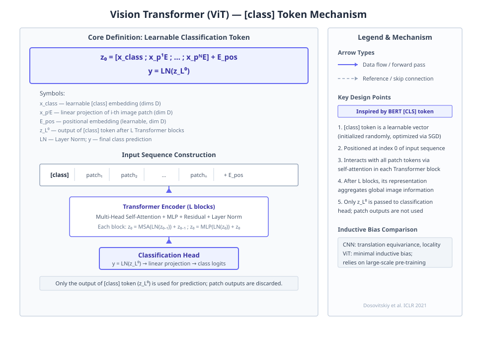
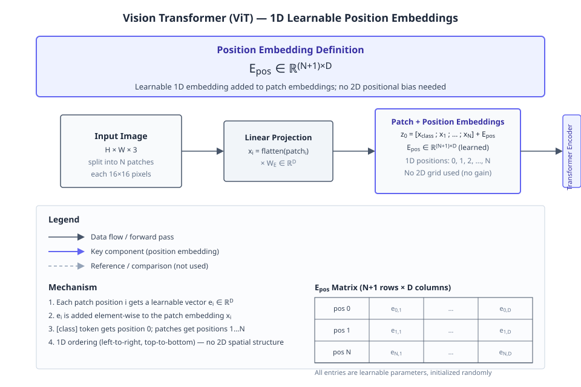

# An Image is Worth 16x16 Words: Transformers for Image Recognition at Scale

**Authors:** Alexey Dosovitskiy, Lucas Beyer, Alexander Kolesnikov, Dirk Weissenborn, Xiaohua Zhai, Thomas Unterthiner et al.  •  **Year:** 2020  •  **arXiv:** [2010.11929](https://arxiv.org/abs/2010.11929)  •  [PDF](https://arxiv.org/pdf/2010.11929.pdf)

- [🎯 贡献与创新点](#contributions)
- [🔬 技术细节解释](#technical)
- [🔗 知识关联](#connections)
- [🛠️ 复现指南](#reproduction)

<a id="contributions"></a>

## 🎯 贡献与创新点

**核心贡献:** 本文提出Vision Transformer (ViT)，证明直接对图像块序列应用纯Transformer，在足够大的数据集上预训练后，可以在图像分类任务上取得与最先进CNN相当或更优的性能，且训练计算资源更少。

**新颖之处:** 与以往结合注意力与卷积或仅替换CNN部分组件的工作不同，本文首次展示了完全不需要CNN的归纳偏置，一个纯Transformer架构可以直接处理图像块序列并在大规模预训练下成功应用到视觉任务。

**解决的问题:** 解决了Transformer因缺乏CNN的平移等变性和局部性等归纳偏置，在小数据集上泛化能力差的问题，表明大规模预训练可以克服这一局限性，使纯Transformer在视觉任务上取得优异表现。

> **原文出处:**
> - [Frontmatter (p.1)](https://arxiv.org/pdf/2010.11929.pdf#page=1): We show that this reliance on CNNs is not necessary and a pure transformer applied directly to sequences of image patches can perform very well on image classification tasks.
> - [Frontmatter (p.1)](https://arxiv.org/pdf/2010.11929.pdf#page=1): When pre-trained on large amounts of data and transferred to multiple mid-sized or small image recognition benchmarks (ImageNet, CIFAR-100, VTAB, etc.), Vision Transformer (ViT) attains excellent results compared to state-of-the-art convolutional networks while requiring substantially fewer computational resources to train.
> - [1 INTRODUCTION (p.1)](https://arxiv.org/pdf/2010.11929.pdf#page=1): We find that large scale training trumps inductive bias. Our Vision Transformer (ViT) attains excellent results when pre-trained at sufficient scale and transferred to tasks with fewer datapoints.

<a id="technical"></a>

## 🔬 技术细节解释

### 1. Multihead Self-Attention  `🔴 high`

输入序列 $z$ 通过线性投影得到查询 $q$、键 $k$、值 $v$，计算缩放点积注意力 $\text{softmax}(qk^\top / \sqrt{D_h})$ 得到权重矩阵，对值加权求和。并行执行 $k$ 个这样的注意力头，每个头维度为 $D_h = D/k$，最后将所有头的输出拼接并线性投影。

$$
\text{MSA}(z) = [\text{SA}_1(z); \text{SA}_2(z); \dots; \text{SA}_k(z)] \mathbf{U}_{msa}, \text{ where } \text{SA}(z) = \text{softmax}(qk^\top / \sqrt{D_h}) v
$$

> 💡 **类比:** 多个专家同时阅读同一段文本，各自关注不同的词语关联，最后综合所有人的观察得出最终理解。

📍 出处: [Appendix A](https://arxiv.org/pdf/2010.11929.pdf)


*Figure 6: Representative ex- amples of attention from the output token to the input space. See Appendix D.7 for details. (论文原图)*

### 2. Masked Patch Prediction Self-Supervision  `🔴 high`

自监督预训练时，随机损坏 50% 的 patch 嵌入：80% 用可学习的 [mask] 嵌入替换，10% 用随机其他 patch 嵌入替换，10% 保持原样。模型基于损坏后的序列，对每个被损坏 patch 的最终表示预测其 3-bit 平均颜色（总共 512 种颜色）。

> 💡 **类比:** 刻意遮盖图片的部分拼块，有的涂黑，有的换成错误拼块，然后让模型根据剩余信息猜出原图的颜色，迫使模型学会图像的统计规律。

📍 出处: [B.1.2](https://arxiv.org/pdf/2010.11929.pdf)


*教学示意图：Masked Patch Prediction Self-Supervision（教学示意图）*

> **读图**：ViT自监督预训练：随机损坏patch并预测其3-bit平均颜色。
>
> - 损坏策略：80%用[mask]替换，10%随机，10%不变。
> - 输入序列：N个patch，50%被损坏，含[class]和[mask]。
> - Transformer编码器：L层，含MSA、MLP、LN和残差连接。
> - 预测目标：每个损坏patch的3-bit平均颜色（512种）。
>
> **关键**：模型仅对损坏patch预测颜色，学习视觉语义。

### 3. Patch Embedding and Sequence Construction  `🟡 mid`

将输入图像 $x \in \mathbb{R}^{H \times W \times C}$ 划分为 $N$ 个大小为 $P \times P$ 的非重叠 patch，每个被展平为长度 $P^2 \cdot C$ 的向量。通过可训练的线性投影 $\mathbf{E}$ 映射到 $D$ 维，形成 patch 嵌入。序列最前端添加一个可学习的 class 嵌入 $x_{\text{class}}$，并将可学习的 1D 位置嵌入 $\mathbf{E}_{pos}$ 加到所有嵌入上，得到 Transformer 的输入序列 $z_0$。

$$
z_0 = [x_{\text{class}}; x^1_p \mathbf{E}; x^2_p \mathbf{E}; \dots; x^N_p \mathbf{E}] + \mathbf{E}_{pos}
$$

> 💡 **类比:** 像把一幅画切成一堆正方形拼块，每块打上一个数字编号，再在所有拼块前放一个“总结”卡片，把所有卡片串成一句话输入给模型。

📍 出处: [3.1 (p.3)](https://arxiv.org/pdf/2010.11929.pdf#page=3)


*Figure 1: Model overview. We split an image into fixed-size patches, linearly embed each of them, add position embeddings, and feed the resulting sequence of vectors to a standard Transformer encoder. In order to perform classification, we use the standard approach of adding an extra learnable “classification token” to the sequence. The illustration of the Transformer encoder was inspired by Vaswani  (论文原图)*

### 4. Transformer Encoder with Pre-Normalization  `🟡 mid`

编码器由交替的多头自注意力 (MSA) 和 MLP 块组成。在每个子层之前应用 LayerNorm (LN)，然后相加残差连接：$z'_\ell = \text{MSA}(\text{LN}(z_{\ell-1})) + z_{\ell-1}$，$z_\ell = \text{MLP}(\text{LN}(z'_\ell)) + z'_\ell$。MLP 包含两个线性层和 GELU 激活函数。

$$
z'_\ell = \text{MSA}(\text{LN}(z_{\ell-1})) + z_{\ell-1}, \quad z_\ell = \text{MLP}(\text{LN}(z'_\ell)) + z'_\ell
$$

> 💡 **类比:** 流水线上，每个工位在加工前先检查前一个工位的输出是否规范，然后加上自己的修改，确保最终产品稳定。

📍 出处: [3.1 (p.3)](https://arxiv.org/pdf/2010.11929.pdf#page=3)


*教学示意图：Transformer Encoder with Pre-Normalization（教学示意图）*

> **读图**：ViT编码器块结构：预归一化+残差连接
>
> - zℓ-1: 上一编码器块的输出
> - LayerNorm: 子层前归一化，稳定训练
> - MSA: 多头自注意力，捕捉全局依赖
> - MLP: 两层线性+GELU，提升非线性
>
> **关键**：先LN再子层，残差加回输入，梯度更顺畅

### 5. Hybrid Architecture  `🟢 low`

作为纯 patch 输入的替代，可以从 CNN 提取的特征图构造输入序列。将 CNN 特征图划分为 patch（空间尺寸可以是 $1 \times 1$），然后按相同方式投影为嵌入并添加 class 嵌入和位置嵌入。输入序列由展平并投影的特征图 patch 组成。

> 💡 **类比:** 先用一只卷积“眼睛”提取出有意义的局部纹理，再将这些纹理块像纯 patch 一样交给 Transformer 处理，融合两种网络的力量。

📍 出处: [3.1 (p.3)](https://arxiv.org/pdf/2010.11929.pdf#page=3)


*教学示意图：Hybrid Architecture（教学示意图）*

> **读图**：混合架构：CNN提取特征图，划分patch后输入Transformer。
>
> - CNN特征图：尺寸H×W×C，如ResNet stage 4输出。
> - Patch划分：将特征图分为P×P patch，常为1×1。
> - 展平投影：每个patch展平并线性投影到D维嵌入。
> - 输入序列：[class]标记与patch嵌入相加位置编码后送Transformer。
>
> **关键**：CNN特征图视为patch序列，结合[class]标记用于分类。

### 6. Classification Head Strategy  `🟢 low`

预训练时，分类头是一个含一个隐藏层的 MLP，作用于 class token 的最终输出 $z^0_L$。微调时，移除整个预训练头部，替换为一个零初始化的单线性层 $D \times K$，直接输出目标类别数 $K$。论文发现这种替换比仅重新初始化最后一层更稳健。

> 💡 **类比:** 学习阶段有一个内部助教提炼信息，考试时只用最直接的答题卡，确保适应各种新题型。

📍 出处: [3.1, 3.2 (p.3)](https://arxiv.org/pdf/2010.11929.pdf#page=3)


*教学示意图：Classification Head Strategy（教学示意图）*

> **读图**：ViT分类头策略：预训练MLP，微调替换为单线性层
>
> - 预训练头：MLP含一个隐藏层，输入z⁰_L
> - 微调头：移除预训练MLP，替换为零初始化线性层
> - 替换策略比仅重初始化最后一层更稳健
>
> **关键**：微调时整个替换分类头，而非仅最后一层

<a id="connections"></a>

## 🔗 知识关联

| 概念 | 相关论文 | 关系 |
| --- | --- | --- |
| Transformer architecture | [Vaswani et al. 2017](https://arxiv.org/abs/1706.03762) | 继承；模型设计尽可能遵循原始Transformer，使用多头自注意力和MLP块交替的结构 |
| [class] token | [Devlin et al. 2019](https://arxiv.org/abs/1810.04805) | 继承；类似BERT，在嵌入序列前添加可学习的[class] token，其输出作为图像表示 |
| Pre-norm residual blocks | [Wang et al. 2019; Baevski & Auli 2019](https://arxiv.org/abs/1906.01787) | 继承；在每一个块之前应用LayerNorm，并在块之后添加残差连接 |
| Residual networks (ResNets) | [He et al. 2016](https://arxiv.org/abs/1512.03385) | 对比；在中小数据集上训练时，ViT精度低于同等规模的ResNet；但在大规模预训练下，ViT可以超越ResNet |
| Transfer learning protocol | [Kolesnikov et al. 2020](https://arxiv.org/abs/1912.11370) | 继承；在VTAB任务上遵循其评测协议，并且在不同分辨率下微调的做法也是参照该工作 |
| Masked patch prediction | [Devlin et al. 2019](https://arxiv.org/abs/1810.04805) | 对比；自监督预训练中采用类似于BERT的掩码预测策略，但针对图像patch，并实验了不同的掩码比例 |

<a id="reproduction"></a>

## 🛠️ 复现指南

- **官方代码（已核实 · 论文原文链接 ✓官方 · ★12561）:** [https://github.com/google-research/vision_transformer](https://github.com/google-research/vision_transformer)
- **安装 / 运行（取自仓库）:**
  - `pip install -e .`
  - `Make sure you have `Python>=3.10` installed on your machine.`
- **环境要求:** PyTorch >= 1.7 (推断自 ViT 通常所需), CUDA 可用显存 >= 16G (建议用于大模型微调)
- **推荐硬件:** A100 40G 或 TPUv3 (论文使用 TPUv3 训练) ; 微调可使用 V100 32G
- **关键超参数:** `image_size=224`, `patch_size=16`, `learning_rate=0.003 (预训练, Adam)`, `learning_rate=0.03 (微调, SGD)`, `momentum=0.9`, `weight_decay=0.1 (预训练)`, `batch_size=4096 (预训练)`, `batch_size=512 (微调)`, `dropout=0.1 (ViT-B)`, `fine_tune_resolution=384`

### 环境配置步骤

**1. 安装 PyTorch 和通用依赖**

创建虚拟环境并安装 PyTorch、torchvision、timm (社区常用 ViT 实现依赖)、tensorflow (如用 TPU) 等

```bash
conda create -n vit python=3.8 -y && conda activate vit && pip install torch torchvision timm tensorflow
```

**2. 下载数据集 (以 ImageNet-1k 为例)**

从 ImageNet 官网下载ILSVRC2012 数据集并解压到指定目录；CIFAR-100 可通过 torchvision 自动下载

```bash
# ImageNet 需手动下载并解压到 ./data/imagenet/ ; CIFAR-100 可在代码中 torchvision.datasets.CIFAR100 自动下载
```

**3. 克隆参考实现 (非官方但广泛使用)**

由于论文未提供官方代码链接，可自行实现或使用社区实现如 lucidrains/vit-pytorch 或 rwightman/pytorch-image-models

```bash
git clone https://github.com/rwightman/pytorch-image-models.git && cd pytorch-image-models
```

**4. 准备预训练模型或从头训练**

若使用预训练权重，需从第三方源下载对应配置的 checkpoint；否则按论文超参从头预训练 (需大量资源)

```bash
python train.py --model vit_base_patch16_224 --batch-size 32 --lr 0.003 --dataset imagenet --data-dir ./data/imagenet
```

### 性能基准

| 设置 | Baseline | 结果 | 加速 | 显存 |
| --- | --- | --- | --- | --- |
| ViT-H/14, JFT-300M pre-training → ImageNet fine-tune | 未给出具体对比 CNN | 88.55% top-1 accuracy | 训练资源大幅减少 (论文声称 substantially fewer computational resources), 但未提供数值 | - |
| ViT-L/16, ImageNet-21k pre-training → ImageNet fine-tune | 85.2% (BiT-L, 但其并非直接对比) | 85.30% top-1 accuracy (Table 5) | - | - |

### 数据集

- **[ImageNet-1k (ILSVRC2012)](https://image-net.org/challenges/LSVRC/2012/)** — 标准图像分类基准
- **[ImageNet-21k](https://image-net.org/download-images.php (非直接公开))** — 大规模预训练
- **[JFT-300M](未公开)** — Google 内部大规模预训练数据集
- **[CIFAR-100](https://www.cs.toronto.edu/~kriz/cifar.html)** — 小规模微调评估
- **[VTAB](https://github.com/google-research/task_adaptation)** — 多任务视觉适应基准

### 常见报错与解决

- **报错:** `RuntimeError: shape mismatch when loading pretrained weights`
  - 原因: 模型结构与权重文件不匹配 (如 patch_size、embed_dim 或 num_classes 不同)
  - 修复: `检查配置并重建模型: vi_patch16_224(pretrained=False, num_classes=1000) ; 或修改权重 key 映射`
- **报错:** `GPU out of memory during fine-tuning with resolution 384`
  - 原因: 高分辨率导致序列长度增大，显存需求上升
  - 修复: `减小 batch size 或使用 gradient accumulation: --batch-size 16 --grad-accum-steps 4`
- **报错:** `Fine-tuning accuracy drops after loading pretrained model`
  - 原因: 位置嵌入未正确插值以适应新分辨率
  - 修复: `调用插值函数: pos_embed = torch.nn.functional.interpolate(pos_embed, size=(new_h, new_w), mode='bilinear')`

### ⚠️ 坑点提示

- 从 224 分辨率和 16x16 patch 产生的序列长度为 197 (含 class token), 增大分辨率或缩小 patch 会大幅增加计算量
- 预训练使用 Adam 且 warmup 为 10k steps，微调使用 SGD momentum=0.9，务必切换优化器
- ViT 对超参数敏感，特别是学习率和 weight decay；建议对每个下游任务进行小范围网格搜索
- 自监督预训练实验中，掩码补丁预测仅使用 3-bit 平均颜色作为目标，不要误用全像素回归


---
*Generated by [PaperMind](https://github.com/Wenhao-Hua/papermind).*