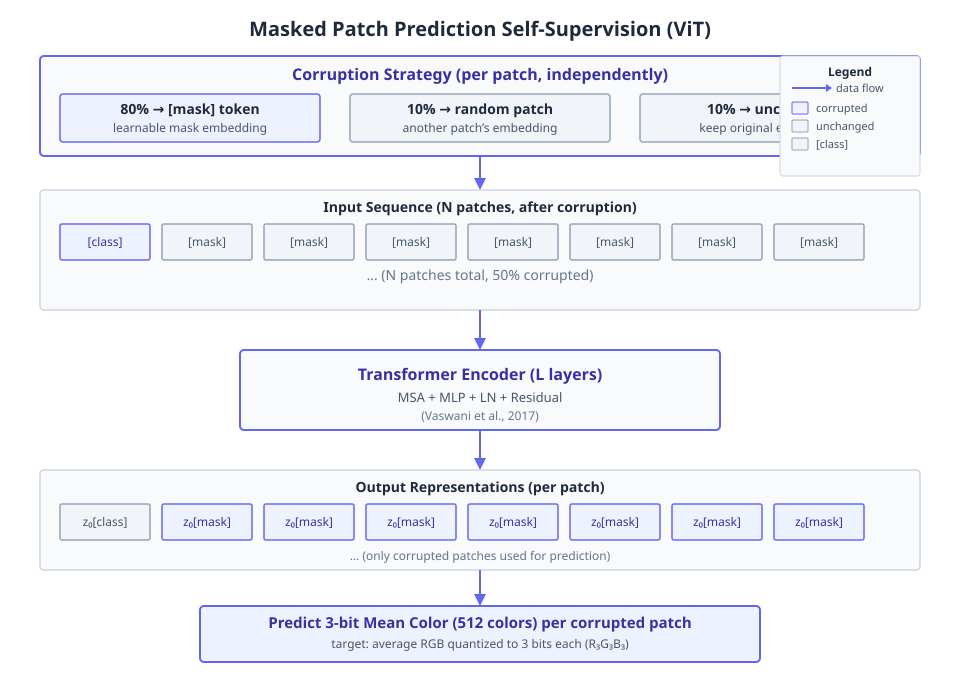
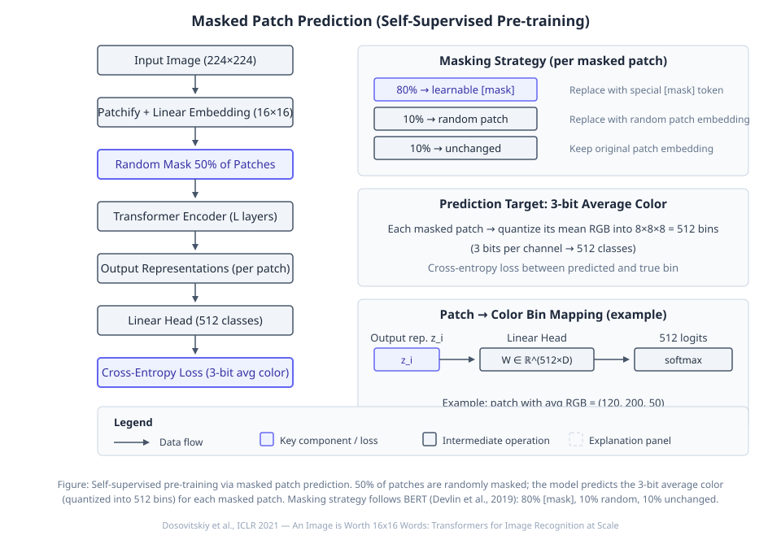

# An Image is Worth 16x16 Words: Transformers for Image Recognition at Scale

**Authors:** Alexey Dosovitskiy, Lucas Beyer, Alexander Kolesnikov, Dirk Weissenborn, Xiaohua Zhai, Thomas Unterthiner et al.  •  **Year:** 2020  •  **arXiv:** [2010.11929](https://arxiv.org/abs/2010.11929)  •  [PDF](https://arxiv.org/pdf/2010.11929.pdf)

- [🎯 贡献与创新点](#contributions)
- [🔬 技术细节解释](#technical)
- [🔗 知识关联](#connections)
- [🛠️ 复现指南](#reproduction)

<a id="contributions"></a>

## 🎯 贡献与创新点

**核心贡献:** 提出 Vision Transformer (ViT)，直接将标准 Transformer 应用于图像 patch 序列，在大规模预训练下性能超越或媲美最先进的卷积网络，并且所需训练计算资源显著更少。

**新颖之处:** 首次展示纯 Transformer 无需依赖 CNN 的归纳偏置，仅通过大规模预训练即可在图像分类上达到与最先进 CNN 相当甚至更好的结果。

**解决的问题:** 解决了 Transformer 在视觉任务中必须结合 CNN 或设计专门的注意力模式才能有效扩展的问题，证明标准 Transformer 通过大规模数据即可克服归纳偏置不足。

> **原文出处:**
> - [ABSTRACT (p.1)](https://arxiv.org/pdf/2010.11929.pdf#page=1): ⚠️ 未核实 · We show that this reliance on CNNs is not necessary and a pure transformer applied directly to sequences of image patches can perform very well on image classification tasks. … Vision Transformer (ViT) attains excellent results compared to state-of-the-art convolutional networks while requiring substantially fewer computational resources to train.
> - [1 INTRODUCTION (p.1)](https://arxiv.org/pdf/2010.11929.pdf#page=1): ⚠️ 未核实 · Inspired by the Transformer scaling successes in NLP, we experiment with applying a standard Transformer directly to images, with the fewest possible modifications. … We find that large scale training trumps inductive bias. Our Vision Transformer (ViT) attains excellent results when pre-trained at sufficient scale and transferred to tasks with fewer datapoints.
> - [2 RELATED WORK (p.3)](https://arxiv.org/pdf/2010.11929.pdf#page=3): In model design we follow the original Transformer (Vaswani et al., 2017) as closely as possible. An advantage of this intentionally simple setup is that scalable NLP Transformer architectures – and their efficient implementations – can be used almost out of the box.
> - [3.2 FINE-TUNING AND HIGHER RESOLUTION (p.4)](https://arxiv.org/pdf/2010.11929.pdf#page=4): When considering the computational cost of pre-training the model, ViT performs very favourably, attaining state of the art on most recognition benchmarks at a lower pre-training cost.

<a id="technical"></a>

## 🔬 技术细节解释

### 1. 多头自注意力（Multihead Self-Attention）  `🔴 high`

将输入序列通过线性投影得到查询 $q$、键 $k$、值 $v$，每个头独立计算缩放点积注意力：$\text{Attention}(q,k,v)=\text{softmax}(qk^\top/\sqrt{D_h})v$，然后将所有头的输出拼接起来再通过一个线性层投影回原始维度。多个头允许模型在不同子空间中捕捉信息。

$$
\text{MSA}(z) = [\text{SA}_1(z); \text{SA}_2(z); \cdots; \text{SA}_k(z)] U_{msa}, \quad U_{msa} \in \mathbb{R}^{k D_h \times D}
$$

> 💡 **类比:** 就像一组专家各自从不同视角审视输入序列，最后综合他们的意见。

📍 出处: [Appendix A (p.13)](https://arxiv.org/pdf/2010.11929.pdf#page=13)


*Figure 6: Representative ex- amples of attention from the output token to the input space. See Appendix D.7 for details. (论文原图)*

### 2. 微调时位置嵌入的二维插值  `🔴 high`

当用更高分辨率图像微调时，保持patch大小不变会导致序列变长，预训练的位置嵌入不再匹配。于是对预训练的1D位置嵌入进行2D插值，根据它们在原始图像中的空间位置重新采样到新的网格上。这是模型中唯一注入2D图像结构信息的点。

> 💡 **类比:** 就像把一张小地图上的地标坐标通过拉伸转换到大尺寸地图上。

📍 出处: [Section 3.2 (p.4)](https://arxiv.org/pdf/2010.11929.pdf#page=4)


*教学示意图：微调时位置嵌入的二维插值（教学示意图）*

> **读图**：微调高分辨率ViT时对位置嵌入进行2D插值
>
> - 预训练网格14×14，位置嵌入Epos为1D序列
> - 微调网格24×24，通过双线性插值重采样
> - 将Epos重塑为2D，插值后展平回1D
> - 仅位置嵌入插值，其余操作不变
>
> **关键**：2D插值是ViT中唯一注入2D结构信息的位置

### 3. 自监督预训练的掩码patch预测（Masked Patch Prediction）  `🔴 high`

随机遮挡50%的patch嵌入（其中80%替换为可学习[mask]嵌入，10%替换为随机patch，10%保持不变），然后用Transformer输出对应位置的表示预测被遮挡patch的3-bit平均颜色（512分类）。训练目标是最小化颜色分类的交叉熵。

> 💡 **类比:** 类似于玩拼图时遮住一些碎片，然后根据周围碎片猜测被遮碎片的颜色。

📍 出处: [Section 4.6 & Appendix B.1.2 (p.8)](https://arxiv.org/pdf/2010.11929.pdf#page=8)


*教学示意图：自监督预训练的掩码patch预测（Masked Patch Prediction）（教学示意图）*

> **读图**：自监督预训练：预测被遮挡patch的3-bit平均颜色。
>
> - 输入图像224×224，分块为16×16并线性嵌入。
> - 随机遮挡50%的patch，80%替换为[mask]标记。
> - Transformer编码后，线性头输出512类颜色分类。
> - 交叉熵损失优化预测与真实颜色bin的匹配。
>
> **关键**：模型通过预测遮挡patch的颜色学习视觉表示。

### 4. 图像patch嵌入（Patch Embedding）  `🟡 mid`

将输入图像切分成固定大小的不重叠patch，每个patch展平为一个向量，然后通过一个可训练的线性投影映射到Transformer的隐藏维度 $D$。这样每个patch就变成了一个类似NLP中token的嵌入向量。

$$
x_p^i E, \quad E \in \mathbb{R}^{(P^2 \cdot C) \times D}
$$

> 💡 **类比:** 把一幅画切割成若干小块，每块标上序号后输入模型。

📍 出处: [Section 3.1 (p.3)](https://arxiv.org/pdf/2010.11929.pdf#page=3)


*Figure 1: Model overview. We split an image into fixed-size patches, linearly embed each of them, add position embeddings, and feed the resulting sequence of vectors to a standard Transformer encoder. In order to perform classification, we use the standard approach of adding an extra learnable “classification token” to the sequence. The illustration of the Transformer encoder was inspired by Vaswani  (论文原图)*

### 5. 可学习的分类token（[class] token）  `🟡 mid`

在patch嵌入序列的最前面添加一个额外的可学习嵌入 $x_{\text{class}}$。经过Transformer编码器后，将这个token对应的输出向量 $z_L^0$ 作为整个图像的表示，接到分类头进行预测。该设计借鉴了BERT的 [CLS] token。

$$
z_0 = [x_{\text{class}}; x_p^1 E; \dots; x_p^N E] + E_{\text{pos}}, \quad y = \text{LN}(z_L^0)
$$

> 💡 **类比:** 在讨论组里指定一个专门的‘书记员’，汇总所有人的发言后汇报最终结论。

📍 出处: [Section 3.1 (p.3)](https://arxiv.org/pdf/2010.11929.pdf#page=3)

![教学示意图：可学习的分类token（[class] token）](figures/vit-fig3.svg)
*教学示意图：可学习的分类token（[class] token）（教学示意图）*

> **读图**：ViT使用可学习的[class] token聚合图像信息用于分类。
>
> - x_class: 可学习的[class]嵌入向量，维度D。
> - z_L⁰: 经L个Transformer块后的[class]输出。
> - y = LN(z_L⁰): 对z_L⁰做层归一化后接分类头。
> - 仅[class] token输出用于预测，patch输出丢弃。
>
> **关键**：关注[class] token的最终输出z_L⁰，它代表整图特征。

### 6. 可学习的1D位置嵌入（Position Embeddings）  `🟡 mid`

为每个patch位置和分类token学习一个可训练的嵌入向量 $E_{\text{pos}} \in \mathbb{R}^{(N+1) \times D}$，直接加到输入的patch嵌入上。使用1D位置嵌入而非2D，因为实验发现2D版本没有显著性能增益。

$$
E_{\text{pos}} \in \mathbb{R}^{(N+1) \times D}
$$

> 💡 **类比:** 给每个拼图碎片贴上它在原图中的位置编号，让模型知道碎片的顺序。

📍 出处: [Section 3.1 (p.3)](https://arxiv.org/pdf/2010.11929.pdf#page=3)

<a id="connections"></a>

## 🔗 知识关联

| 概念 | 相关论文 | 关系 |
| --- | --- | --- |
| Transformer architecture | [Vaswani et al. 2017](https://arxiv.org/abs/1706.03762) | 继承：直接应用标准Transformer到图像序列，几乎未作修改。 |
| [class] token and pre-training/fine-tuning paradigm | [Devlin et al. 2019 (BERT)](https://arxiv.org/abs/1810.04805) | 继承：借鉴BERT的[class] token作为图像表示，以及大规模预训练后在下游任务微调的范式。自监督掩码补丁预测实验也受BERT的MLM启发。 |
| Convolutional neural networks (ResNet) | [He et al. 2016](https://arxiv.org/abs/1512.03385) | 对比：以ResNet作为卷积基线，证明ViT在数据量充足时可超越CNN。 |
| Big Transfer (BiT) | [Kolesnikov et al. 2020](https://arxiv.org/abs/1912.11370) | 对比：与BiT（大型ResNet迁移学习）在多个基准上比较，ViT以更少预训练计算量取得更优结果。 |
| Noisy Student | [Xie et al. 2020](https://arxiv.org/abs/1911.04252) | 对比：与半监督学习的EfficientNet-L2比较，ViT-H/14在ImageNet上达到相当精度，消耗更少计算。 |
| Patch extraction + full self-attention | [Cordonnier et al. 2020](https://arxiv.org/abs/1911.03584) | 改进/对比：该方法提取2×2小块并应用自注意力，仅适用于低分辨率；ViT使用更大块（如16×16）并证明大规模预训练使纯Transformer超越CNN。 |

<a id="reproduction"></a>

## 🛠️ 复现指南

- **代码仓库（论文原文链接 · ★12561）:** [https://github.com/google-research/vision_transformer](https://github.com/google-research/vision_transformer)
- **安装 / 运行（取自该仓库，非模型生成）:**
  - `pip install -e .`
  - `Make sure you have `Python>=3.10` installed on your machine.`
- **环境要求:** Linux with Python 3.8+; preferred TPU v3-8 (or GPU with >=24GB memory); JAX >=0.2.20, Flax, TensorFlow Datasets
- **推荐硬件:** TPU v3-8 or higher (e.g., v3-128); for GPU reproduction: A100 (40GB) or V100 (32GB)
- **关键超参数:** `optimizer=Adam`, `beta1=0.9`, `beta2=0.999`, `weight_decay=0.1`, `batch_size=4096`, `learning_rate_schedule=linear_warmup_then_cosine_decay`, `patch_size=16 (for ViT-B/16) or 14 (for ViT-H/14)`, `hidden_size=768 (Base), 1024 (Large), 1280 (Huge)`, `num_layers=12 (Base), 24 (Large), 32 (Huge)`, `num_heads=12 (Base), 16 (Large & Huge)`, `MLP_dim=3072 (Base), 4096 (Large), 5120 (Huge)`, `dropout (used in small-dataset training, applied after dense layers except qkv and after position embedding)`, `label_smoothing (used when training on ImageNet)`, `finetune_optimizer=SGD`, `finetune_momentum=0.9`, `finetune_batch_size=512`, `finetune_learning_rate (sweep over {0.001, 0.003, 0.01, 0.03} for CIFAR, Pets, Flowers; {0.003, 0.01, 0.03, 0.06} for ImageNet; VTAB fixed 0.01)`, `finetune schedule=cosine_decay`, `finetune_weight_decay=0`, `finetune_grad_clip_global_norm=1`, `finetune_resolution=384 (for ViT, unless noted)`

### 环境配置步骤

**1. 克隆官方仓库**

下载论文配套代码

```bash
git clone https://github.com/google-research/vision_transformer.git
```

**2. 安装依赖**

根据仓库的 requirements.txt 安装 JAX、Flax、TensorFlow Datasets 等。如果使用 GPU，需安装对应 CUDA 版本的 jaxlib；如果使用 TPU，安装 jax[tpu]。

```bash
cd vision_transformer && pip install -r vit_jax/requirements.txt
```

**3. 准备数据集**

论文使用 ImageNet-1k、ImageNet-21k 或 JFT-300M。对于公开数据集，可通过 TensorFlow Datasets 下载；JFT 为 Google 内部数据，无法获取。以 ImageNet-1k 为例，设置 TFDS_DATA_DIR。

```bash
export TFDS_DATA_DIR=/path/to/tensorflow_datasets && python -c "import tensorflow_datasets as tfds; tfds.load('imagenet2012')"
```

**4. 验证环境与模型下载**

运行一个简单的测试，确保 JAX 能检测到加速设备（如 TPU 或 GPU）。如果环境正常，会输出设备信息。

```bash
python -c "import jax; print(jax.devices()); print(jax.local_device_count())"
```

### 性能基准

| 设置 | Baseline | 结果 | 加速 | 显存 |
| --- | --- | --- | --- | --- |
| ViT-H/14 pretrained on JFT-300M, finetuned on ImageNet with 518 resolution | BiT-L (ResNet152x4) accuracy 87.54% (JFT pretrain, 9.9k TPUv3-core-days) | 88.55% accuracy, 2.5k TPUv3-core-days | 3.96x fewer TPUv3-core-days | - |
| ViT-L/16 pretrained on JFT-300M, finetuned on ImageNet | BiT-L (ResNet152x4) accuracy 87.54% (9.9k TPUv3-core-days) | 87.76% accuracy, 0.68k TPUv3-core-days | 14.6x fewer TPUv3-core-days | - |

### 数据集

- **[ImageNet-1k (ILSVRC-2012)](https://www.image-net.org/challenges/LSVRC/2012/)** — 主要图像分类基准
- **[ImageNet-21k](https://www.image-net.org/)** — 大规模预训练（公开14M图像）
- **JFT-300M** — 内部大规模预训练（非公开）
- **[CIFAR-10 / CIFAR-100](https://www.cs.toronto.edu/~kriz/cifar.html)** — 下游小样本迁移评估
- **[Oxford-IIIT Pets](https://www.robots.ox.ac.uk/~vgg/data/pets/)** — 细粒度分类评估
- **[Oxford Flowers-102](https://www.robots.ox.ac.uk/~vgg/data/flowers/102/)** — 细粒度分类评估
- **[VTAB (Visual Task Adaptation Benchmark)](https://github.com/google-research/task_adaptation)** — 多任务泛化评估（19个任务）

### 常见报错与解决

- **报错:** `Out of memory on GPU when finetuning with large resolution (384 or 512)`
  - 原因: Transformer sequence length grows quadratically with resolution; ViT-L/16 at 512px may exceed 32GB
  - 修复: `Reduce finetune batch size, enable gradient checkpointing, or switch to TPU. In config, set grad_norm_clip and use JAX remat.`
- **报错:** `KeyError: 'tfds' or dataset not found`
  - 原因: TensorFlow Datasets directory not set or dataset not downloaded
  - 修复: `export TFDS_DATA_DIR=/your/tensorflow_datasets; python -m tensorflow_datasets.scripts.download_and_prepare --datasets=imagenet2012`
- **报错:** `jax not found or jaxlib version mismatch with CUDA`
  - 原因: Installed jaxlib without GPU support or wrong version
  - 修复: `pip install --upgrade jax jaxlib==0.4.23+cuda12.cudnn89 -f https://storage.googleapis.com/jax-releases/jax_cuda_releases.html`
- **报错:** `TPU/device not detected`
  - 原因: Missing TPU runtime or incorrect network setup
  - 修复: `Ensure TPU_NAME is exported, run `gcloud compute tpus tpu-vm ssh ...`, and install jax[tpu]>=0.4.20`

### ⚠️ 坑点提示

- 预训练数据集 JFT-300M 为 Google 内部数据，不可公开获取；大多数复现工作只能使用 ImageNet-21k 或 ImageNet-1k，但性能会下降，如 ViT-L/16 在 ImageNet-21k 上训练后 ImageNet 准确率约 85.3%，而非 JFT 上的 87.8%。
- 微调时需对位置编码进行 2D 插值以适应更高分辨率；代码中已实现，但需注意插值后的 embedding 可能需重新训练。
- 论文使用 Adam 优化器训练 ResNet 而非传统的 SGD，这在代码中可能引发争议，但实验证明 Adam 有助于迁移学习。
- 在较小数据集（如仅 ImageNet-1k）上训练 ViT 时，强烈需要正则化（dropout、label smoothing、weight decay），否则性能低于同等规模的 ResNet。
- VTAB 评估中所有任务统一使用 384 分辨率且学习率 0.01，无需任务特定分辨率。


---
*Generated by [PaperMind](https://github.com/Wenhao-Hua/papermind).*